# For Comprehensions

Scala's `for` comprehension is the ideal FP abstraction for sequential programs
that interact with the world. Since we will be using it a lot, we're going to
relearn the principles of `for` and how Cats can help us to write cleaner code.

This chapter doesn't try to write pure programs and the techniques are
applicable to non-FP codebases.

## Syntax Sugar

Scala's `for` is just a simple rewrite rule, also called *syntax
sugar*, that doesn't have any contextual information.

To see what a `for` comprehension is doing, we use the `show` and
`reify` feature in the REPL to print out what code looks like after
type inference.

{lang="text"}
~~~~~~~~
  scala> import scala.reflect.runtime.universe._
  scala> val a, b, c = Option(1)
  scala> show { reify {
           for { i <- a ; j <- b ; k <- c } yield (i + j + k)
         } }
  
  res:
  $read.a.flatMap(
    ((i) => $read.b.flatMap(
      ((j) => $read.c.map(
        ((k) => i.$plus(j).$plus(k)))))))
~~~~~~~~

There is a lot of noise due to additional sugarings (e.g. `+` is
rewritten `$plus`, etc). We will skip the `show` and `reify` for brevity
when the REPL line is `reify>`, and manually clean up the generated
code so that it doesn't become a distraction.

{lang="text"}
~~~~~~~~
  reify> for { i <- a ; j <- b ; k <- c } yield (i + j + k)
  
  a.flatMap {
    i => b.flatMap {
      j => c.map {
        k => i + j + k }}}
~~~~~~~~

The rule of thumb is that every `<-` (called a *generator*) is a
nested `flatMap` call, with the final generator a `map` containing the
`yield` body.

### Assignment

We can assign values inline like `ij = i + j` (a `val` keyword is not
needed).

{lang="text"}
~~~~~~~~
  reify> for {
           i <- a
           j <- b
           ij = i + j
           k <- c
         } yield (ij + k)
  
  a.flatMap {
    i => b.map { j => (j, i + j) }.flatMap {
      case (j, ij) => c.map {
        k => ij + k }}}
~~~~~~~~

A `map` over the `b` introduces the `ij` which is flat-mapped along
with the `j`, then the final `map` for the code in the `yield`.

Unfortunately we cannot assign before any generators.

{lang="text"}
~~~~~~~~
  scala> for {
           initial = getDefault
           i <- a
         } yield initial + i
  <console>:1: error: '<-' expected but '=' found.
~~~~~~~~

We can workaround the limitation by defining a `val` outside the `for`

{lang="text"}
~~~~~~~~
  scala> val initial = getDefault
  scala> for { i <- a } yield initial + i
~~~~~~~~

or create an `Option` out of the initial assignment

{lang="text"}
~~~~~~~~
  scala> for {
           initial <- Option(getDefault)
           i <- a
         } yield initial + i
~~~~~~~~

A> `val` doesn't have to assign to a single value, it can be anything
A> that works as a `case` in a pattern match.
A> 
A> {lang="text"}
A> ~~~~~~~~
A>   scala> val (first, second) = ("hello", "world")
A>   first: String = hello
A>   second: String = world
A>   
A>   scala> val list: List[Int] = ...
A>   scala> val head :: tail = list
A>   head: Int = 1
A>   tail: List[Int] = List(2, 3)
A> ~~~~~~~~
A> 
A> The same is true for assignment in `for` comprehensions
A> 
A> {lang="text"}
A> ~~~~~~~~
A>   scala> val maybe = Option(("hello", "world"))
A>   scala> for {
A>            entry <- maybe
A>            (first, _) = entry
A>          } yield first
A>   res: Some(hello)
A> ~~~~~~~~
A> 
A> But be careful not to miss any cases or there will be a runtime exception (a
A> *totality* failure).
A> 
A> {lang="text"}
A> ~~~~~~~~
A>   scala> val a :: tail = list
A>   caught scala.MatchError: List()
A> ~~~~~~~~

### Filter

It is possible to put `if` statements after a generator to filter
values by a predicate

{lang="text"}
~~~~~~~~
  reify> for {
           i  <- a
           j  <- b
           if i > j
           k  <- c
         } yield (i + j + k)
  
  a.flatMap {
    i => b.withFilter {
      j => i > j }.flatMap {
        j => c.map {
          k => i + j + k }}}
~~~~~~~~

Older versions of Scala used `filter`, but `Traversable.filter` creates new
collections for every predicate, so `withFilter` was introduced as the more
performant alternative. We can accidentally trigger a `withFilter` by providing
type information, interpreted as a pattern match.

{lang="text"}
~~~~~~~~
  reify> for { i: Int <- a } yield i
  
  a.withFilter {
    case i: Int => true
    case _      => false
  }.map { case i: Int => i }
~~~~~~~~

Like assignment, a generator can use a pattern match on the left hand side. But
unlike assignment (which throws `MatchError` on failure), generators are
*filtered* and will not fail at runtime. However, there is an inefficient double
application of the pattern.

### For Each

Finally, if there is no `yield`, the compiler will use `foreach`
instead of `flatMap`, which is only useful for side-effects.

{lang="text"}
~~~~~~~~
  reify> for { i <- a ; j <- b } println(s"$i $j")
  
  a.foreach { i => b.foreach { j => println(s"$i $j") } }
~~~~~~~~

### Summary

The full set of methods supported by `for` comprehensions do not share
a common super type; each generated snippet is independently compiled.
If there were a trait, it would roughly look like:

{lang="text"}
~~~~~~~~
  trait ForComprehensible[C[_]] {
    def map[A, B](f: A => B): C[B]
    def flatMap[A, B](f: A => C[B]): C[B]
    def withFilter[A](p: A => Boolean): C[A]
    def foreach[A](f: A => Unit): Unit
  }
~~~~~~~~

If the context (`C[_]`) of a `for` comprehension doesn't provide its own `map`
and `flatMap`, all is not lost. If an implicit `cats.FlatMap[T]` is available
for `T`, it will provide `map` and `flatMap`.

A> It often surprises developers when inline `Future` calculations in a
A> `for` comprehension do not run in parallel:
A> 
A> {lang="text"}
A> ~~~~~~~~
A>   import scala.concurrent._
A>   import ExecutionContext.Implicits.global
A>   
A>   for {
A>     i <- Future { expensiveCalc() }
A>     j <- Future { anotherExpensiveCalc() }
A>   } yield (i + j)
A> ~~~~~~~~
A> 
A> This is because the `flatMap` spawning `anotherExpensiveCalc` is
A> strictly **after** `expensiveCalc`. To ensure that two `Future`
A> calculations begin in parallel, start them outside the `for`
A> comprehension.
A> 
A> {lang="text"}
A> ~~~~~~~~
A>   val a = Future { expensiveCalc() }
A>   val b = Future { anotherExpensiveCalc() }
A>   for { i <- a ; j <- b } yield (i + j)
A> ~~~~~~~~
A> 
A> `for` comprehensions are fundamentally for defining sequential
A> programs. We will show a far superior way of defining parallel
A> computations in a later chapter. Spoiler: don't use `Future`.

## Unhappy path

So far we've only looked at the rewrite rules, not what is happening in `map`
and `flatMap`. Consider what happens when the `for` context decides that it
cannot proceed any further.

In the `Option` example, the `yield` is only called when `i,j,k` are
all defined.

{lang="text"}
~~~~~~~~
  for {
    i <- a
    j <- b
    k <- c
  } yield (i + j + k)
~~~~~~~~

If any of `a,b,c` are `None`, the comprehension short-circuits with
`None` but it doesn't tell us what went wrong.

A> There are many functions in the wild that take `Option` parameters but actually
A> require all parameters to exist. An alternative to throwing a runtime exception
A> is to use a `for` comprehension, giving us totality (a return value for every
A> input):
A> 
A> {lang="text"}
A> ~~~~~~~~
A>   def namedThings(
A>     someName  : Option[String],
A>     someNumber: Option[Int]
A>   ): Option[String] = for {
A>     name   <- someName
A>     number <- someNumber
A>   } yield s"$number ${name}s"
A> ~~~~~~~~
A> 
A> but this is verbose, clunky and bad style. If a function requires
A> every input then it should make its requirement explicit, pushing the
A> responsibility of dealing with optional parameters to its caller.
A> 
A> {lang="text"}
A> ~~~~~~~~
A>   def namedThings(name: String, num: Int) = s"$num ${name}s"
A> ~~~~~~~~

If we use `Either`, then a `Left` will cause the `for` comprehension
to short circuit with extra information, much better than `Option` for
error reporting:

{lang="text"}
~~~~~~~~
  scala> val a = Right(1)
  scala> val b = Right(2)
  scala> val c: Either[String, Int] = Left("sorry, no c")
  scala> for { i <- a ; j <- b ; k <- c } yield (i + j + k)
  
  Left(sorry, no c)
~~~~~~~~

And lastly, let's see what happens with a `Future` that fails:

{lang="text"}
~~~~~~~~
  scala> import scala.concurrent._
  scala> import ExecutionContext.Implicits.global
  scala> for {
           i <- Future.failed[Int](new Throwable)
           j <- Future { println("hello") ; 1 }
         } yield (i + j)
  scala> Await.result(f, duration.Duration.Inf)
  caught java.lang.Throwable
~~~~~~~~

The `Future` that prints to the terminal is never called because, like
`Option` and `Either`, the `for` comprehension short circuits.

Short circuiting for the unhappy path is a common and important theme.
`for` comprehensions cannot express resource cleanup: there is no way
to `try` / `finally`. This is good, in FP it puts a clear ownership of
responsibility for unexpected error recovery and resource cleanup onto
the context (which is usually a `Monad` as we will see later), not the
business logic.

## Gymnastics

Although it is easy to rewrite simple sequential code as a `for`
comprehension, sometimes we will want to do something that appears to
require mental summersaults. This section collects some practical
examples and how to deal with them.

### Fallback Logic

Say we are calling out to a method that returns an `Option`. If it is not
successful we want to fallback to another method (and so on and so on), like
when we're using a cache:

{lang="text"}
~~~~~~~~
  def getFromRedis(s: String): Option[String]
  def getFromSql(s: String): Option[String]
  
  getFromRedis(key) orElse getFromSql(key)
~~~~~~~~

If we have to do this for an asynchronous version of the same API

{lang="text"}
~~~~~~~~
  def getFromRedis(s: String): Future[Option[String]]
  def getFromSql(s: String): Future[Option[String]]
~~~~~~~~

then we have to be careful not to do extra work because

{lang="text"}
~~~~~~~~
  for {
    cache <- getFromRedis(key)
    sql   <- getFromSql(key)
  } yield cache orElse sql
~~~~~~~~

will run both queries. We can pattern match on the first result but
the type is wrong

{lang="text"}
~~~~~~~~
  for {
    cache <- getFromRedis(key)
    res   <- cache match {
               case Some(_) => cache !!! wrong type !!!
               case None    => getFromSql(key)
             }
  } yield res
~~~~~~~~

We need to create a `Future` from the `cache`

{lang="text"}
~~~~~~~~
  for {
    cache <- getFromRedis(key)
    res   <- cache match {
               case Some(_) => Future.successful(cache)
               case None    => getFromSql(key)
             }
  } yield res
~~~~~~~~

`Future.successful` creates a new `Future`, much like an `Option` or
`List` constructor.

### Early Exit

Say we have some condition that should exit early with a successful value.

If we want to exit early with an error, it is standard practice in OOP to throw
an exception

{lang="text"}
~~~~~~~~
  def getA: Int = ...
  
  val a = getA
  require(a > 0, s"$a must be positive")
  a * 10
~~~~~~~~

which can be rewritten async

{lang="text"}
~~~~~~~~
  def getA: Future[Int] = ...
  def error(msg: String): Future[Nothing] =
    Future.failed(new RuntimeException(msg))
  
  for {
    a <- getA
    b <- if (a <= 0) error(s"$a must be positive")
         else Future.successful(a)
  } yield b * 10
~~~~~~~~

But if we want to exit early with a successful return value, the simple
synchronous code:

{lang="text"}
~~~~~~~~
  def getB: Int = ...
  
  val a = getA
  if (a <= 0) 0
  else a * getB
~~~~~~~~

translates into a nested `for` comprehension when our dependencies are
asynchronous:

{lang="text"}
~~~~~~~~
  def getB: Future[Int] = ...
  
  for {
    a <- getA
    c <- if (a <= 0) Future.successful(0)
         else for { b <- getB } yield a * b
  } yield c
~~~~~~~~

A> If there is an implicit `Monad[T]` for `T[_]` (i.e. `T` is monadic) then Cats
A> lets us create a `T[A]` from a value `a: A` by calling `a.pure[T]`.
A> 
A> Cats provides `Monad[Future]`, and `.pure[Future]` calls `Future.successful`.
A> Besides `pure` being slightly shorter to type, it is a general concept that
A> works beyond `Future`, and is therefore recommended.
A> 
A> {lang="text"}
A> ~~~~~~~~
A>   for {
A>     a <- getA
A>     c <- if (a <= 0) 0.pure[Future]
A>          else for { b <- getB } yield a * b
A>   } yield c
A> ~~~~~~~~

## Incomprehensible

The context we're comprehending over must stay the same: we cannot mix
contexts.

{lang="text"}
~~~~~~~~
  scala> def option: Option[Int] = ...
  scala> def future: Future[Int] = ...
  scala> for {
           a <- option
           b <- future
         } yield a * b
  <console>:23: error: type mismatch;
   found   : Future[Int]
   required: Option[?]
           b <- future
                ^
~~~~~~~~

Nothing can help us mix arbitrary contexts in a `for` comprehension
because the meaning is not well defined.

But when we have nested contexts the intention is usually obvious yet
the compiler still doesn't accept our code.

{lang="text"}
~~~~~~~~
  scala> def getA: Future[Option[Int]] = ...
  scala> def getB: Future[Option[Int]] = ...
  scala> for {
           a <- getA
           b <- getB
         } yield a * b
                   ^
  <console>:30: error: value * is not a member of Option[Int]
~~~~~~~~

Here we want `for` to take care of the outer context and let us write
our code on the inner `Option`. Hiding the outer context is exactly
what a *monad transformer* does, and Cats provides implementations
for `Option` and `Either` named `OptionT` and `EitherT` respectively.

The outer context can be anything that normally works in a `for`
comprehension, but it needs to stay the same throughout.

We create an `OptionT` from each method call. This changes the context
of the `for` from `Future[Option[_]]` to `OptionT[Future, _]`.

{lang="text"}
~~~~~~~~
  scala> val result = for {
           a <- OptionT(getA)
           b <- OptionT(getB)
         } yield a * b
  result: OptionT[Future, Int] = OptionT(Future(<not completed>))
~~~~~~~~

`.value` returns us to the original context

{lang="text"}
~~~~~~~~
  scala> result.value
  res: Future[Option[Int]] = Future(<not completed>)
~~~~~~~~

The monad transformer also allows us to mix `Future[Option[_]]` calls with
methods that just return plain `Future` via `.liftM[OptionT]` (provided by
Cats):

{lang="text"}
~~~~~~~~
  scala> def getC: Future[Int] = ...
  scala> val result = for {
           a <- OptionT(getA)
           b <- OptionT(getB)
           c <- OptionT.liftF(getC)
         } yield a * b / c
  result: OptionT[Future, Int] = OptionT(Future(<not completed>))
~~~~~~~~

and we can mix with methods that return plain `Option` by wrapping
them in `Future.successful` (`.pure[Future]`) followed by `OptionT`

{lang="text"}
~~~~~~~~
  scala> def getD: Option[Int] = ...
  scala> val result = for {
           a <- OptionT(getA)
           b <- OptionT(getB)
           c <- OptionT.liftF(getC)
           d <- OptionT(getD.pure[Future])
         } yield (a * b) / (c * d)
  result: OptionT[Future, Int] = OptionT(Future(<not completed>))
~~~~~~~~

It is messy again, but it is better than writing nested `flatMap` and
`map` by hand. We can clean it up with a DSL that handles all the
required conversions into `OptionT[Future, _]`

{lang="text"}
~~~~~~~~
  def liftFutureOption[A](f: Future[Option[A]]) = OptionT(f)
  def liftFuture[A](f: Future[A]) = OptionT.liftF(f)
  def liftOption[A](o: Option[A]) = OptionT(o.pure[Future])
  def lift[A](a: A)               = liftOption(Option(a))
~~~~~~~~

To use our DSL we can use the Typelevel Mouse extensions to Cats, add the
following to your `build.sbt`

{lang="text"}
~~~~~~~~
  libraryDepedencies += "org.typelevel" %% "mouse" % "0.24"
~~~~~~~~

giving us the `|>` operator, which applies the function on the right to the
value on the left, to visually separate the logic from the transformers

{lang="text"}
~~~~~~~~
  scala> import mouse._
  scala> val result = for {
           a <- getA       |> liftFutureOption
           b <- getB       |> liftFutureOption
           c <- getC       |> liftFuture
           d <- getD       |> liftOption
           e <- 10         |> lift
         } yield e * (a * b) / (c * d)
  result: OptionT[Future, Int] = OptionT(Future(<not completed>))
~~~~~~~~

A> `|>` is often called the *thrush operator* because of its uncanny resemblance to
A> the cute bird. Those who do not like symbolic operators can use the alias
A> `.thrush`.

This approach also works for `Either` (and others) as the inner context, but
their lifting methods are more complex and require parameters.

# Application Design

In this chapter we will write the business logic and tests for a purely
functional server application. The source code for this application is included
under the `example` directory along with the book's source, however it is
recommended not to read the source code until the final chapter as there will be
significant refactors as we learn more about FP.

## Specification

Our application will manage a just-in-time build farm on a shoestring
budget. It will listen to a [Drone](https://github.com/drone/drone) Continuous Integration server, and
spawn worker agents using [Google Container Engine](https://cloud.google.com/container-engine/) (GKE) to meet the
demand of the work queue.

{width=60%}
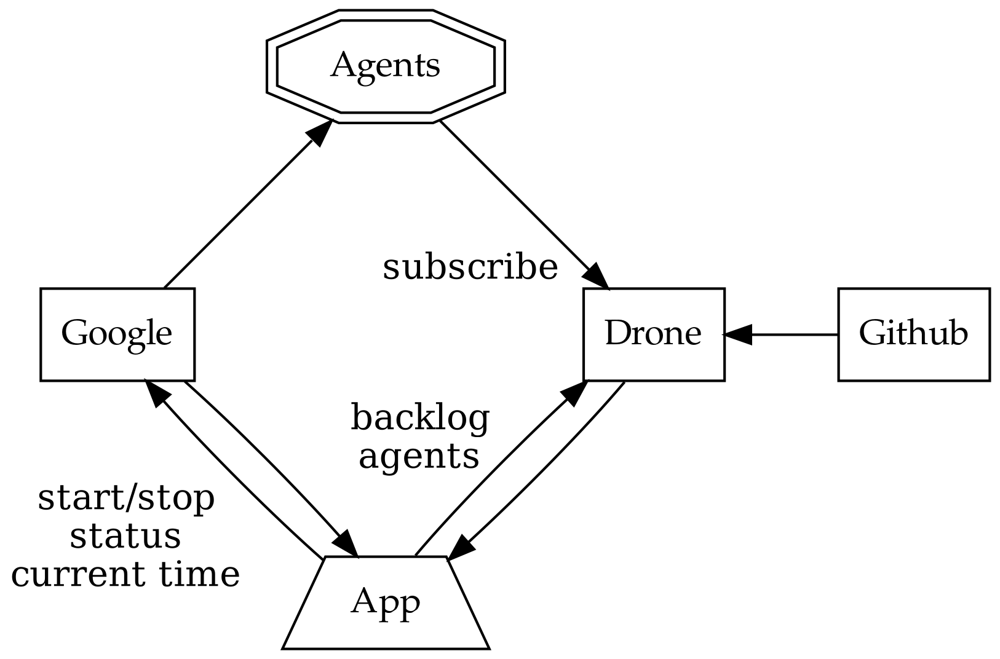

Drone receives work when a contributor submits a github pull request
to a managed project. Drone assigns the work to its agents, each
processing one job at a time.

The goal of our app is to ensure that there are enough agents to
complete the work, with a cap on the number of agents, whilst
minimising the total cost. Our app needs to know the number of items
in the *backlog* and the number of available *agents*.

Google can spawn *nodes*, each can host multiple drone agents. When an
agent starts up, it registers itself with drone and drone takes care
of the lifecycle (including keep-alive calls to detect removed
agents).

GKE charges a fee per minute of uptime, rounded up to the nearest hour
for each node. One does not simply spawn a new node for each job in
the work queue, we must re-use nodes and retain them until their 58th
minute to get the most value for money.

Our app needs to be able to start and stop nodes, as well as check
their status (e.g. uptimes, list of inactive nodes) and to know what
time GKE believes it to be.

In addition, there is no API to talk directly to an *agent* so we do
not know if any individual agent is performing any work for the drone
server. If we accidentally stop an agent whilst it is performing work,
it is inconvenient and requires a human to restart the job.

Contributors can manually add agents to the farm, so counting agents
and nodes is not equivalent. We don't need to supply any nodes if
there are agents available.

The failure mode should always be to take the least costly option.

Both Drone and GKE have a JSON over REST API with OAuth 2.0
authentication.

## Interfaces / Algebras

We will now codify the architecture diagram from the previous section. Firstly,
we need to define a simple data type to capture a millisecond timestamp because
such a simple thing does not exist in either the Java or Scala standard
libraries:

{lang="text"}
~~~~~~~~
  import scala.concurrent.duration._
  
  final case class Epoch(millis: Long) extends AnyVal {
    def +(d: FiniteDuration): Epoch = Epoch(millis + d.toMillis)
    def -(e: Epoch): FiniteDuration = (millis - e.millis).millis
  }
~~~~~~~~

In FP, an *algebra* takes the place of an `interface` in Java, or the
set of valid messages for an `Actor` in Akka. This is the layer where
we define all side-effecting interactions of our system.

There is tight iteration between writing the business logic and the
algebra: it is a good level of abstraction to design a system.

{lang="text"}
~~~~~~~~
  trait Drone[F[_]] {
    def getBacklog: F[Int]
    def getAgents: F[Int]
  }
  
  final case class MachineNode(id: String)
  trait Machines[F[_]] {
    def getTime: F[Epoch]
    def getManaged: F[NonEmptyList[MachineNode]]
    def getAlive: F[Map[MachineNode, Epoch]]
    def start(node: MachineNode): F[MachineNode]
    def stop(node: MachineNode): F[MachineNode]
  }
~~~~~~~~

We've used `NonEmptyList`, easily created by calling `.toNel` on the
stdlib's `List` (returning an `Option[NonEmptyList]`), otherwise
everything should be familiar.

A> It is good practice in FP to encode constraints in parameters **and** return types
A> --- it means we never need to handle situations that are impossible. However,
A> this often conflicts with *Postel's law* "be liberal in what you accept from
A> others".
A> 
A> Although we agree that parameters should be as general as possible, we do not
A> agree that a function should take `Seq` unless it can handle empty `Seq`,
A> otherwise the only course of action would be to exception, breaking totality and
A> causing a side effect.
A> 
A> We prefer `NonEmptyList`, not because it is a `List`, but because of its
A> non-empty property.

## Business Logic

Now we write the business logic that defines the application's
behaviour, considering only the happy path.

We need a `WorldView` class to hold a snapshot of our knowledge of the
world. If we were designing this application in Akka, `WorldView`
would probably be a `var` in a stateful `Actor`.

`WorldView` aggregates the return values of all the methods in the
algebras, and adds a *pending* field to track unfulfilled requests.

{lang="text"}
~~~~~~~~
  final case class WorldView(
    backlog: Int,
    agents: Int,
    managed: NonEmptyList[MachineNode],
    alive: Map[MachineNode, Epoch],
    pending: Map[MachineNode, Epoch],
    time: Epoch
  )
~~~~~~~~

Now we are ready to write our business logic, but we need to indicate
that we depend on `Drone` and `Machines`.

We can write the interface for the business logic

{lang="text"}
~~~~~~~~
  trait DynAgents[F[_]] {
    def initial: F[WorldView]
    def update(old: WorldView): F[WorldView]
    def act(world: WorldView): F[WorldView]
  }
~~~~~~~~

and implement it with a *module*. A module depends only on other modules,
algebras and pure functions, and can be abstracted over `F`. If an
implementation of an algebraic interface is tied to a specific type, e.g. `IO`,
it is called an *interpreter*.

{lang="text"}
~~~~~~~~
  final class DynAgentsModule[F[_]: Monad](D: Drone[F], M: Machines[F])
    extends DynAgents[F] {
~~~~~~~~

The `Monad` context bound means that `F` is *monadic*, allowing us to use `map`,
`pure` and, of course, `flatMap` via `for` comprehensions.

We have access to the algebra of `Drone` and `Machines` as `D` and `M`,
respectively. Using a single capital letter name is a common naming convention
for monad and algebra implementations.

Our business logic will run in an infinite loop (pseudocode)

{lang="text"}
~~~~~~~~
  state = initial()
  while True:
    state = update(state)
    state = act(state)
~~~~~~~~

### initial

In `initial` we call all external services and aggregate their results
into a `WorldView`. We default the `pending` field to an empty `Map`.

{lang="text"}
~~~~~~~~
  def initial: F[WorldView] = for {
    db <- D.getBacklog
    da <- D.getAgents
    mm <- M.getManaged
    ma <- M.getAlive
    mt <- M.getTime
  } yield WorldView(db, da, mm, ma, Map.empty, mt)
~~~~~~~~

Recall from Chapter 1 that `flatMap` (i.e. when we use the `<-`
generator) allows us to operate on a value that is computed at
runtime. When we return an `F[_]` we are returning another program to
be interpreted at runtime, that we can then `flatMap`. This is how we
safely chain together sequential side-effecting code, whilst being
able to provide a pure implementation for tests. FP could be described
as Extreme Mocking.

### update

`update` should call `initial` to refresh our world view, preserving
known `pending` actions.

If a node has changed state, we remove it from `pending` and if a
pending action is taking longer than 10 minutes to do anything, we
assume that it failed and forget that we asked to do it.

{lang="text"}
~~~~~~~~
  def update(old: WorldView): F[WorldView] = for {
    snap <- initial
    changed = symdiff(old.alive.keySet, snap.alive.keySet)
    pending = (old.pending -- changed).filterNot {
      case (_, started) => (snap.time - started) >= 10.minutes
    }
    update = snap.copy(pending = pending)
  } yield update
  
  private def symdiff[T](a: Set[T], b: Set[T]): Set[T] =
    (a union b) -- (a intersect b)
~~~~~~~~

Concrete functions like `.symdiff` don't need test interpreters, they have
explicit inputs and outputs, so we could move all pure code into standalone
methods on a stateless `object`, testable in isolation. We're happy testing only
the public methods, preferring that our business logic is easy to read.

### act

The `act` method is slightly more complex, so we will split it into two
parts for clarity: detection of when an action needs to be taken,
followed by taking action. This simplification means that we can only
perform one action per invocation, but that is reasonable because we
can control the invocations and may choose to re-run `act` until no
further action is taken.

We write the scenario detectors as extractors for `WorldView`, which
is nothing more than an expressive way of writing `if` / `else`
conditions.

We need to add agents to the farm if there is a backlog of work, we
have no agents, we have no nodes alive, and there are no pending
actions. We return a candidate node that we would like to start:

{lang="text"}
~~~~~~~~
  private object NeedsAgent {
    def unapply(world: WorldView): Option[MachineNode] = world match {
      case WorldView(backlog, 0, managed, alive, pending, _)
           if backlog > 0 && alive.isEmpty && pending.isEmpty
             => Option(managed.head)
      case _ => None
    }
  }
~~~~~~~~

If there is no backlog, we should stop all nodes that have become stale (they
are not doing any work). However, since Google charge per hour we only shut down
machines in their 58th minute to get the most out of our money. We return the
non-empty list of nodes to stop.

As a financial safety net, all nodes should have a maximum lifetime of
5 hours.

{lang="text"}
~~~~~~~~
  private object Stale {
    def unapply(world: WorldView): Option[NonEmptyList[MachineNode]] = world match {
      case WorldView(backlog, _, _, alive, pending, time) if alive.nonEmpty =>
        (alive -- pending.keys).collect {
          case (n, started) if backlog == 0 && (time - started).toMinutes % 60 >= 58 => n
          case (n, started) if (time - started) >= 5.hours => n
        }.toList.toNel
  
      case _ => None
    }
  }
~~~~~~~~

Now that we have detected the scenarios that can occur, we can write
the `act` method. When we schedule a node to be started or stopped, we
add it to `pending` noting the time that we scheduled the action.

{lang="text"}
~~~~~~~~
  def act(world: WorldView): F[WorldView] = world match {
    case NeedsAgent(node) =>
      for {
        _ <- M.start(node)
        update = world.copy(pending = Map(node -> world.time))
      } yield update
  
    case Stale(nodes) =>
      nodes.foldLeftM(world) { (world, n) =>
        for {
          _ <- M.stop(n)
          update = world.copy(pending = world.pending + (n -> world.time))
        } yield update
      }
  
    case _ => world.pure[F]
  }
~~~~~~~~

Because `NeedsAgent` and `Stale` do not cover all possible situations,
we need a catch-all `case _` to do nothing. Recall from Chapter 2 that
`.pure` creates the `for`'s (monadic) context from a value.

`.foldLeftM` is like `.foldLeft`, but each iteration of the fold may return a
monadic value. In our case, each iteration of the fold returns `F[WorldView]`.
The `M` is for Monadic. We will find more of these *lifted* methods that behave
as one would expect, taking monadic values in place of values.

## Unit Tests

The FP approach to writing applications is a designer's dream: delegate writing
the implementations of algebras to team members while focusing on making
business logic meet the requirements.

Our application is highly dependent on timing and third party webservices. If
this was a traditional OOP application, we'd create mocks for all the method
calls, or test actors for the outgoing mailboxes. FP mocking is equivalent to
providing an alternative implementation of dependency algebras. The algebras
already isolate the parts of the system that need to be *mocked*, i.e.
interpreted differently in the unit tests.

We will start with some test data

{lang="text"}
~~~~~~~~
  object Data {
    val node1   = MachineNode("1243d1af-828f-4ba3-9fc0-a19d86852b5a")
    val node2   = MachineNode("550c4943-229e-47b0-b6be-3d686c5f013f")
    val managed = NonEmptyList.of(node1, node2)
  
    val time1: Epoch = epoch"2017-03-03T18:07:00Z"
    val time2: Epoch = epoch"2017-03-03T18:59:00Z" // +52 mins
    val time3: Epoch = epoch"2017-03-03T19:06:00Z" // +59 mins
    val time4: Epoch = epoch"2017-03-03T23:07:00Z" // +5 hours
  
    val needsAgents = WorldView(5, 0, managed, Map.empty, Map.empty, time1)
  }
  import Data._
~~~~~~~~

A> The `epoch` string interpolator is written with Jon Pretty's [contextual](https://github.com/propensive/contextual) library,
A> giving us compiletime safety around string constructors of a type:
A> 
A> {lang="text"}
A> ~~~~~~~~
A>   import java.time.Instant
A>   object EpochInterpolator extends Verifier[Epoch] {
A>     def check(s: String): Either[(Int, String), Epoch] =
A>       try Right(Epoch(Instant.parse(s).toEpochMilli))
A>       catch { case _ => Left((0, "not in ISO-8601 format")) }
A>   }
A>   implicit class EpochMillisStringContext(sc: StringContext) {
A>     val epoch = Prefix(EpochInterpolator, sc)
A>   }
A> ~~~~~~~~

We implement algebras by extending `Drone` and `Machines` with a specific
monadic context, `Id` being the simplest.

Our "mock" implementations simply play back a fixed `WorldView`. We've
isolated the state of our system, so we can use `var` to store the
state:

{lang="text"}
~~~~~~~~
  class Mutable(state: WorldView) {
    var started, stopped: Int = 0
  
    private val D: Drone[Id] = new Drone[Id] {
      def getBacklog: Int = state.backlog
      def getAgents: Int = state.agents
    }
  
    private val M: Machines[Id] = new Machines[Id] {
      def getAlive: Map[MachineNode, Epoch] = state.alive
      def getManaged: NonEmptyList[MachineNode] = state.managed
      def getTime: Epoch = state.time
      def start(node: MachineNode): MachineNode = { started += 1 ; node }
      def stop(node: MachineNode): MachineNode = { stopped += 1 ; node }
    }
  
    val program = new DynAgentsModule[Id](D, M)
  }
~~~~~~~~

A> We will return to this code later on and replace `var` with something safer.

When we write a unit test (here using `FlatSpec` from Scalatest), we create an
instance of `Mutable` and then import all of its members.

Our implicit `drone` and `machines` both use the `Id` execution
context and therefore interpreting this program with them returns an
`Id[WorldView]` that we can assert on.

In this trivial case we just check that the `initial` method returns
the same value that we use in the static implementations:

{lang="text"}
~~~~~~~~
  "Business Logic" should "generate an initial world view" in {
    val mutable = new Mutable(needsAgents)
    import mutable._
  
    program.initial shouldBe needsAgents
  }
~~~~~~~~

We can create more advanced tests of the `update` and `act` methods,
helping us flush out bugs and refine the requirements:

{lang="text"}
~~~~~~~~
  it should "remove changed nodes from pending" in {
    val world = WorldView(0, 0, managed, Map(node1 -> time3), Map.empty, time3)
    val mutable = new Mutable(world)
    import mutable._
  
    val old = world.copy(alive = Map.empty,
                         pending = Map(node1 -> time2),
                         time = time2)
    program.update(old) shouldBe world
  }
  
  it should "request agents when needed" in {
    val mutable = new Mutable(needsAgents)
    import mutable._
  
    val expected = needsAgents.copy(
      pending = Map(node1 -> time1)
    )
  
    program.act(needsAgents) shouldBe expected
  
    mutable.stopped shouldBe 0
    mutable.started shouldBe 1
  }
~~~~~~~~

It would be boring to go through the full test suite. The following tests are
easy to implement using the same approach:

-   not request agents when pending
-   don't shut down agents if nodes are too young
-   shut down agents when there is no backlog and nodes will shortly incur new costs
-   not shut down agents if there are pending actions
-   shut down agents when there is no backlog if they are too old
-   shut down agents, even if they are potentially doing work, if they are too old
-   ignore unresponsive pending actions during update

All of these tests are synchronous and isolated to the test runner's
thread (which could be running tests in parallel). If we'd designed
our test suite in Akka, our tests would be subject to arbitrary
timeouts and failures would be hidden in logfiles.

The productivity boost of simple tests for business logic cannot be
overstated. Consider that 90% of an application developer's time
interacting with the customer is in refining, updating and fixing
these business rules. Everything else is implementation detail.

## Parallel

The application that we have designed runs each of its algebraic
methods sequentially. But there are some obvious places where work can
be performed in parallel.

### initial

In our definition of `initial` we could ask for all the information we
need at the same time instead of one query at a time.

As opposed to `flatMap` for sequential operations, Cats uses
`Semigroupal` syntax for parallel operations:

{lang="text"}
~~~~~~~~
  (D.getBacklog, D.getAgents, M.getManaged, M.getAlive, M.getTime).mapN(...)
~~~~~~~~

If each of the parallel operations returns a value in the same monadic
context, we can apply a function to the results when they all return.
Rewriting `initial` to take advantage of this:

{lang="text"}
~~~~~~~~
  def initial: F[WorldView] =
    (D.getBacklog, D.getAgents, M.getManaged, M.getAlive, M.getTime).mapN {
      case (db, da, mm, ma, mt) => WorldView(db, da, mm, ma, Map.empty, mt)
    }
~~~~~~~~

A> We are cheating somewhat in the way that this has been presented. We will return
A> later to add one last piece of the puzzle, ensuring that the operations
A> definitely run in `Parallel`.

### act

In the current logic for `act`, we are stopping each node
sequentially, waiting for the result, and then proceeding. But we
could stop all the nodes in parallel and then update our view of the
world.

A disadvantage of doing it this way is that any failures will cause us
to short-circuit before updating the `pending` field. But that is a
reasonable tradeoff since our `update` will gracefully handle the case
where a `node` is shut down unexpectedly.

We need a method that operates on `NonEmptyList` that allows us to
`.map` each element into an `F[MachineNode]`, returning an
`F[NonEmptyList[MachineNode]]`. The method is called `.traverse`, and
when we `.flatMap` over it we get a `NonEmptyList[MachineNode]` that we
can deal with in a simple way:

{lang="text"}
~~~~~~~~
  for {
    stopped <- nodes.traverse(M.stop)
    updates = stopped.map(_ -> world.time).toList.toMap
    update = world.copy(pending = world.pending ++ updates)
  } yield update
~~~~~~~~

Arguably, this is easier to understand than the sequential version.

## Summary

1.  *algebras* define the interface between systems.
2.  *modules* are implementations of an algebra in terms of other algebras.
3.  *interpreters* are concrete implementations of an algebra for a fixed `F[_]`.
4.  Test interpreters can replace the side-effecting parts of the system,
    giving a high amount of test coverage.

# Data and Functionality

From OOP we are used to thinking about data and functionality
together: class hierarchies carry methods, and traits can demand that
data fields exist. Runtime polymorphism of an object is in terms of
"is a" relationships, requiring classes to inherit from common
interfaces. This can get messy as a codebase grows. Simple data types
become obscured by hundreds of lines of methods, trait mixins suffer
from initialisation order errors, and testing / mocking of highly
coupled components becomes a chore.

FP takes a different approach, defining data and functionality
separately. In this chapter, we will cover the basics of data types
and the advantages of constraining ourselves to a subset of the Scala
language. We will also discover *typeclasses* as a way to achieve
compiletime polymorphism: thinking about functionality of a data
structure in terms of "has a" rather than "is a" relationships.

## Data

The fundamental building blocks of data types are

-   `final case class` also known as *products*
-   `sealed abstract class` also known as *coproducts*
-   `case object` and `Int`, `Double`, `String` (etc) *values*

with no methods or fields other than the constructor parameters. We prefer
`abstract class` to `trait` in order to get better binary compatibility and to
discourage trait mixing.

The collective name for *products*, *coproducts* and *values* is
*Algebraic Data Type* (ADT).

We compose data types from the `AND` and `XOR` (exclusive `OR`)
Boolean algebra: a product contains every type that it is composed of,
but a coproduct can be only one. For example

-   product: `ABC = a AND b AND c`
-   coproduct: `XYZ = x XOR y XOR z`

written in Scala

{lang="text"}
~~~~~~~~
  // values
  case object A
  type B = String
  type C = Int
  
  // product
  final case class ABC(a: A.type, b: B, c: C)
  
  // coproduct
  sealed abstract class XYZ
  case object X extends XYZ
  case object Y extends XYZ
  final case class Z(b: B) extends XYZ
~~~~~~~~

### Recursive ADTs

When an ADT refers to itself, we call it a *Recursive Algebraic Data Type*.

The standard library `List` is recursive because `::` (the cons cell) contains a
reference to `List`. The following is a simplification of the actual
implementation:

{lang="text"}
~~~~~~~~
  sealed abstract class List[+A]
  case object Nil extends List[Nothing]
  final case class ::[+A](head: A, tail: List[A]) extends List[A]
~~~~~~~~

### Functions on ADTs

ADTs can contain *pure functions*

{lang="text"}
~~~~~~~~
  final case class UserConfiguration(accepts: Int => Boolean)
~~~~~~~~

But ADTs that contain functions come with some caveats as they don't translate
perfectly onto the JVM. For example, legacy `Serializable`, `.hashCode`,
`.equals` and `.toString` do not behave as one might reasonably expect.

Unfortunately, `Serializable` is used by popular frameworks, despite
far superior alternatives. A common pitfall is forgetting that
`Serializable` may attempt to serialise the entire closure of a
function, which can crash production servers. A similar caveat applies
to legacy Java classes such as `Throwable`, which can carry references
to arbitrary objects.

We will explore alternatives to the legacy methods when we discuss the
Cats library in the next chapter, at the cost of losing
interoperability with some legacy Java and Scala code.

### Exhaustivity

It is important that we use `sealed abstract class`, not just
`abstract class`, when defining a data type. Sealing a `class` means
that all subtypes must be defined in the same file, allowing the
compiler to know about them in pattern match exhaustivity checks and
in macros that eliminate boilerplate. e.g.

{lang="text"}
~~~~~~~~
  scala> sealed abstract class Foo
         final case class Bar(flag: Boolean) extends Foo
         final case object Baz extends Foo
  
  scala> def thing(foo: Foo) = foo match {
           case Bar(_) => true
         }
  <console>:14: error: match may not be exhaustive.
  It would fail on the following input: Baz
         def thing(foo: Foo) = foo match {
                               ^
~~~~~~~~

This shows the developer what they have broken when they add a new
product to the codebase. We're using `-Xfatal-warnings`, otherwise
this is just a warning.

However, the compiler will not perform exhaustivity checking if the
`class` is not sealed or if there are guards, e.g.

{lang="text"}
~~~~~~~~
  scala> def thing(foo: Foo) = foo match {
           case Bar(flag) if flag => true
         }
  
  scala> thing(Baz)
  scala.MatchError: Baz (of class Baz$)
    at .thing(<console>:15)
~~~~~~~~

To remain safe, don't use guards on `sealed` types.

The [`-Xstrict-patmat-analysis`](https://github.com/scala/scala/pull/5617) flag has been proposed as a language
improvement to perform additional pattern matcher checks.

### Alternative Products and Coproducts

Another form of product is a tuple, which is like an unlabelled `final
case class`.

`(A.type, B, C)` is equivalent to `ABC` in the above example but it is best to
use `final case class` when part of an ADT because the lack of names is awkward
to deal with, and `case class` has much better performance for primitive values.

Another form of coproduct is when we nest `Either` types. e.g.

{lang="text"}
~~~~~~~~
  Either[X.type, Either[Y.type, Z]]
~~~~~~~~

equivalent to the `XYZ` sealed abstract class. A cleaner syntax to define
nested `Either` types is to create an alias type ending with a colon,
allowing infix notation with association from the right:

{lang="text"}
~~~~~~~~
  type |:[L,R] = Either[L, R]
  
  X.type |: Y.type |: Z
~~~~~~~~

This is useful to create anonymous coproducts when we cannot put all
the implementations into the same source file.

{lang="text"}
~~~~~~~~
  type Accepted = String |: Long |: Boolean
~~~~~~~~

Yet another alternative coproduct is to create a custom `sealed abstract class`
with `final case class` definitions that simply wrap the desired type:

{lang="text"}
~~~~~~~~
  sealed abstract class Accepted
  final case class AcceptedString(value: String) extends Accepted
  final case class AcceptedLong(value: Long) extends Accepted
  final case class AcceptedBoolean(value: Boolean) extends Accepted
~~~~~~~~

Pattern matching on these forms of coproduct can be tedious, which is why [Union
Types](https://contributors.scala-lang.org/t/733) are a Scala 3 language feature.

### Convey Information

Besides being a container for necessary business information, data
types can be used to encode constraints. For example,

{lang="text"}
~~~~~~~~
  final case class NonEmptyList[A](head: A, tail: List[A])
~~~~~~~~

can never be empty. This makes `cats.data.NonEmptyList` a useful data type despite
containing the same information as `List`.

Product types often contain types that are far more general than is allowed. In
traditional OOP this would be handled with input validation through assertions:

{lang="text"}
~~~~~~~~
  final case class Person(name: String, age: Int) {
    require(name.nonEmpty && age > 0) // breaks Totality, don't do this!
  }
~~~~~~~~

Instead, we can use the `Either` data type to provide `Right[Person]` for valid
instances and protect invalid instances from propagating. Note that the
constructor is `private`:

{lang="text"}
~~~~~~~~
  final case class Person private(name: String, age: Int)
  object Person {
    def apply(name: String, age: Int): Either[String, Person] = {
      if (name.nonEmpty && age > 0) Right(new Person(name, age))
      else Left(s"bad input: $name, $age")
    }
  }
  
  def welcome(person: Person): String =
    s"${person.name} you look wonderful at ${person.age}!"
  
  for {
    person <- Person("", -1)
  } yield welcome(person)
~~~~~~~~

#### Refined Data Types

A clean way to restrict the values of a general type is with the `refined`
library, providing a suite of restrictions to the contents of data. To install
refined, add the following to `build.sbt`

{lang="text"}
~~~~~~~~
  libraryDependencies += "eu.timepit" %% "refined-cats" % "0.9.13"
~~~~~~~~

and the following imports

{lang="text"}
~~~~~~~~
  import eu.timepit.refined
  import refined.api.Refined
~~~~~~~~

`Refined` allows us to define `Person` using adhoc refined types to capture
requirements exactly, written `A Refined B`.

A> All types with two parameters can be written *infix* in Scala. For example,
A> `Either[String, Int]` is the same as `String Either Int`. It is conventional for
A> `Refined` to be written infix since `A Refined B` can be read as "an `A` that
A> meets the requirements defined in `B`".

{lang="text"}
~~~~~~~~
  import refined.numeric.Positive
  import refined.collection.NonEmpty
  
  final case class Person(
    name: String Refined NonEmpty,
    age: Int Refined Positive
  )
~~~~~~~~

The underlying value can be obtained with `.value`. We can construct a
value at runtime using `.refineV`, returning an `Either`

{lang="text"}
~~~~~~~~
  scala> import refined.refineV
  scala> refineV[NonEmpty]("")
  Left(Predicate isEmpty() did not fail.)
  
  scala> refineV[NonEmpty]("Zara")
  Right(Zara)
~~~~~~~~

If we add the following import

{lang="text"}
~~~~~~~~
  import refined.auto._
~~~~~~~~

we can construct valid values at compiletime and get an error if the provided
value does not meet the requirements

{lang="text"}
~~~~~~~~
  scala> val sam: String Refined NonEmpty = "Zara"
  Zara
  
  scala> val empty: String Refined NonEmpty = ""
  <console>:21: error: Predicate isEmpty() did not fail.
~~~~~~~~

More complex requirements can be captured, for example we can use the built-in
rule `MaxSize` with the following imports

{lang="text"}
~~~~~~~~
  import refined.W
  import refined.boolean.And
  import refined.collection.MaxSize
~~~~~~~~

capturing the requirement that the `String` must be both non-empty and have a
maximum size of 10 characters:

{lang="text"}
~~~~~~~~
  type Name = NonEmpty And MaxSize[W.`10`.T]
  
  final case class Person(
    name: String Refined Name,
    age: Int Refined Positive
  )
~~~~~~~~

A> The `W` notation is short for "witness". This syntax will be much simpler in
A> Scala 2.13, which has support for *literal types*:
A> 
A> {lang="text"}
A> ~~~~~~~~
A>   type Name = NonEmpty And MaxSize[10]
A> ~~~~~~~~

It is easy to define custom requirements that are not covered by the refined
library. For example in `drone-dynamaic-agents` we will need a way of ensuring
that a `String` contains `application/x-www-form-urlencoded` content. We can
create a `Refined` rule using the Java regular expression library:

{lang="text"}
~~~~~~~~
  sealed abstract class UrlEncoded
  object UrlEncoded {
    private[this] val valid: Pattern =
      Pattern.compile("\\A(\\p{Alnum}++|[-.*_+=&]++|%\\p{XDigit}{2})*\\z")
  
    implicit def urlValidate: Validate.Plain[String, UrlEncoded] =
      Validate.fromPredicate(
        s => valid.matcher(s).find(),
        identity,
        new UrlEncoded {}
      )
  }
~~~~~~~~

### Simple to Share

By not providing any functionality, ADTs can have a minimal set of
dependencies. This makes them easy to publish and share with other
developers. By using a simple data modelling language, it makes it
possible to interact with cross-discipline teams, such as DBAs, UI
developers and business analysts, using the actual code instead of a
hand written document as the source of truth.

Furthermore, tooling can be more easily written to produce or consume
schemas from other programming languages and wire protocols.

### Counting Complexity

The complexity of a data type is the count of values that can exist. A good data
type has the least amount of complexity it needs to hold the information it
conveys, and no more.

Values have a built-in complexity:

-   `Unit` has one value (why it is called "unit")
-   `Boolean` has two values
-   `Int` has 4,294,967,295 values
-   `String` has effectively infinite values

To find the complexity of a product, we multiply the complexity of
each part.

-   `(Boolean, Boolean)` has 4 values (`2*2`)
-   `(Boolean, Boolean, Boolean)` has 8 values (`2*2*2`)

To find the complexity of a coproduct, we add the complexity of each
part.

-   `(Boolean |: Boolean)` has 4 values (`2+2`)
-   `(Boolean |: Boolean |: Boolean)` has 6 values (`2+2+2`)

To find the complexity of a ADT with a type parameter, multiply each part by the
complexity of the type parameter:

-   `Option[Boolean]` has 3 values, `Some[Boolean]` and `None` (`2+1`)

In FP, functions are *total* and must return an value for every
input, no `Exception`. Minimising the complexity of inputs and outputs
is the best way to achieve totality. As a rule of thumb, it is a sign
of a badly designed function when the complexity of a function's
return value is larger than the product of its inputs: it is a source
of entropy.

The complexity of a total function is the number of possible functions that can
satisfy the type signature: the output to the power of the input.

-   `Unit => Boolean` has complexity 2
-   `Boolean => Boolean` has complexity 4
-   `Option[Boolean] => Option[Boolean]` has complexity 27
-   `Boolean => Int` is a mere quintillion going on a sextillion.
-   `Int => Boolean` is so big that if all implementations were assigned a unique
    number, each would require 4 gigabytes to represent.

In reality, `Int => Boolean` will be something simple like `isOdd`, `isEven` or
a sparse `BitSet`. This function, when used in an ADT, could be better replaced
with a coproduct labelling the limited set of functions that are relevant.

When our complexity is "infinity in, infinity out" we should introduce
restrictive data types and validation closer to the point of input with
`Refined` from the previous section.

The ability to count the complexity of a type signature has one other practical
application: we can find simpler type signatures with High School algebra! To go
from a type signature to its algebra of complexity, simply replace

-   `Either[A, B]` with `a + b`
-   `(A, B)` with `a * b`
-   `A => B` with `b ^ a`

do some rearranging, and convert back. For example, say we've designed a
framework based on callbacks and we've managed to work ourselves into the
situation where we have created this type signature:

{lang="text"}
~~~~~~~~
  (A => C) => ((B => C) => C)
~~~~~~~~

We can convert and rearrange

{lang="text"}
~~~~~~~~
  (c ^ (c ^ b)) ^ (c ^ a)
  = c ^ ((c ^ b) * (c ^ a))
  = c ^ (c ^ (a + b))
~~~~~~~~

then convert back to types and get

{lang="text"}
~~~~~~~~
  (Either[A, B] => C) => C
~~~~~~~~

which is much simpler: we only need to ask the users of our framework to provide
a `Either[A, B] => C`.

The same line of reasoning can be used to prove that

{lang="text"}
~~~~~~~~
  A => B => C
~~~~~~~~

is equivalent to

{lang="text"}
~~~~~~~~
  (A, B) => C
~~~~~~~~

also known as *Currying*.

### Prefer Coproduct over Product

An archetypal modelling problem that comes up a lot is when there are
mutually exclusive configuration parameters `a`, `b` and `c`. The
product `(a: Boolean, b: Boolean, c: Boolean)` has complexity 8
whereas the coproduct

{lang="text"}
~~~~~~~~
  sealed abstract class Config
  object Config {
    case object A extends Config
    case object B extends Config
    case object C extends Config
  }
~~~~~~~~

has a complexity of 3. It is better to model these configuration
parameters as a coproduct rather than allowing 5 invalid states to
exist.

The complexity of a data type also has implications on testing. It is
practically impossible to test every possible input to a function, but it is
easy to test a sample of values with the [Scalacheck](https://www.scalacheck.org/) property testing framework.
If a random sample of a data type has a low probability of being valid, it is a
sign that the data is modelled incorrectly.

### Optimisations

A big advantage of using a simplified subset of the Scala language to
represent data types is that tooling can optimise the JVM bytecode
representation.

For example, we could pack `Boolean` and `Option` fields into an `Array[Byte]`,
cache values, memoise `hashCode`, optimise `equals`, use `@switch` statements
when pattern matching, and much more.

These optimisations are not applicable to OOP `class` hierarchies that
may be managing state, throwing exceptions, or providing adhoc method
implementations.

### Example: Evaluation

Java is a *strict* evaluation language: all the parameters to a method
must be evaluated to a *value* before the method is called. Scala
introduces the notion of *by-name* parameters on methods with `a: =>A`
syntax. These parameters are wrapped up as a zero argument function
which is called every time the `a` is referenced.

Scala also has *by-need* evaluation of values, with the `lazy`
keyword: the computation is evaluated at most once to produce the
value. Unfortunately, Scala does not support *by-need* evaluation of
method parameters.

A> If the calculation of a `lazy val` throws an exception, it is retried
A> every time it is accessed. Because exceptions can break referential
A> transparency, we limit our discussion to `lazy val` calculations that
A> do not throw exceptions.

Cats formalises the three evaluation strategies with an ADT called `Eval`. The
following is a simplified version of the implementation:

{lang="text"}
~~~~~~~~
  sealed abstract class Eval[A] {
    def value: A
  }
  object Eval {
    def always(a: =>A): Eval[A] = Always(() => a)
    def later(a: =>A): Eval[A] = Later(() => a)
    def now(a: A): Eval[A] = Now(a)
  }
  final case class Always[A](f: () => A) extends Eval[A] {
    def value: A = f()
  }
  final case class Later[A](f: () => A)  extends Eval[A] {
    lazy val value: A = f
  }
  final case class Now[A](value: A)      extends Eval[A]
~~~~~~~~

The weakest form of evaluation is `Always`, giving no computational
guarantees. Next is `Later`, guaranteeing *at most once* evaluation,
whereas `Now` is pre-computed and therefore *exactly once*
evaluation.

When we write *pure programs*, we are free to replace any `Always` with
`Later` or `Now`, and vice versa, with no change to the correctness
of the program. This is the essence of *referential transparency*: the
ability to replace a computation by its value, or a value by its
computation.

In functional programming we almost always want `Now` or `Later`
(also known as *strict* and *lazy*): there is little value in `Always`.

A> *by-name* and *lazy* are not the free lunch they appear to be. When
A> Scala converts *by-name* parameters and `lazy val` into bytecode,
A> there is an object allocation overhead.
A> 
A> Before rewriting anything to use *by-name* parameters, or *lazy val* fields,
A> ensure that the cost of the overhead does not eclipse the saving. There is no
A> benefit unless there is the possibility of **not** evaluating. High performance
A> code that runs in a tight loop and always evaluates will suffer.

## Functionality

Pure functions are typically defined as methods on an `object`.

{lang="text"}
~~~~~~~~
  package object math {
    def sin(x: Double): Double = java.lang.Math.sin(x)
    ...
  }
  
  math.sin(1.0)
~~~~~~~~

However, it can be clunky to use `object` methods since it reads
inside-out, not left to right. In addition, a function on an `object`
steals the namespace. If we were to define `sin(t: T)` somewhere else
we get *ambiguous reference* errors. This is the same problem as
Java's static methods vs class methods.

W> The sort of developer who puts methods on a `trait`, requiring users to mix it
W> with the *cake pattern*, is going straight to hell. It leaks internal
W> implementation detail to public APIs, bloats bytecode, makes binary
W> compatibility basically impossible, and confuses IDE autocompleters.

With the `implicit class` language feature (also known as *extension
methodology* or *syntax*), and a little boilerplate, we can get the
familiar style:

{lang="text"}
~~~~~~~~
  scala> implicit class DoubleOps(x: Double) {
           def sin: Double = math.sin(x)
         }
  
  scala> (1.0).sin
  res: Double = 0.8414709848078965
~~~~~~~~

Often it is best to just skip the `object` definition and go straight
for an `implicit class`, keeping boilerplate to a minimum:

{lang="text"}
~~~~~~~~
  implicit class DoubleOps(x: Double) {
    def sin: Double = java.lang.Math.sin(x)
  }
~~~~~~~~

A> `implicit class` is syntax sugar for an implicit conversion:
A> 
A> {lang="text"}
A> ~~~~~~~~
A>   implicit def DoubleOps(x: Double): DoubleOps = new DoubleOps(x)
A>   class DoubleOps(x: Double) {
A>     def sin: Double = java.lang.Math.sin(x)
A>   }
A> ~~~~~~~~
A> 
A> Which unfortunately has a runtime cost: each time the extension method
A> is called, an intermediate `DoubleOps` will be constructed and then
A> thrown away. This can contribute to GC pressure in hotspots.
A> 
A> There is a slightly more verbose form of `implicit class` that avoids
A> the allocation and is therefore preferred:
A> 
A> {lang="text"}
A> ~~~~~~~~
A>   implicit final class DoubleOps(private val x: Double) extends AnyVal {
A>     def sin: Double = java.lang.Math.sin(x)
A>   }
A> ~~~~~~~~

### Polymorphic Functions

The more common kind of function is a polymorphic function, which
lives in a *typeclass*. A typeclass is a trait that:

-   holds no state
-   has a type parameter
-   has at least one abstract method (*primitive combinators*)
-   may contain *generalised* methods (*derived combinators*)
-   may extend other typeclasses

There can only be one implementation of a typeclass for any given type
parameter, a property known as *typeclass coherence*. Typeclasses look
superficially similar to algebraic interfaces from the previous chapter, but
algebras do not have to be coherent.

A> Typeclass coherence is primarily about consistency, and the consistency gives us
A> the confidence to use `implicit` parameters. It would be difficult to reason
A> about code that performs differently depending on the implicit imports that are
A> in scope. Typeclass coherence effectively says that imports should not impact
A> the behaviour of the code.
A> 
A> Additionally, typeclass coherence allows us to globally cache implicits at
A> runtime and save memory allocations, gaining performance improvements from
A> reduced pressure on the garbage collector.

Typeclasses are used in the Scala stdlib. We will explore a simplified
version of `scala.math.Numeric` to demonstrate the principle:

{lang="text"}
~~~~~~~~
  trait Ordering[T] {
    def compare(x: T, y: T): Int
  
    def lt(x: T, y: T): Boolean = compare(x, y) < 0
    def gt(x: T, y: T): Boolean = compare(x, y) > 0
  }
  
  trait Numeric[T] extends Ordering[T] {
    def plus(x: T, y: T): T
    def times(x: T, y: T): T
    def negate(x: T): T
    def zero: T
  
    def abs(x: T): T = if (lt(x, zero)) negate(x) else x
  }
~~~~~~~~

We can see all the key features of a typeclass in action:

-   there is no state
-   `Ordering` and `Numeric` have type parameter `T`
-   `Ordering` has abstract `compare` and `Numeric` has abstract `plus`,
    `times`, `negate` and `zero`
-   `Ordering` defines generalised `lt` and `gt` based on `compare`,
    `Numeric` defines `abs` in terms of `lt`, `negate` and `zero`.
-   `Numeric` extends `Ordering`

We can now write functions for types that "have a" `Numeric`
typeclass:

{lang="text"}
~~~~~~~~
  def signOfTheTimes[T](t: T)(implicit N: Numeric[T]): T = {
    import N._
    times(negate(abs(t)), t)
  }
~~~~~~~~

We are no longer dependent on the OOP hierarchy of our input types,
i.e. we don't demand that our input "is a" `Numeric`, which is vitally
important if we want to support a third party class that we cannot
redefine.

Another advantage of typeclasses is that the association of
functionality to data is at compiletime, as opposed to OOP runtime
dynamic dispatch.

For example, whereas the `List` class can only have one implementation
of a method, a typeclass method allows us to have a different
implementation depending on the `List` contents and therefore offload
work to compiletime instead of leaving it to runtime.

### Syntax

The syntax for writing `signOfTheTimes` is clunky, there are some
things we can do to clean it up.

Downstream users will prefer to see our method use *context bounds*,
since the signature reads cleanly as "takes a `T` that has a
`Numeric`"

{lang="text"}
~~~~~~~~
  def signOfTheTimes[T: Numeric](t: T): T = ...
~~~~~~~~

but now we have to use `implicitly[Numeric[T]]` everywhere. By
defining boilerplate on the companion of the typeclass

{lang="text"}
~~~~~~~~
  object Numeric {
    def apply[T](implicit numeric: Numeric[T]): Numeric[T] = numeric
  }
~~~~~~~~

we can obtain the implicit with less noise

{lang="text"}
~~~~~~~~
  def signOfTheTimes[T: Numeric](t: T): T = {
    val N = Numeric[T]
    import N._
    times(negate(abs(t)), t)
  }
~~~~~~~~

But it is still worse for us as the implementors. We have the
syntactic problem of inside-out static methods vs class methods. We
deal with this by introducing `ops` on the typeclass companion:

{lang="text"}
~~~~~~~~
  object Numeric {
    def apply[T](implicit numeric: Numeric[T]): Numeric[T] = numeric
  
    object ops {
      implicit class NumericOps[T](t: T)(implicit N: Numeric[T]) {
        def +(o: T): T = N.plus(t, o)
        def *(o: T): T = N.times(t, o)
        def unary_-: T = N.negate(t)
        def abs: T = N.abs(t)
  
        // duplicated from Ordering.ops
        def <(o: T): T = N.lt(t, o)
        def >(o: T): T = N.gt(t, o)
      }
    }
  }
~~~~~~~~

Note that `-x` is expanded into `x.unary_-` by the compiler's syntax
sugar, which is why we define `unary_-` as an extension method. We can
now write the much cleaner:

{lang="text"}
~~~~~~~~
  import Numeric.ops._
  def signOfTheTimes[T: Numeric](t: T): T = -(t.abs) * t
~~~~~~~~

The good news is that we never need to write this boilerplate because [Typelevel
Simulacrum](https://github.com/mpilquist/simulacrum) provides a `@typeclass` macro annotation that automatically generates
the `.apply` and `.ops`. It even allows us to define alternative (usually
symbolic) names for common methods. In full:

{lang="text"}
~~~~~~~~
  import simulacrum._
  
  @typeclass trait Ordering[T] {
    def compare(x: T, y: T): Int
    @op("<") def lt(x: T, y: T): Boolean = compare(x, y) < 0
    @op(">") def gt(x: T, y: T): Boolean = compare(x, y) > 0
  }
  
  @typeclass trait Numeric[T] extends Ordering[T] {
    @op("+") def plus(x: T, y: T): T
    @op("*") def times(x: T, y: T): T
    @op("unary_-") def negate(x: T): T
    def zero: T
    def abs(x: T): T = if (lt(x, zero)) negate(x) else x
  }
  
  import Numeric.ops._
  def signOfTheTimes[T: Numeric](t: T): T = -(t.abs) * t
~~~~~~~~

When there is a custom symbolic `@op`, it can be pronounced like its method
name. e.g. `<` is pronounced "less than", not "left angle bracket".

### Instances

*Instances* of `Numeric` (which are also instances of `Ordering`) are
defined as an `implicit val` that extends the typeclass, and can
provide optimised implementations for the generalised methods:

{lang="text"}
~~~~~~~~
  implicit val NumericDouble: Numeric[Double] = new Numeric[Double] {
    def plus(x: Double, y: Double): Double = x + y
    def times(x: Double, y: Double): Double = x * y
    def negate(x: Double): Double = -x
    def zero: Double = 0.0
    def compare(x: Double, y: Double): Int = java.lang.Double.compare(x, y)
  
    // optimised
    override def lt(x: Double, y: Double): Boolean = x < y
    override def gt(x: Double, y: Double): Boolean = x > y
    override def abs(x: Double): Double = java.lang.Math.abs(x)
  }
~~~~~~~~

Although we are using `+`, `*`, `unary_-`, `<` and `>` here, which are
the ops (and could be an infinite loop!), these methods exist already
on `Double`. Class methods are always used in preference to extension
methods. Indeed, the Scala compiler performs special handling of
primitives and converts these method calls into raw `dadd`, `dmul`,
`dcmpl` and `dcmpg` bytecode instructions, respectively.

We can also implement `Numeric` for Java's `BigDecimal` class.

{lang="text"}
~~~~~~~~
  import java.math.{ BigDecimal => BD }
  
  implicit val NumericBD: Numeric[BD] = new Numeric[BD] {
    def plus(x: BD, y: BD): BD = x.add(y)
    def times(x: BD, y: BD): BD = x.multiply(y)
    def negate(x: BD): BD = x.negate
    def zero: BD = BD.ZERO
    def compare(x: BD, y: BD): Int = x.compareTo(y)
  }
~~~~~~~~

We could create our own data structure for complex numbers:

{lang="text"}
~~~~~~~~
  final case class Complex[T](r: T, i: T)
~~~~~~~~

And derive a `Numeric[Complex[T]]` if `Numeric[T]` exists. Since these
instances depend on the type parameter, it is a `def`, not a `val`.

{lang="text"}
~~~~~~~~
  implicit def numericComplex[T: Numeric]: Numeric[Complex[T]] =
    new Numeric[Complex[T]] {
      type CT = Complex[T]
      def plus(x: CT, y: CT): CT = Complex(x.r + y.r, x.i + y.i)
      def times(x: CT, y: CT): CT =
        Complex(x.r * y.r + (-x.i * y.i), x.r * y.i + x.i * y.r)
      def negate(x: CT): CT = Complex(-x.r, -x.i)
      def zero: CT = Complex(Numeric[T].zero, Numeric[T].zero)
      def compare(x: CT, y: CT): Int = {
        val real = (Numeric[T].compare(x.r, y.r))
        if (real != 0) real
        else Numeric[T].compare(x.i, y.i)
      }
    }
~~~~~~~~

The observant reader may notice that `abs` is not at all what a
mathematician would expect. The correct return value for `abs` should
be `T`, not `Complex[T]`.

`scala.math.Numeric` tries to do too much and does not generalise
beyond real numbers. This is a good lesson that smaller, well defined,
typeclasses are often better than a monolithic collection of overly
specific features.

### Implicit Resolution

We've discussed implicits a lot: this section is to clarify what
implicits are and how they work.

*Implicit parameters* are when a method requests that a unique
instance of a particular type is in the *implicit scope* of the
caller, with special syntax for typeclass instances. Implicit
parameters are a clean way to thread configuration through an
application.

In this example, `foo` requires that typeclass instances of `Numeric` and
`Typeable` are available for `A`, as well as an implicit `Handler` object that
takes two type parameters

{lang="text"}
~~~~~~~~
  def foo[A: Numeric: Typeable](implicit A: Handler[String, A]) = ...
~~~~~~~~

*Implicit conversion* is when an `implicit def` exists. One such use
of implicit conversions is to enable extension methodology. When the
compiler is resolving a call to a method, it first checks if the
method exists on the type, then its ancestors (Java-like rules). If it
fails to find a match, it will search the *implicit scope* for
conversions to other types, then search for methods on those types.

Another use for implicit conversions is *typeclass derivation*. In the
previous section we wrote an `implicit def` that derived a
`Numeric[Complex[T]]` if a `Numeric[T]` is in the implicit scope. It
is possible to chain together many `implicit def` (including
recursively) which is the basis of *typeful programming*, allowing for
computations to be performed at compiletime rather than runtime.

The glue that combines implicit parameters (receivers) with implicit
conversion (providers) is implicit resolution.

First, the normal variable scope is searched for implicits, in order:

-   local scope, including scoped imports (e.g. the block or method)
-   outer scope, including scoped imports (e.g. members in the class)
-   ancestors (e.g. members in the super class)
-   the current package object
-   ancestor package objects (when using nested packages)
-   the file's imports

If that fails to find a match, the special scope is searched, which
looks for implicit instances inside a type's companion, its package
object, outer objects (if nested), and then repeated for ancestors.
This is performed, in order, for the:

-   given parameter type
-   expected parameter type
-   type parameter (if there is one)

If two matching implicits are found in the same phase of implicit
resolution, an *ambiguous implicit* error is raised.

Implicits are often defined on a `trait`, which is then extended by an
object. This is to try and control the priority of an implicit
relative to another more specific one, to avoid ambiguous implicits.

The Scala Language Specification is rather vague for corner cases, and the
compiler implementation is the *de facto* standard. There are some rules of
thumb that we will use throughout this book, e.g. prefer `implicit val` over
`implicit object` despite the temptation of less typing. It is a [quirk of
implicit resolution](https://github.com/scala/bug/issues/8697) that `implicit object` on companion objects are not treated
the same as `implicit val`.

Implicit resolution falls short when there is a hierarchy of typeclasses, like
`Ordering` and `Numeric`. If we write a function that takes an implicit
`Ordering`, and we call it for a primitive type which has an instance of
`Numeric` defined on the `Numeric` companion, the compiler will fail to find it.

Implicit resolution is particularly hit-or-miss [if type aliases are used](https://github.com/scala/bug/issues/10582) where
the *shape* of the implicit parameters are changed. For example an implicit
parameter using an alias such as `type Values[A] = List[Option[A]]` will
probably fail to find implicits defined as raw `List[Option[A]]` because the
shape is changed from a *thing of things* of `A` to a *thing* of `A`.

## Modelling OAuth2

We will finish this chapter with a practical example of data modelling
and typeclass derivation, combined with algebra / module design from
the previous chapter.

In our `drone-dynamic-agents` application, we must communicate with Drone and
Google Cloud using JSON over REST. Both services use [OAuth2](https://tools.ietf.org/html/rfc6749) for authentication.
There are many ways to interpret OAuth2, but we will focus on the version that
works for Google Cloud (the Drone version is even simpler).

### Description

Every Google Cloud application needs to have an *OAuth 2.0 Client Key*
set up at

{lang="text"}
~~~~~~~~
  https://console.developers.google.com/apis/credentials?project={PROJECT_ID}
~~~~~~~~

Obtaining a *Client ID* and a *Client secret*.

The application can then obtain a one time *code* by making the user perform an
*Authorization Request* in their browser. We need to make this page open in the
browser:

{lang="text"}
~~~~~~~~
  https://accounts.google.com/o/oauth2/v2/auth?\
    redirect_uri={CALLBACK_URI}&\
    prompt=consent&\
    response_type=code&\
    scope={SCOPE}&\
    access_type=offline&\
    client_id={CLIENT_ID}
~~~~~~~~

The *code* is delivered to the `{CALLBACK_URI}` in a `GET` request. To
capture it in our application, we need to have a web server listening
on `localhost`.

Once we have the *code*, we can perform an *Access Token Request*:

{lang="text"}
~~~~~~~~
  POST /oauth2/v4/token HTTP/1.1
  Host: www.googleapis.com
  Content-length: {CONTENT_LENGTH}
  content-type: application/x-www-form-urlencoded
  user-agent: google-oauth-playground
  code={CODE}&\
    redirect_uri={CALLBACK_URI}&\
    client_id={CLIENT_ID}&\
    client_secret={CLIENT_SECRET}&\
    scope={SCOPE}&\
    grant_type=authorization_code
~~~~~~~~

which gives a JSON response payload

{lang="text"}
~~~~~~~~
  {
    "access_token": "BEARER_TOKEN",
    "token_type": "Bearer",
    "expires_in": 3600,
    "refresh_token": "REFRESH_TOKEN"
  }
~~~~~~~~

*Bearer tokens* typically expire after an hour, and can be refreshed
by sending an HTTP request with any valid *refresh token*:

{lang="text"}
~~~~~~~~
  POST /oauth2/v4/token HTTP/1.1
  Host: www.googleapis.com
  Content-length: {CONTENT_LENGTH}
  content-type: application/x-www-form-urlencoded
  user-agent: google-oauth-playground
  client_secret={CLIENT_SECRET}&
    grant_type=refresh_token&
    refresh_token={REFRESH_TOKEN}&
    client_id={CLIENT_ID}
~~~~~~~~

responding with

{lang="text"}
~~~~~~~~
  {
    "access_token": "BEARER_TOKEN",
    "token_type": "Bearer",
    "expires_in": 3600
  }
~~~~~~~~

All userland requests to the server should include the header

{lang="text"}
~~~~~~~~
  Authorization: Bearer BEARER_TOKEN
~~~~~~~~

after substituting the actual `BEARER_TOKEN`.

Google expires all but the most recent 50 *bearer tokens*, so the
expiry times are just guidance. The *refresh tokens* persist between
sessions and can be expired manually by the user. We can therefore
have a one-time setup application to obtain the refresh token and then
include the refresh token as configuration for the user's install of
the headless server.

Drone doesn't implement the `/auth` endpoint, or the refresh, and simply
provides a `BEARER_TOKEN` through their user interface.

### Data

The first step is to model the data needed for OAuth2. We create an ADT with
fields having exactly the same name as required by the OAuth2 server. We will
use `String` and `Long` for brevity, but we could use refined types if they leak
into our business models.

{lang="text"}
~~~~~~~~
  import refined.api.Refined
  import refined.string.Url
  
  final case class AuthRequest(
    redirect_uri: String Refined Url,
    scope: String,
    client_id: String,
    prompt: String = "consent",
    response_type: String = "code",
    access_type: String = "offline"
  )
  final case class AccessRequest(
    code: String,
    redirect_uri: String Refined Url,
    client_id: String,
    client_secret: String,
    scope: String = "",
    grant_type: String = "authorization_code"
  )
  final case class AccessResponse(
    access_token: String,
    token_type: String,
    expires_in: Long,
    refresh_token: String
  )
  final case class RefreshRequest(
    client_secret: String,
    refresh_token: String,
    client_id: String,
    grant_type: String = "refresh_token"
  )
  final case class RefreshResponse(
    access_token: String,
    token_type: String,
    expires_in: Long
  )
~~~~~~~~

W> Try to avoid using `java.net.URL`: it uses DNS to resolve the hostname part when
W> performing `.toString`, `.equals` or `.hashCode`.
W> 
W> Apart from being very slow, these methods can throw I/O exceptions (are not
W> *pure*), and can change depending on the network configuration (are not
W> *deterministic*).
W> 
W> The refined type `String Refined Url` allows us to perform equality checks based
W> on the `String` and we can safely construct a `URL` only if it is needed by a
W> legacy API.
W> 
W> That said, in high performance code we would prefer to skip `java.net.URL`
W> entirely and use a third party URL parser such as [jurl](https://github.com/anthonynsimon/jurl), because even the safe
W> parts of `java.net.*` are extremely slow at scale.

### Functionality

We need to marshal the data classes we defined in the previous section into
JSON, URLs and POST-encoded forms. Since this requires polymorphism, we will
need typeclasses.

`jsonformat` is a simple JSON library that we will study in more detail in a
later chapter for teaching purposes, we should use [Typelevel Circe](https://github.com/circe/circe) for
production systems.

`jsonformat` consists of a JSON AST and encoder / decoder typeclasses:

{lang="text"}
~~~~~~~~
  package jsonformat
  
  sealed abstract class JsValue
  final case object JsNull                                   extends JsValue
  final case class JsObject(fields: List[(String, JsValue)]) extends JsValue
  final case class JsArray(elements: List[JsValue])          extends JsValue
  final case class JsBoolean(value: Boolean)                 extends JsValue
  final case class JsString(value: String)                   extends JsValue
  final case class JsDouble(value: Double)                   extends JsValue
  final case class JsInteger(value: Long)                    extends JsValue
  
  @typeclass trait JsEncoder[A] {
    def toJson(obj: A): JsValue
  }
  
  @typeclass trait JsDecoder[A] {
    def fromJson(json: JsValue): Either[String, A]
  }
~~~~~~~~

We need instances of `JsDecoder[AccessResponse]` and `JsDecoder[RefreshResponse]`.
We can do this by making use of a helper function:

{lang="text"}
~~~~~~~~
  implicit class JsValueOps(j: JsValue) {
    def getAs[A: JsDecoder](key: String): Either[String, A] = ...
  }
~~~~~~~~

We put the instances on the companions of our data types, so that they are
always in the implicit scope:

{lang="text"}
~~~~~~~~
  import jsonformat._, JsDecoder.ops._
  
  object AccessResponse {
    implicit val json: JsDecoder[AccessResponse] = j =>
      for {
        acc <- j.getAs[String]("access_token")
        tpe <- j.getAs[String]("token_type")
        exp <- j.getAs[Long]("expires_in")
        ref <- j.getAs[String]("refresh_token")
      } yield AccessResponse(acc, tpe, exp, ref)
  }
  
  object RefreshResponse {
    implicit val json: JsDecoder[RefreshResponse] = j =>
      for {
        acc <- j.getAs[String]("access_token")
        tpe <- j.getAs[String]("token_type")
        exp <- j.getAs[Long]("expires_in")
      } yield RefreshResponse(acc, tpe, exp)
  }
~~~~~~~~

We can then parse a string into an `AccessResponse` or a `RefreshResponse`

{lang="text"}
~~~~~~~~
  scala> import jsonformat._, JsDecoder.ops._
  scala> val json = JsParser("""
                       {
                         "access_token": "BEARER_TOKEN",
                         "token_type": "Bearer",
                         "expires_in": 3600,
                         "refresh_token": "REFRESH_TOKEN"
                       }
                       """)
  
  scala> json.map(_.as[AccessResponse])
  AccessResponse(BEARER_TOKEN,Bearer,3600,REFRESH_TOKEN)
~~~~~~~~

We need to write our own typeclasses for URL and POST encoding. The
following is a reasonable design:

{lang="text"}
~~~~~~~~
  // URL query key=value pairs, in un-encoded form.
  final case class UrlQuery(params: List[(String, String)])
  
  @typeclass trait UrlQueryWriter[A] {
    def toUrlQuery(a: A): UrlQuery
  }
  
  @typeclass trait UrlEncodedWriter[A] {
    def toUrlEncoded(a: A): String Refined UrlEncoded
  }
~~~~~~~~

We need to provide typeclass instances for basic types:

{lang="text"}
~~~~~~~~
  import java.net.URLEncoder
  
  object UrlEncodedWriter {
    implicit val encoded: UrlEncodedWriter[String Refined UrlEncoded] = identity
  
    implicit val string: UrlEncodedWriter[String] =
      (s => Refined.unsafeApply(URLEncoder.encode(s, "UTF-8")))
  
    implicit val url: UrlEncodedWriter[String Refined Url] =
      (s => s.value.toUrlEncoded)
  
    implicit val long: UrlEncodedWriter[Long] =
      (s => Refined.unsafeApply(s.toString))
  
    implicit def list[K: UrlEncodedWriter, V: UrlEncodedWriter]
      : UrlEncodedWriter[List[(K, V)]] = { m =>
      val raw = m.map {
        case (k, v) => k.toUrlEncoded.value + "=" + v.toUrlEncoded.value
      }.intercalate("&")
      Refined.unsafeApply(raw) // by deduction
    }
  
  }
~~~~~~~~

We use `Refined.unsafeApply` when we can logically deduce that the contents of
the string are already url encoded, bypassing any further checks.

`.list` is an example of simple typeclass derivation, much as we derived
`Numeric[Complex]` from the underlying numeric representation. The
`.intercalate` method is like `.mkString` but more general.

A> `UrlEncodedWriter` is making use of the *Single Abstract Method* (SAM types)
A> Scala language feature. The full form of the above is
A> 
A> {lang="text"}
A> ~~~~~~~~
A>   implicit val string: UrlEncodedWriter[String] =
A>     new UrlEncodedWriter[String] {
A>       override def toUrlEncoded(s: String): String = ...
A>     }
A> ~~~~~~~~
A> 
A> When the Scala compiler expects a class (which has a single abstract
A> method) but receives a lambda, it fills in the boilerplate
A> automatically.
A> 
A> Prior to SAM types, a common pattern was to define a method named
A> `instance` on the typeclass companion
A> 
A> {lang="text"}
A> ~~~~~~~~
A>   def instance[T](f: T => String): UrlEncodedWriter[T] =
A>     new UrlEncodedWriter[T] {
A>       override def toUrlEncoded(t: T): String = f(t)
A>     }
A> ~~~~~~~~
A> 
A> allowing for
A> 
A> {lang="text"}
A> ~~~~~~~~
A>   implicit val string: UrlEncodedWriter[String] = instance { s => ... }
A> ~~~~~~~~
A> 
A> This pattern is still used in code that must support older versions of
A> Scala, or for typeclasses instances that need to provide more than one
A> method.

In a dedicated chapter on *Typeclass Derivation* we will calculate instances of
`UrlQueryWriter` automatically, as well as clean up what
we have already written, but for now we will write the boilerplate for the types
we wish to convert:

{lang="text"}
~~~~~~~~
  import UrlEncodedWriter.ops._
  object AuthRequest {
    implicit val query: UrlQueryWriter[AuthRequest] = { a =>
      UrlQuery(List(
        ("redirect_uri"  -> a.redirect_uri.value),
        ("scope"         -> a.scope),
        ("client_id"     -> a.client_id),
        ("prompt"        -> a.prompt),
        ("response_type" -> a.response_type),
        ("access_type"   -> a.access_type))
    }
  }
  object AccessRequest {
    implicit val encoded: UrlEncodedWriter[AccessRequest] = { a =>
      List(
        "code"          -> a.code.toUrlEncoded,
        "redirect_uri"  -> a.redirect_uri.toUrlEncoded,
        "client_id"     -> a.client_id.toUrlEncoded,
        "client_secret" -> a.client_secret.toUrlEncoded,
        "scope"         -> a.scope.toUrlEncoded,
        "grant_type"    -> a.grant_type.toUrlEncoded
      ).toUrlEncoded
    }
  }
  object RefreshRequest {
    implicit val encoded: UrlEncodedWriter[RefreshRequest] = { r =>
      List(
        "client_secret" -> r.client_secret.toUrlEncoded,
        "refresh_token" -> r.refresh_token.toUrlEncoded,
        "client_id"     -> r.client_id.toUrlEncoded,
        "grant_type"    -> r.grant_type.toUrlEncoded
      ).toUrlEncoded
    }
  }
~~~~~~~~

### Module

That concludes the data and functionality modelling required to implement
OAuth2. Recall from the previous chapter that we define components that need to
interact with the world as algebras, and we define business logic in a module,
so it can be thoroughly tested.

We define our dependency algebras, and use context bounds to show that our
responses must have a `JsDecoder` and our `POST` payload must have a
`UrlEncodedWriter`:

{lang="text"}
~~~~~~~~
  trait JsonClient[F[_]] {
    def get[A: JsDecoder](
      uri: String Refined Url,
      headers: List[(String, String)]
    ): F[A]
  
    def post[P: UrlEncodedWriter, A: JsDecoder](
      uri: String Refined Url,
      payload: P,
      headers: List[(String, String] = Nil
    ): F[A]
  }
~~~~~~~~

Note that we only define the happy path in the `JsonClient` API. We will get
around to error handling in a later chapter.

Obtaining a `CodeToken` from the Google `OAuth2` server involves

1.  starting an HTTP server on the local machine, and obtaining its port number.
2.  making the user open a web page in their browser, which allows them to log in
    with their Google credentials and authorise the application, with a redirect
    back to the local machine.
3.  capturing the code, informing the user of next steps, and closing the HTTP
    server.

We can model this with three methods on a `UserInteraction` algebra.

{lang="text"}
~~~~~~~~
  final case class CodeToken(token: String, redirect_uri: String Refined Url)
  
  trait UserInteraction[F[_]] {
    def start: F[String Refined Url]
    def open(uri: String Refined Url): F[Unit]
    def stop: F[CodeToken]
  }
~~~~~~~~

It almost sounds easy when put like that.

We also need an algebra to abstract over the local system time

{lang="text"}
~~~~~~~~
  trait LocalClock[F[_]] {
    def now: F[Epoch]
  }
~~~~~~~~

And introduce data types that we will use in the refresh logic

{lang="text"}
~~~~~~~~
  final case class ServerConfig(
    auth: String Refined Url,
    access: String Refined Url,
    refresh: String Refined Url,
    scope: String,
    clientId: String,
    clientSecret: String
  )
  final case class RefreshToken(token: String)
  final case class BearerToken(token: String, expires: Epoch)
~~~~~~~~

Now we can write an OAuth2 client module:

{lang="text"}
~~~~~~~~
  import http.encoding.UrlQueryWriter.ops._
  
  class OAuth2Client[F[_]: Monad](
    config: ServerConfig
  )(
    user: UserInteraction[F],
    client: JsonClient[F],
    clock: LocalClock[F]
  ) {
    def authenticate: F[CodeToken] =
      for {
        callback <- user.start
        params   = AuthRequest(callback, config.scope, config.clientId)
        _        <- user.open(params.toUrlQuery.forUrl(config.auth))
        code     <- user.stop
      } yield code
  
    def access(code: CodeToken): F[(RefreshToken, BearerToken)] =
      for {
        request <- AccessRequest(code.token,
                                 code.redirect_uri,
                                 config.clientId,
                                 config.clientSecret).pure[F]
        msg     <- client.post[AccessRequest, AccessResponse](
                     config.access, request)
        time    <- clock.now
        expires = time + msg.expires_in.seconds
        refresh = RefreshToken(msg.refresh_token)
        bearer  = BearerToken(msg.access_token, expires)
      } yield (refresh, bearer)
  
    def bearer(refresh: RefreshToken): F[BearerToken] =
      for {
        request <- RefreshRequest(config.clientSecret,
                                  refresh.token,
                                  config.clientId).pure[F]
        msg     <- client.post[RefreshRequest, RefreshResponse](
                     config.refresh, request)
        time    <- clock.now
        expires = time + msg.expires_in.seconds
        bearer  = BearerToken(msg.access_token, expires)
      } yield bearer
  }
~~~~~~~~

## Summary

-   *algebraic data types* (ADTs) are defined as *products* (`final case class`)
    and *coproducts* (`sealed abstract class`).
-   `Refined` types enforce constraints on values.
-   concrete functions can be defined in an `implicit class` to maintain
    left-to-right flow.
-   polymorphic functions are defined in *typeclasses*. Functionality is provided
    via "has a" *context bounds*, rather than "is a" class hierarchies.
-   typeclass *instances* are implementations of a typeclass.
-   `@simulacrum.typeclass` generates `.ops` on the companion, providing
    convenient syntax for typeclass functions.
-   *typeclass derivation* is compiletime composition of typeclass
    instances.

# Cats Typeclasses

In this chapter we will tour most of the typeclasses in Cats.
We don't use everything in `drone-dynamic-agents` so we will give
standalone examples when appropriate.

Before we introduce the typeclass hierarchy, we will peek at the four
most important methods from a control flow perspective: the methods we
will use the most in typical FP applications:

| Typeclass     | Method     | From      | Given       | To        |
|------------- |---------- |--------- |----------- |--------- |
| `Functor`     | `map`      | `F[A]`    | `A => B`    | `F[B]`    |
| `Applicative` | `pure`     | `A`       |             | `F[A]`    |
| `Monad`       | `flatMap`  | `F[A]`    | `A => F[B]` | `F[B]`    |
| `Traverse`    | `sequence` | `F[G[A]]` |             | `G[F[A]]` |

We know that operations which return a `F[_]` can be run sequentially
in a `for` comprehension by `.flatMap`, defined on its `Monad[F]`. The
context `F[_]` can be thought of as a container for an intentional
*effect* with `A` as the output: `.flatMap` allows us to generate new
effects `F[B]` at runtime based on the results of evaluating previous
effects.

Of course, not all type constructors `F[_]` are effectful, even if
they have a `Monad[F]`. Often they are data structures. By using the
least specific abstraction, we can reuse code for `List`, `Either`,
`Future` and more.

If we only need to transform the output from an `F[_]`, that is just `.map`,
introduced by `Functor`. In Chapter 3, we ran effects in parallel with `.mapN`.
In Functional Programming, parallelisable computations are considered **less**
powerful than sequential ones.

In between `Monad` and `Functor` is `Applicative`, defining `.pure`
that lets us lift a value into an effect, or create a data structure
from a single value.

`.sequence` is useful for rearranging type constructors. If we have an `F[G[_]]`
but need a `G[F[_]]`, e.g. `List[Future[Int]]` but need a `Future[List[Int]]`,
that is `.sequence`.

## Agenda

This chapter is longer than usual and jam-packed with information: it is
perfectly reasonable to read it over several sittings. Remembering everything
would require super-human powers, so treat this chapter as a way of knowing
where to look for more information.

Notably absent are many typeclasses that extend `Monad`. They get their own
chapter later.

{width=100%}
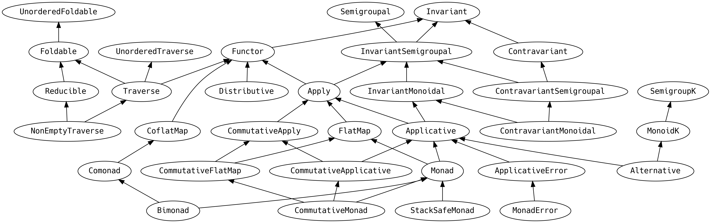

{width=80%}
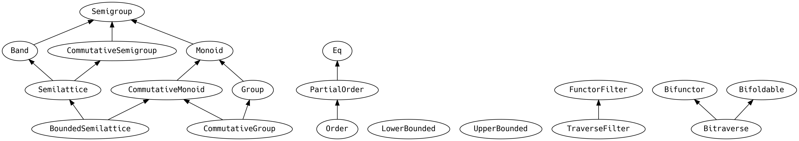

{width=40%}
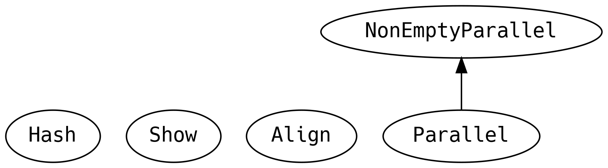

## Appendable Things

{width=25%}
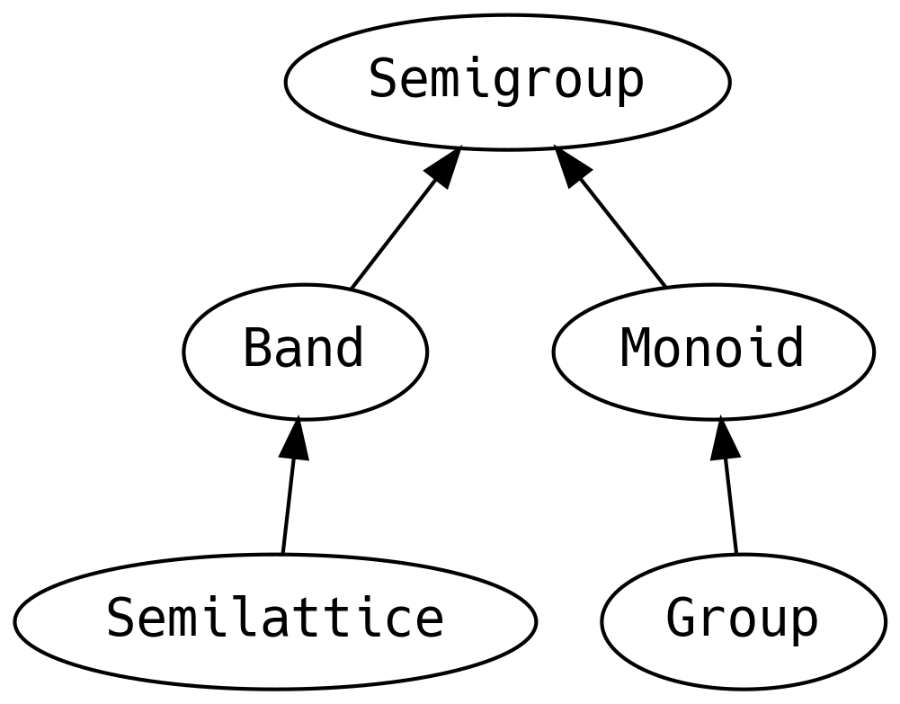

{lang="text"}
~~~~~~~~
  @typeclass trait Semigroup[A] {
    @op("|+|") def combine(x: A, y: A): A
  
    def combineN(value: A, n: Int): A = ...
  }
  
  @typeclass trait Band[A] extends Semigroup[A]
  @typeclass trait Semilattice[A] extends Band[A]
  
  @typeclass trait Monoid[A] extends Semigroup[A] {
    def empty: A
  }
  
  @typeclass trait Group[A] extends Monoid[A] {
    def inverse(a: A): A
  
    @op("|-|") def remove(a: A, b: A): A = combine(a, inverse(b))
  }
~~~~~~~~

A> `|+|` is known as the "combine operator" and is more commonly used than the
A> "`.combine` method".

A `Semigroup` can be defined for a type if two values can be combined. The
operation must be *associative*, meaning that the order of nested operations
should not matter, i.e.

{lang="text"}
~~~~~~~~
  (a |+| b) |+| c == a |+| (b |+| c)
  
  (1 |+| 2) |+| 3 == 1 |+| (2 |+| 3)
~~~~~~~~

A `Monoid` is a `Semigroup` with an *empty* element. Combining `.empty` with any
other `a` should give `a`.

{lang="text"}
~~~~~~~~
  a |+| empty == a
  
  a |+| 0 == a
~~~~~~~~

This is probably bringing back memories of `Numeric` from Chapter 4. There are
implementations of `Monoid` for all the primitive numbers, but the concept of
*appendable* things is useful beyond numbers.

{lang="text"}
~~~~~~~~
  scala> "hello" |+| " " |+| "world!"
  res: String = "hello world!"
  
  scala> List(1, 2) |+| List(3, 4)
  res: List[Int] = List(1, 2, 3, 4)
~~~~~~~~

`Band` has the law that the `.append` operation of the same two
elements is *idempotent*, i.e. gives the same value. Examples are
anything that can only be one value, such as `Unit`, least upper
bounds, or a `Set`. `Band` provides no further methods yet users can
make use of the guarantees for performance optimisation.

`Semilattice` goes one further and adds the additional guarantee that the order
of the parameters in `.combine` does not matter.

A> Viktor Klang, of Lightbend fame, lays claim to the phrase
A> [effectively-once delivery](https://twitter.com/viktorklang/status/789036133434978304) for message processing with idempotent
A> operations, i.e. `Band.combine`.

A `Group` is a `Monoid` where every value has an inverse, that when combined
gives the `.empty` element. For example, every `Int` has an inverse which is its
negated value.

As a realistic example for `Monoid`, consider a trading system that has a large
database of reusable trade templates. Populating the default values for a new
trade involves selecting and combining multiple templates, with a "last rule
wins" merge policy if two templates provide a value for the same field. The
"selecting" work is already done for us by another system, it is our job to
combine the templates in order.

We will create a simple template schema to demonstrate the principle,
but keep in mind that a realistic system would have a more complicated
ADT.

{lang="text"}
~~~~~~~~
  sealed abstract class Currency
  case object EUR extends Currency
  case object USD extends Currency
  
  final case class TradeTemplate(
    payments: List[java.time.LocalDate],
    ccy: Option[Currency],
    otc: Option[Boolean]
  )
~~~~~~~~

If we write a method that takes `templates: List[TradeTemplate]`, we
only need to call

{lang="text"}
~~~~~~~~
  val zero = Monoid[TradeTemplate].empty
  templates.foldLeft(zero)(_ |+| _)
~~~~~~~~

and our job is done!

But to get `zero` or call `|+|` we must have an instance of
`Monoid[TradeTemplate]`. We can create an instance on the companion:

{lang="text"}
~~~~~~~~
  object TradeTemplate {
    implicit val monoid: Monoid[TradeTemplate] = Monoid.instance(
      TradeTemplate(Nil, None, None),
      (a, b) => TradeTemplate(a.payments |+| b.payments,
                              a.ccy |+| b.ccy,
                              a.otc |+| b.otc)
    )
  }
~~~~~~~~

However, this doesn't compile because there is no `Monoid[Option[Currency]]` or
`Monoid[Option[Boolean]]`, so we must provide them:

{lang="text"}
~~~~~~~~
  def lastWins[A]: Monoid[Option[A]] = Monoid.instance(
    None,
    {
      case (None, None) => None
      case (only, None) => only
      case (None, only) => only
      case (_, winner)  => winner
    }
  )
  
  implicit val monoidCcy: Monoid[Option[Currency]] = lastWins
  implicit val monoidOtc: Monoid[Option[Boolean]] = lastWins
~~~~~~~~

Now everything compiles, let's try it out...

{lang="text"}
~~~~~~~~
  scala> import java.time.{LocalDate => LD}
  scala> val templates = List(
           TradeTemplate(Nil,                     None,      None),
           TradeTemplate(Nil,                     Some(EUR), None),
           TradeTemplate(List(LD.of(2017, 8, 5)), Some(USD), None),
           TradeTemplate(List(LD.of(2017, 9, 5)), None,      Some(true)),
           TradeTemplate(Nil,                     None,      Some(false))
         )
  
  scala> templates.foldLeft(zero)(_ |+| _)
  res: TradeTemplate = TradeTemplate(
                         List(2017-08-05,2017-09-05),
                         Some(USD),
                         Some(false))
~~~~~~~~

All we needed to do was implement one piece of business logic and
`Monoid` took care of everything else for us!

Note that the list of `payments` are concatenated. This is because the
default `Monoid[List]` uses concatenation of elements and happens to
be the desired behaviour. If the business requirement was different,
it would be a simple case of providing a custom
`Monoid[List[LocalDate]]`.

## Objecty Things

In the chapter on Data and Functionality we said that the JVM's notion
of equality breaks down for many things that we can put into an ADT.
The problem is that the JVM was designed for Java, and `.equals` is
defined on `java.lang.Object` whether it makes sense or not. There is
no way to remove `.equals` and no way to guarantee that it is
implemented.

However, in FP we prefer typeclasses for polymorphic functionality and even the
concept of equality is captured at compiletime.

{width=40%}
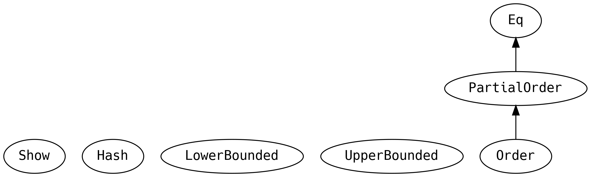

{lang="text"}
~~~~~~~~
  @typeclass trait Equal[F]  {
    @op("===") def eqv(x: A, y: A): Boolean
    @op("=!=") def neqv(x: A, y: A): Boolean = !eqv(x, y)
  }
~~~~~~~~

Indeed `===` (*triple equals*) is more typesafe than `==` (*double
equals*) because it can only be compiled when the types are the same
on both sides of the comparison. This catches a lot of bugs.

`.equal` has the same implementation requirements as `Object.equals`

-   *commutative* `f1 === f2` implies `f2 === f1`
-   *reflexive* `f === f`
-   *transitive* `f1 === f2 && f2 === f3` implies `f1 === f3`

By throwing away the universal concept of `Object.equals` we don't
take equality for granted when we construct an ADT, stopping us at
compiletime from expecting equality when there is none.

Continuing the trend of replacing old Java concepts, rather than data *being a*
`java.lang.Comparable`, they now *have an* `Order` or `PartialOrder` according
to:

{lang="text"}
~~~~~~~~
  @typeclass PartialOrder[A] extends Eq[A] {
    def partialCompare(x: A, y: A): Double
  
    @op("<" ) def lt(x: A, y: A): Boolean = ...
    @op("<=") def lte(x: A, y: A): Boolean = ...
    @op(">" ) def gt(x: A, y: A): Boolean = ...
    @op(">=") def gte(x: A, y: A): Boolean = ...
  }
  
  @typeclass trait Order[A] extends PartialOrder[A] {
    def compare(x: A, y: A): Int
  
    def max(x: A, y: A): A = ...
    def min(x: A, y: A): A = ...
  }
~~~~~~~~

A `PartialOrder` is for values where there are some corner cases that cannot be
compared with other values. `Order` requires that every value can be compared to
every other value.

`Order` implements `.eqv` in terms of the new primitive `.compare`. When a
typeclass implements a parent's *primitive combinator* with a *derived
combinator*, an **implied law of substitution** for the typeclass is added. If an
instance of `Order` were to override `.eqv` for performance reasons, it must
behave identically the same as the original.

Things that have an order may also have an absolute minimum and an absolute
maximum value:

{lang="text"}
~~~~~~~~
  trait LowerBounded[A] {
    def minBound: A
  }
  trait UpperBounded[A] {
    def maxBound: A
  }
~~~~~~~~

Similarly to `Object.equals`, the concept of `.toString` on every `class` does
not make sense in Java. We would like to enforce stringyness at compiletime and
this is exactly what `Show` achieves:

{lang="text"}
~~~~~~~~
  trait Show[T] {
    def show(f: T): String = ...
  }
~~~~~~~~

And `Hash` achieves the same thing for `.hashCode`

{lang="text"}
~~~~~~~~
  trait Hash[A] {
    def hash(x: A): Int = ...
  }
~~~~~~~~

## Mappable Things

We're focusing on things that can be mapped over, or traversed, in
some sense:

{width=100%}
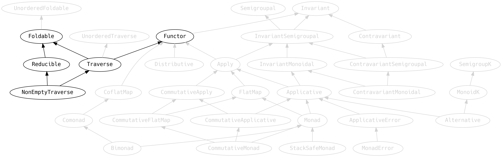

### Functor

{lang="text"}
~~~~~~~~
  @typeclass trait Functor[F[_]] {
    def map[A, B](fa: F[A])(f: A => B): F[B]
    ...
  }
~~~~~~~~

The only abstract method is `.map`, and it must *compose*, i.e. mapping
with `f` and then again with `g` is the same as mapping once with the
composition of `f` and `g`:

{lang="text"}
~~~~~~~~
  fa.map(f).map(g) == fa.map(f.andThen(g))
~~~~~~~~

The `.map` should also perform a no-op if the provided function is
`identity` (i.e. `x => x`)

{lang="text"}
~~~~~~~~
  fa.map(identity) == fa
  
  fa.map(x => x) == fa
~~~~~~~~

`Functor` defines some convenience methods around `.map` that can be optimised by
specific instances. The documentation has been intentionally omitted in the
above definitions to encourage guessing what a method does before looking at the
implementation. Please spend a moment studying only the type signature of the
following before reading further:

{lang="text"}
~~~~~~~~
  def void[A](fa: F[A]): F[Unit] = ...
  def fproduct[A, B](fa: F[A])(f: A => B): F[(A, B)] = ...
  def as[A, B](fa: F[A], b: B): F[B] = ...
  
  def tupleLeft[A, B](fa: F[A], b: B): F[(B, A)] = ...
  def tupleRight[A, B](fa: F[A], b: B): F[(A, B)] = ...
  def unzip[A, B](fab: F[(A, B)]): (F[A], F[B]) = ...
  
  // harder
  def lift[A, B](f: A => B): F[A] => F[B] = ...
~~~~~~~~

1.  `.void` takes an instance of the `F[A]` and always returns an
    `F[Unit]`, it forgets all the values whilst preserving the
    structure.
2.  `.fproduct` takes the same input as `map` but returns `F[(A, B)]`,
    i.e. it tuples the contents with the result of applying the
    function. This is useful when we wish to retain the input.
3.  `.as` ignores the content of the `F[A]` and replaces it with the `B`.
4.  `.tupleLeft` pairs the contents of an `F[A]` with a constant `B` on
    the left.
5.  `.tupleRight` pairs the contents of an `F[A]` with a constant `B` on
    the right.
6.  `.unzip` splits a functor of tuples into a tuple of functors.
7.  `.lift` takes a function `A => B` and returns a `F[A] => F[B]`. In
    other words, it takes a function over the contents of an `F[A]` and
    returns a function that operates **on** the `F[A]` directly.

`.as`, `.tupleLeft` and `.tupleRight` are useful when we wish to retain some
information that would otherwise be lost to scope.

In our example application, as a nasty hack (which we didn't even
admit to until now), we defined `.start` and `.stop` to return their
input:

{lang="text"}
~~~~~~~~
  def start(node: MachineNode): F[MachineNode]
  def stop (node: MachineNode): F[MachineNode]
~~~~~~~~

This allowed us to write terse business logic such as

{lang="text"}
~~~~~~~~
  for {
    _      <- m.start(node)
    update = world.copy(pending = Map(node -> world.time))
  } yield update
~~~~~~~~

and

{lang="text"}
~~~~~~~~
  for {
    stopped <- nodes.traverse(m.stop)
    updates = stopped.map(_ -> world.time).toList.toMap
    update  = world.copy(pending = world.pending ++ updates)
  } yield update
~~~~~~~~

But this hack pushes unnecessary complexity into the implementations. It is
better if we let our algebras return `F[Unit]` and use `.as`:

{lang="text"}
~~~~~~~~
  m.start(node) as world.copy(pending = Map(node -> world.time))
~~~~~~~~

and

{lang="text"}
~~~~~~~~
  for {
    stopped <- nodes.traverse(a => m.stop(a) as a)
    updates = stopped.map(_ -> world.time).toList.toMap
    update  = world.copy(pending = world.pending ++ updates)
  } yield update
~~~~~~~~

### Foldable

Technically, `Foldable` is for data structures that can be walked to produce a
summary value. However, this undersells the fact that it is a one-typeclass army
that can provide most of what we would expect to see in a Collections API.

There are so many methods we are going to have to split them out,
beginning with the abstract methods:

{lang="text"}
~~~~~~~~
  @typeclass trait Foldable[F[_]] {
    def foldLeft[A, B](fa: F[A], b: B)(f: (B, A) => B): B
    def foldRight[A, B](fa: F[A], lb: Eval[B])(f: (A, Eval[B]) => Eval[B]): Eval[B]
  
    def foldMap[A, B: Monoid](fa: F[A])(f: A => B): B = ...
~~~~~~~~

We encountered `Eval` in the previous chapter, as a mechanism to control
evaluation.

An instance of `Foldable` need only implement `.foldLeft` and `.foldRight` to
get all of the functionality in this typeclass, although methods are typically
optimised for specific data structures.

`.foldMap` has a marketing buzzword name: **MapReduce**. Given an `F[A]`, a
function from `A` to `B`, and a way to combine `B` (provided by the `Monoid`,
along with a zero `B`), we can produce a summary value of type `B`. There is no
enforced operation order, allowing for parallel computation.

Noeither `.foldLeft` nor `.foldRight` require their parameters to have a
`Monoid`, meaning that they need a starting value `b` and a way to combine each
element of the data structure with the summary value. The order for traversing
the elements is defined (`.foldLeft` goes from left to right, `.foldRight` goes
from right to left) and therefore cannot be parallelised.

A> `.foldRight` is conceptually the same as the `.foldRight` in the Scala
A> stdlib. However, there is a problem with the stdlib `.foldRight`
A> signature, solved in Cats: very large data structures can stack
A> overflow. `List.foldRight` implements `.foldRight` as a
A> reversed `.foldLeft`
A> 
A> {lang="text"}
A> ~~~~~~~~
A>   override def foldRight[B](z: B)(op: (A, B) => B): B =
A>     reverse.foldLeft(z)((right, left) => op(left, right))
A> ~~~~~~~~
A> 
A> but the concept of reversing is not universal and this workaround cannot be used
A> for all data structures. Say we want to find a small number in a `Stream`, with
A> an early exit:
A> 
A> {lang="text"}
A> ~~~~~~~~
A>   scala> def isSmall(i: Int): Boolean = i < 10
A>   scala> (1 until 100000).toStream.foldRight(false) {
A>            (el, acc) => isSmall(el) || acc
A>          }
A>   java.lang.StackOverflowError
A>     at scala.collection.Iterator.toStream(Iterator.scala:1403)
A>     ...
A> ~~~~~~~~
A> 
A> Cats solves the problem by allowing us to specify the evaluation strategy for
A> the aggregate value.
A> 
A> {lang="text"}
A> ~~~~~~~~
A>   scala> Foldable[Stream].foldRight((1 until 100000).toStream, Eval.now(false)){
A>            (el, acc) => Eval.later(isSmall(el) || acc.value)
A>          }.value
A>   res: Boolean = true
A> ~~~~~~~~
A> 
A> which means that the `acc` is not evaluated unless it is needed.
A> 
A> Beware that we must explicitly invoke the Cats `Foldable.foldRight`, otherwise
A> we will get the standard library implementation and the `StackOverflowError`
A> returns.
A> 
A> {lang="text"}
A> ~~~~~~~~
A>   scala> (1 until 100000).toStream.foldRight(Eval.now(false)){
A>            (el, acc) => Eval.later(isSmall(el) || acc.value)
A>          }.value
A>   java.lang.StackOverflowError
A> ~~~~~~~~
A> 
A> It is worth baring in mind that not all operations are stack safe in
A> `.foldRight`. If we were to require evaluation of all elements, we can
A> still get a `StackOverflowError`.
A> 
A> {lang="text"}
A> ~~~~~~~~
A>   scala> Foldable[Stream].foldRight((1L until 100000L).toStream, Eval.now(0L)){
A>            (el, acc) => Eval.later(el |+| acc.value)
A>          }.value
A>   java.lang.StackOverflowError
A> ~~~~~~~~

The only law for `Foldable` is that `.foldLeft` and `.foldRight` should
each be consistent with `.foldMap` for monoidal operations. e.g.
appending an element to a list for `.foldLeft` and prepending an
element to a list for `.foldRight`. However, `.foldLeft` and `.foldRight`
do not need to be consistent with each other: in fact they often
produce the reverse of each other.

The simplest thing to do with `.foldMap` is to use the `identity`
function, giving `.combineAll` (the natural sum of the monoidal elements)

{lang="text"}
~~~~~~~~
  def combineAll[A: Monoid](t: F[A]): A = ...
~~~~~~~~

Recall that when we learnt about `Monoid`, we wrote this:

{lang="text"}
~~~~~~~~
  scala> templates.foldLeft(Monoid[TradeTemplate].empty)(_ |+| _)
~~~~~~~~

We now know we could have written:

{lang="text"}
~~~~~~~~
  scala> templates.combineAll
  res: TradeTemplate = TradeTemplate(
                         List(2017-08-05,2017-09-05),
                         Some(USD),
                         Some(false))
~~~~~~~~

The strangely named `.intercalate` inserts a specific `A` between each
element before performing the `fold`

{lang="text"}
~~~~~~~~
  def intercalate[A: Monoid](fa: F[A], a: A): A = ...
~~~~~~~~

which is a generalised version of the stdlib's `.mkString`:

{lang="text"}
~~~~~~~~
  scala> List("foo", "bar").intercalate(",")
  res: String = "foo,bar"
~~~~~~~~

The `.foldLeft` provides the means to obtain any element by traversal
index, including a bunch of other related methods:

{lang="text"}
~~~~~~~~
  def get[A](fa: F[A])(idx: Long): Option[A] = ...
  def size[A](fa: F[A]): Long = ...
  def isEmpty[A](fa: F[A]): Boolean = ...
  def nonEmpty[A](fa: F[A]): Boolean = ...
~~~~~~~~

Cats is a pure library of only *total functions*. Whereas `List(0)` can throw an
exception, `Foldable.get` returns an `Option[A]` and would return `None` on an
empty list. `.size`, `.isEmpty` and `.nonEmpty` do as we may expect.

These methods *really* sound like a collections API. And, of course,
anything with a `Foldable` can be converted into a `List`

{lang="text"}
~~~~~~~~
  def toList[A](fa: F[A]): List[A] = ...
~~~~~~~~

There are useful predicate checks

{lang="text"}
~~~~~~~~
  def count[A](fa: F[A])(p: A => Boolean): Long = ...
  def forall[A](fa: F[A])(p: A => Boolean): Boolean = ...
  def exists[A](fa: F[A])(p: A => Boolean): Boolean = ...
  def find[A](fa: F[A])(f: A => Boolean): Option[A] = ...
~~~~~~~~

`.count` is a way of counting how many elements are `true` for a predicate,
`.forall` and `.exists` return `true` if all (or any, respectively) element
meets the predicate, and may exit early. `.find` returns the first element
matching the predicate.

We can make use of `Order` by extracting the minimum or maximum element:

{lang="text"}
~~~~~~~~
  def minimumOption[A: Order](fa: F[A]): Option[A] = ...
  def minimumByOption[A, B: Order](fa: F[A])(f: A => B): Option[A] =
  
  def maximumOption[A: Order](fa: F[A]): Option[A] = ...
  def maximumByOption[A, B: Order](fa: F[A])(f: A => B): Option[A] = ...
~~~~~~~~

For example we can ask which `String` is maximum (by lexicographical ordering)
or `By` length

{lang="text"}
~~~~~~~~
  scala> List("foo", "fazz").maximumOption
  res: Option[String] = Some(foo)
  
  scala> List("foo", "fazz").maximumByOption(_.length)
  res: Option[String] = Some(fazz)
~~~~~~~~

This concludes the key features of `Foldable`. The takeaway is that anything
we'd expect to find in a collection library is probably on `Foldable`.

### Reducible

`Foldable` has a method named `.combineAllOption` which is like `.fold` but
takes a `Semigroup` instead of a `Monoid`, returning an `Option` if the
collection is empty (recall that `Semigroup` does not have a `empty`):

{lang="text"}
~~~~~~~~
  def combineAllOption[A: Semigroup](fa: F[A]): Option[A] = ...
~~~~~~~~

Taking this concept further, the child typeclass `Reducible` has more
`Semigroup` variants and makes sense for data structures that are never empty,
without requiring a `Monoid` on the elements.

{lang="text"}
~~~~~~~~
  @typeclass Reducible[F[_]] extends Foldable[F] {
    def reduceLeft[A](fa: F[A])(f: (A, A) => A): A = ...
    def reduceRight[A](fa: F[A])(f: (A, Eval[A]) => Eval[A]): Eval[A] = ...
    def reduce[A: Semigroup](fa: F[A]): A = ...
    def reduceMap[A, B: Semigroup](fa: F[A])(f: A => B): B =
    ...
  }
~~~~~~~~

Importantly, there are variants that take monadic calculations. We already used
`.foldLeftM` when we first wrote the business logic of our application, now we
know that it is from `Foldable`:

{lang="text"}
~~~~~~~~
  def foldM[G[_]: Monad, A, B](fa: F[A], z: B)(f: (B, A) => G[B]): G[B] = ...
  def foldMapM[G[_]: Monad, A, B: Monoid](fa: F[A])(f: A => G[B]): G[B] = ...
  def findM[G[_]: Monad, A](fa: F[A])(p: A => G[Boolean]): G[Option[A]] = ...
  def existsM[G[_]: Monad, A](fa: F[A])(p: A => G[Boolean]): G[Boolean] = ...
  def forallM[G[_]: Monad, A](fa: F[A])(p: A => G[Boolean]): G[Boolean] = ...
  ...
~~~~~~~~

Some of the methods we have seen in this section (`.size`, `.isEmpty`,
`.nonEmpty`, `.exists`, `.forall`, `.count`) are defined on `UnorderedFoldable`,
a parent of `Foldable`, and can be used for niche data structures that do not
have an ordering.

### Traverse

`Traverse` is what happens when we cross a `Functor` with a `Foldable`

{lang="text"}
~~~~~~~~
  trait Traverse[F[_]] extends Functor[F] with Foldable[F] {
    def traverse[G[_]: Applicative, A, B](fa: F[A])(f: A => G[B]): G[F[B]]
    def sequence[G[_]: Applicative, A](fga: F[G[A]]): G[F[A]] = ...
  
    def zipWithIndex[A](fa: F[A]): F[(A, Int)] = ...
    def mapWithIndex[A, B](fa: F[A])(f: (A, Int) => B): F[B] = ...
  
    def flatTraverse[G[_]: Applicative, A, B](fa: F[A])(f: A => G[F[B]])
          (implicit F: FlatMap[F]): G[F[B]] = ...
  
    def flatSequence[G[_]: Applicative, A](fgfa: F[G[F[A]]])
          (implicit F: FlatMap[F]): G[F[A]] = ...
  }
~~~~~~~~

At the beginning of the chapter we showed the importance of `.traverse`
and `.sequence` for swapping around type constructors to fit a
requirement (e.g. `List[Future[_]]` to `Future[List[_]]`).

We can `.zipWithIndex` to pair each element with its ordered location, or
`.mapWithIndex` if we wish to do something with the index but do not need to
keep it around.

`.flatTraverse` and `.flatSequence` are useful for cases where we want to
flatten the results of the calculation. For example, say we have a
`List[Future[List[_]]]` and we want a `Future[List[_]]` by concatenating all the
lists.

Finally `NonEmptyTraverse`, like `Reducible`, provides variants of these methods
for data structures that cannot be empty, accepting the weaker `Semigroup`
instead of a `Monoid`, and an `Apply` instead of an `Applicative`.

### Distributive

Very closely related to `Traverse` is `Distributive`, with `.traverse` and
`.sequence` highlighted to show the subtle difference in the type signatures

{lang="text"}
~~~~~~~~
  @typeclass trait Distributive[F[_]] extends Functor[F] {
    def distribute[G[_]: Functor, A, B](ga: G[A])(f: A => F[B]): F[G[B]]
  //def   traverse[G[_]: Applicative, A, B](fa: F[A])(f: A => G[B]): G[F[B]]
  
    def cosequence[G[_]: Functor, A](ga: G[F[A]]): F[G[A]] = ...
  //def   sequence[G[_]: Applicative, A](fga: F[G[A]]): G[F[A]] = ...
  }
~~~~~~~~

The important difference being that `.distribute` and `.cosequence` take
functions that take another functor `G[_]` and rearrange them so the `F[_]` is
the outermost context. Contrast to `Traverse` which does the opposite.

`Distribute` is a good fallback if we need to perform a `.traverse` but we don't
have the `Traverse` or `Applicative` that we need.

## More Functors

Although not part of the typeclass hierarchy, these are some typeclasses closely
related to `Functor` that are worth knowing

{width=60%}

### Align

`Align` is about merging and padding a `Functor`. Before
looking at `Align`, meet the `Ior` data type:

{lang="text"}
~~~~~~~~
  sealed abstract class Ior[+A, +B]
  final case class Left[A](a: A) extends Ior[A, Nothing]
  final case class Right[B](b: B) extends Ior[Nothing, B]
  final case class Both[A, B](a: A, b: B) extends Ior[A, B]
~~~~~~~~

i.e. it is a data encoding of inclusive logical `OR`. `A` or `B` or both `A` and
`B`.

`Align` does not extend `Functor` but instead must be able to provide one

{lang="text"}
~~~~~~~~
  @typeclass trait Align[F[_]] {
    def functor: Functor[F]
  
    def align[A, B](fa: F[A], fb: F[B]): F[Ior[A, B]]
    def alignWith[A, B, C](fa: F[A], fb: F[B])(f: Ior[A, B] => C): F[C] = ...
  
    def alignCombine[A: Semigroup](fa1: F[A], fa2: F[A]): F[A] = ...
  
    def padZip[A, B](fa: F[A], fb: F[B]): F[(Option[A], Option[B])] = ...
    def padZipWith[A, B, C](fa: F[A], fb: F[B])(f: (Option[A], Option[B]) => C): F[C] = ...
  }
~~~~~~~~

`.align` constructs an `Ior` out of two `F[_]`, in the same `F[_]` context.

`.alignWith` takes a function from either an `A` or a `B` (or both) to
a `C` and returns a lifted function from a tuple of `F[A]` and `F[B]`
to an `F[C]`.

`.alignCombine` allows us to combine two `F[A]` when `A` has a `Semigroup`. For example,
the implementation of `Semigroup[Map[K, V]]` defers to `Semigroup[V]`, combining
two entries results in combining their values, having the consequence that
`Map[K, List[A]]` behaves like a multimap:

{lang="text"}
~~~~~~~~
  scala> Map("foo" -> List(1)) alignCombine Map("foo" -> List(1), "bar" -> List(2))
  res = Map(foo -> List(1, 1), bar -> List(2))
~~~~~~~~

and a `Map[K, Int]` simply tally their contents when merging:

{lang="text"}
~~~~~~~~
  scala> Map("foo" -> 1) alignCombine Map("foo" -> 1, "bar" -> 2)
  res = Map(foo -> 2, bar -> 2)
~~~~~~~~

`.padZip` and `.padZipWith` are for partially merging two data structures that might
be missing values on one side. For example if we wanted to aggregate independent
votes and retain the knowledge of where the votes came from

{lang="text"}
~~~~~~~~
  scala> Map("foo" -> 1) padZip Map("foo" -> 1, "bar" -> 2)
  res = Map(foo -> (Some(1),Some(1)), bar -> (None,Some(2)))
  
  scala> Map("foo" -> 1, "bar" -> 2) padZip Map("foo" -> 1)
  res = Map(foo -> (Some(1),Some(1)), bar -> (Some(2),None))
~~~~~~~~

### Bifunctor, Bifoldable and Bitraverse

Cats provides variations of `Functor`, `Foldable` and `Traverse` for structures
that require two functions, not just one.

{lang="text"}
~~~~~~~~
  @typeclass trait Bifunctor[F[_, _]] {
    def bimap[A, B, C, D](fab: F[A, B])(f: A => C, g: B => D): F[C, D]
    def leftMap[A, B, C](fab: F[A, B])(f: A => C): F[C, B] = ...
    ...
  }
~~~~~~~~

The simplest example of a `Bifunctor` is `Either`. Sometimes we want to map over
both possible values in a convenient way

{lang="text"}
~~~~~~~~
  scala> val a: Either[String, Int] = Left("fail")
         val b: Either[String, Int] = Right(13)
  
  scala> b.bimap(_.toUpperCase, _ * 2)
  res: Either[String, Int] = Right(26)
  
  scala> a.bimap(_.toUpperCase, _ * 2)
  res: Either[String, Int] = Left(FAIL)
~~~~~~~~

And whereas we can use the regular `.map` to map over the `Right`, sometimes we
want to map over just the `Left`, which often contains the an error message

{lang="text"}
~~~~~~~~
  scala> a.leftMap(_.toUpperCase)
  res: Either[String,Int] = Left(FAIL)
  
  scala> b.leftMap(_.toUpperCase)
  res: Either[String, Int] = Right(13)
~~~~~~~~

leaving the contents of the `Right` untouched.

Similarly `Bifoldable` and `Bitraverse` are the same idea for `Foldable` and `Traverse`

{lang="text"}
~~~~~~~~
  @typeclass trait Bifoldable[F[_, _]] {
    def bifoldLeft[A, B, C](fab: F[A, B], c: C)(f: (C, A) => C, g: (C, B) => C): C
    def bifoldRight[A, B, C](fab: F[A, B], c: Eval[C])
          (f: (A, Eval[C]) => Eval[C], g: (B, Eval[C]) => Eval[C]): Eval[C]
  
    def bifoldMap[A, B, C: Monoid](fab: F[A, B])(f: A => C, g: B => C): C = ...
    def bifold[A: Monoid, B: Monoid](fab: F[A, B]): (A, B) = ...
  }
  
  @typeclass trait Bitraverse[F[_, _]] extends Bifunctor[F] with Bifoldable[F] {
    def bitraverse[G[_]: Applicative, A, B, C, D](fab: F[A, B])
          (f: A => G[C], g: B => G[D]): G[F[C, D]]
  
    def bisequence[G[_]: Applicative, A, B](fab: F[G[A], G[B]]): G[F[A, B]] = ...
  }
~~~~~~~~

`.bifoldMap` is especially useful for the case where both functions return the
same value, allowing us to produce a single value and combine the two sides:

{lang="text"}
~~~~~~~~
  scala> val a: Either[String, Int] = Left("fail")
         val b: Either[String, Int] = Right(13)
  
  scala> a.bifoldMap(_.length, identity)
  res: Int = 4
  
  scala> a.bitraverse(s => Option(s.length), i => Option(i))
  res: Option[Either[Int,Int]] = Some(Left(4))
~~~~~~~~

### Filters

`FunctorFilter` adds the ability to discard entries from the functor with its
`.mapFilter` method and related convenience methods. Similarly to `Align`,
`FunctorFilter` must be able to provide a `Functor`.

{lang="text"}
~~~~~~~~
  trait FunctorFilter[F[_]] extends Serializable {
    def functor: Functor[F]
  
    def mapFilter[A, B](fa: F[A])(f: A => Option[B]): F[B]
    def filter[A](fa: F[A])(f: A => Boolean): F[A] = ...
    def filterNot[A](fa: F[A])(f: A => Boolean): F[A] = ...
  
    def collect[A, B](fa: F[A])(f: PartialFunction[A, B]): F[B] = ...
    def flattenOption[A](fa: F[Option[A]]): F[A] = ...
  }
~~~~~~~~

And similarly, `TraverseFilter` can filter the values while traversing or sequencing

{lang="text"}
~~~~~~~~
  trait TraverseFilter[F[_]] extends FunctorFilter[F] {
    def traverse: Traverse[F]
  
    def traverseFilter[G[_]: Applicative, A, B](fa: F[A])(f: A => G[Option[B]]): G[F[B]]
    def sequenceFilter[G[_]: Applicative, A](fgoa: F[G[Option[A]]]): G[F[A]] = ...
    def filterA[G[_]: Applicative, A](fa: F[A])(f: A => G[Boolean]): G[F[A]] = ...
  }
~~~~~~~~

## Variance

We must return to `Functor` for a moment and discuss an ancestor that
we previously ignored:

{width=100%}
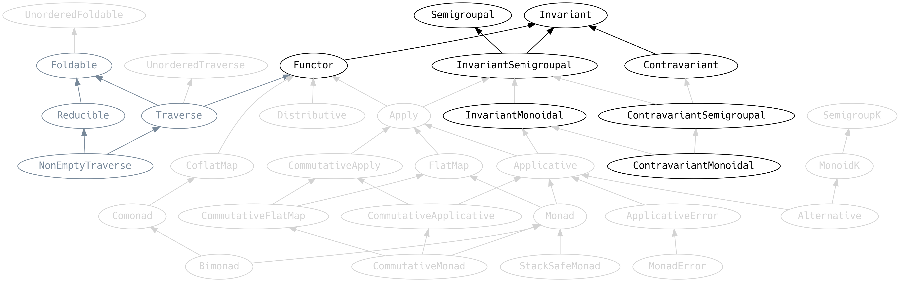

`Invariant` has a method `.imap` which says that given a function from `A` to
`B`, and a function from `B` to `A`, then we can convert `F[A]` to `F[B]`.

`Functor` is a short name for what should be *covariant functor*. But since
`Functor` is so popular it gets the nickname. Likewise `Contravariant` should
really be *contravariant functor*, and `Invariant` an *invariant functor*.

`Functor` implements `.imap` with `.map` and ignores the function from
`B` to `A`. `Contravariant`, on the other hand, implements `.imap` with
`.contramap` and ignores the function from `A` to `B`:

{lang="text"}
~~~~~~~~
  @typeclass trait Invariant[F[_]] {
    def imap[A, B](fa: F[A], f: A => B, g: B => A): F[B]
    ...
  }
  
  @typeclass trait Functor[F[_]] extends Invariant[F] {
    def map[A, B](fa: F[A])(f: A => B): F[B]
    def imap[A, B](fa: F[A], f: A => B, g: B => A): F[B] = map(fa)(f)
    ...
  }
  
  @typeclass trait Contravariant[F[_]] extends Invariant[F] {
    def contramap[A, B](fa: F[A])(f: B => A): F[B]
    def imap[A, B](fa: F[A], f: A => B, g: B => A): F[B] = contramap(fa)(g)
    ...
  }
~~~~~~~~

It is important to note that, although related at a theoretical level,
the words *covariant*, *contravariant* and *invariant* do not directly
refer to Scala type variance (i.e. `+` and `-` prefixes that may be
written in type signatures). *Invariance* here means that it is
possible to map the contents of a structure `F[A]` into `F[B]`. Using
`identity` we can see that `A` can be safely downcast (or upcast) into
`B` depending on the variance of the functor.

`.map` may be understood by its contract "if you give me an `F` of `A` and a way
to turn an `A` into a `B`, then I can give you an `F` of `B`".

Likewise, `.contramap` reads as "if you give me an `F` of `A` and a way to turn
a `B` into an `A`, then I can give you an `F` of `B`".

We will consider an example: in our application we introduce domain specific
types `Alpha`, `Beta`, `Gamma`, etc, to ensure that we don't mix up numbers in a
financial calculation:

{lang="text"}
~~~~~~~~
  final case class Alpha(value: Double)
~~~~~~~~

but now we're faced with the problem that we don't have any typeclasses for
these new types. If we use the values in JSON documents, we have to write
instances of `JsEncoder` and `JsDecoder`.

However, `JsEncoder` has a `Contravariant` and `JsDecoder` has a `Functor`, so
we can derive instances. Filling in the contract:

-   "if you give me a `JsDecoder` for a `Double`, and a way to go from a `Double`
    to an `Alpha`, then I can give you a `JsDecoder` for an `Alpha`".
-   "if you give me a `JsEncoder` for a `Double`, and a way to go from an `Alpha`
    to a `Double`, then I can give you a `JsEncoder` for an `Alpha`".

{lang="text"}
~~~~~~~~
  object Alpha {
    implicit val decoder: JsDecoder[Alpha] = JsDecoder[Double].map(Alpha(_))
    implicit val encoder: JsEncoder[Alpha] = JsEncoder[Double].contramap(_.value)
  }
~~~~~~~~

Methods on a typeclass can have their type parameters in *contravariant
position* (method parameters) or in *covariant position* (return type). If a
typeclass has a combination of covariant and contravariant positions, it might
have an *invariant functor*. For example, `Semigroup` and `Monoid` have an
`Invariant`, but not a `Functor` or a `Contravariant`.

## Semigroupal, Apply and FlatMap

Consider this the warm-up act to `Applicative` and `Monad`

{width=100%}
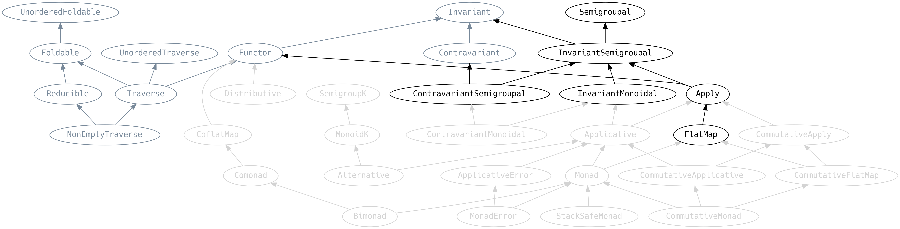

### Semigroupal

`Semigroupal` looks at first sight to be similar to `Align` because it zips
together two values in the same context

{lang="text"}
~~~~~~~~
  @typeclass trait Semigroupal[F[_]] {
    def product[A, B](fa: F[A], fb: F[B]): F[(A, B)]
  }
~~~~~~~~

however this is the Cartesian product, which means that every `A` is matched up
with every `B`. Compare how `Align.align` and `Semigroupal.product` differ in this
example

{lang="text"}
~~~~~~~~
  scala> Align[List].align(List("a", "b", "c"), List(1,2,3,4))
  res: List[Ior[String,Int]] = List(Both(a,1), Both(b,2), Both(c,3), Right(4))
  
  scala> Semigroupal[List].product(List("a", "b", "c"), List(1,2,3,4))
  res: List[(String, Int)] = List((a,1), (a,2), (a,3), (a,4),
                                  (b,1), (b,2), (b,3), (b,4),
                                  (c,1), (c,2), (c,3), (c,4))
~~~~~~~~

### Apply

`Apply` extends `Functor` and `Semigroupal` by adding a method named `.ap` which is
similar to `.map` in that it applies a function to values. However,
with `.ap`, the function is in the same context as the values.

{lang="text"}
~~~~~~~~
  @typeclass trait Apply[F[_]] extends Functor[F] with Semigroupal[F] {
    @op("<*>") def ap[A, B](ff: F[A => B])(fa: F[A]): F[B]
    ...
~~~~~~~~

A> `<*>` is spoken as "the ap operator".

It is worth taking a moment to consider what that means for a simple data
structure like `Option[A]`, having the following implementation of `.ap`

{lang="text"}
~~~~~~~~
  implicit def option[A]: Apply[Option[A]] = new Apply[Option[A]] {
    override def ap[A, B](ff: Option[A => B], fa: Option[A])() = f match {
      case Some(f) => fa.map(f)
      case None    => None
    }
    ...
  }
~~~~~~~~

To implement `.ap`, we must first extract the function `f: A => B` from `ff:
Option[A => B]`, then we can map over `fa`. The extraction of the function from
the context is the important power that `Apply` brings, allowing multiple
function to be combined inside the context.

Returning to `Apply`, we find `.mapX` boilerplate that allows us to combine
parallel functions and then map over their combined output:

{lang="text"}
~~~~~~~~
  @typeclass trait Apply[F[_]] extends Functor[F] with Semigroupal[F] {
    ...
    def map2[A,B,Z](fa: F[A], fb: F[B])(f: (A, B) => Z): F[Z] = ...
    def map3[A,B,C,Z](fa: F[A], fb: F[B], fc: F[C])(f: (A,B,C) => Z): F[Z] = ...
    ...
    def map22[...]
~~~~~~~~

Read `.map2` as a contract promising: "if you give me an `F` of `A` and an `F`
of `B`, with a way of combining `A` and `B` into a `Z`, then I can give you an
`F` of `Z`". There are many uses for this contract and the two most important are:

-   constructing some typeclasses for a product type `Z` from its constituents `A`
    and `B`
-   performing *effects* in parallel, like the drone and google algebras we
    created in Chapter 3, and then combining their results.

Indeed, `Apply` is so useful that it has special syntax that is worth revisiting from Chapter 3:

{lang="text"}
~~~~~~~~
  (d.getBacklog, d.getAgents, m.getManaged, m.getAlive, m.getTime).mapN { ... }
~~~~~~~~

where the `.mapN` method will apply `.map5` here, because the compiler knows the
size of the tuple. We could also write

or directly call `applyX`

{lang="text"}
~~~~~~~~
  Apply[F].map5(d.getBacklog, d.getAgents, m.getManaged, m.getAlive, m.getTime)
~~~~~~~~

`.productL` and `.productR` offer a way to ignore the output from one of two
effects:

{lang="text"}
~~~~~~~~
  @op("<*") def productL[A, B](fa: F[A])(fb: F[B]): F[A] = ...
  @op("*>") def productR[A, B](fa: F[A])(fb: F[B]): F[B] = ...
~~~~~~~~

A> `<*` and `*>` are spoken "product left" and "product right".

Despite being more commonly used with effects, `Apply` works just as well with
data structures. Consider rewriting

{lang="text"}
~~~~~~~~
  for {
    foo <- data.foo: Option[String]
    bar <- data.bar: Option[Int]
  } yield foo + bar.shows
~~~~~~~~

as

{lang="text"}
~~~~~~~~
  (data.foo, data.bar).mapN(_ + _.shows)
~~~~~~~~

If we only want the combined output as a tuple, methods exist to do
just that:

{lang="text"}
~~~~~~~~
  def tuple2[A,B](fa: F[A], fb: F[B]): F[(A,B)] = ...
  def tuple3[A,B,C](fa: F[A], fb: F[B], fc: F[C]): F[(A,B,C)] = ...
  ...
  def tuple22[...]
~~~~~~~~

{lang="text"}
~~~~~~~~
  Apply[Option].tuple2(data.foo, data.bar) : Option[(String, Int)]
~~~~~~~~

### FlatMap

`FlatMap` introduces `.flatMap` which allows functions
over the result of an effect to return a new effect, or for functions over the
values of a data structure to return new data structures that are then joined.

{lang="text"}
~~~~~~~~
  @typeclass trait FlatMap[F[_]] extends Apply[F] {
  
    @op(">>=") def flatMap[A, B](fa: F[A])(f: A => F[B]): F[B]
  
    def flatten[A](ffa: F[F[A]]): F[A] =
  
    override def map2[A, B, Z](fa: F[A], fb: F[B])(f: (A, B) => Z): F[Z] =
      flatMap(fa)(a => map(fb)(b => f(a, b)))
  
    def mproduct[A, B](fa: F[A])(f: A => F[B]): F[(A, B)] = ...
    def ifM[B](fa: F[Boolean])(ifTrue: => F[B], ifFalse: => F[B]): F[B] = ...
  }
~~~~~~~~

`.flatten` takes a nested context and squashes it into one.

Derived combinators are introduced for `.map2` that require consistency with
`.flatMap` ordering. We will see later that this law has consequences for
parallelisation strategies.

`.mproduct` is like `Functor.fproduct` and pairs the function's input with its
output, inside the `F`.

`.ifM` is a way to construct a conditional data structure or effect:

{lang="text"}
~~~~~~~~
  scala> List(true, false, true).ifM(List(0), List(1, 1))
  res: List[Int] = List(0, 1, 1, 0)
~~~~~~~~

If we want to ignore the result of the `.flatMap` effect, we can use `.flatTap`,
analagous to `.productL`

{lang="text"}
~~~~~~~~
  def flatTap[A, B](fa: F[A])(f: A => F[B]): F[A] = ...
~~~~~~~~

Finally `.foreverM`

{lang="text"}
~~~~~~~~
  def foreverM[A, B](fa: F[A]): F[B] = ...
~~~~~~~~

repeating an effect without stopping. Instances of `FlatMap` are guaranteed to
be stack safe, in the sense that we will never get a `StackOverflowError` as a
result of calling `.foreverM`, because the tail recursive step must be
implemented

{lang="text"}
~~~~~~~~
  def tailRecM[A, B](a: A)(f: A => F[Either[A, B]]): F[B]
~~~~~~~~

If our love of FP is not forever, we can exit the loop

{lang="text"}
~~~~~~~~
  def untilDefinedM[A](foa: F[Option[A]]): F[A]
~~~~~~~~

Only kidding, our love of FP **is** forever, we simply return `Some` love and
continue FPing!

### InvariantSemigroupal, InvariantMonoidal

`InvariantSemigroupal` is a convenient typeclass that combines `Semigroupal` and
`Invariant` without adding any new methods, simply because it is so common to do
this.

{lang="text"}
~~~~~~~~
  @typeclass trait InvariantSemigroupal[F[_]] extends Semigroupal[F] with Invariant[F]
~~~~~~~~

That leads to `InvariantMonoidal` which introduces `.point` as a way to wrap a
single value in a context. `.unit` is a convenience for `.point(())` (the `Unit`
type).

{lang="text"}
~~~~~~~~
  @typeclass trait InvariantMonoidal[F[_]] extends InvariantSemigroupal[F] {
    def point[A](a: A): F[A]
    def unit: F[Unit]
  }
~~~~~~~~

{lang="text"}
~~~~~~~~
  scala> InvariantMonoidal[Option].point(13)
  res: Option[Int] = Some(13)
~~~~~~~~

## Applicative and Monad

From an API point of view, `Applicative` is `Apply` with a `.pure` method, and
`Monad` extends `Applicative` with `FlatMap`.

{width=100%}
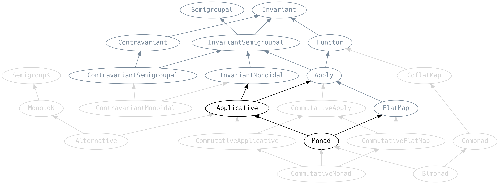

{lang="text"}
~~~~~~~~
  @typeclass trait Applicative[F[_]] extends Apply[F] with InvariantMonoidal[F] {
    def pure[A](a: A): F[A]
  }
  
  @typeclass trait Monad[F[_]] extends Applicative[F] with FlatMap[F]
~~~~~~~~

In many ways, `Applicative` and `Monad` are the culmination of everything we've
seen in this chapter. `.pure` (aliased to `.point`) allows us to create effects
or data structures from values.

Instances of `Applicative` must meet some laws, effectively asserting
that all the methods are consistent:

-   **Identity**: `fa <*> pure(identity) === fa`, (where `fa` is an `F[A]`) i.e.
    applying `pure(identity)` does nothing.
-   **Homomorphism**: `pure(a) <*> pure(ab) === pure(ab(a))` (where `ab` is an `A =>
      B`), i.e. applying a `pure` function to a `pure` value is the same as applying
    the function to the value and then using `pure` on the result.
-   **Interchange**: `pure(a) <*> fab === fab <*> pure(f => f(a))`, (where `fab` is
    an `F[A => B]`), i.e. `pure` is a left and right identity
-   **Mappy**: `map(fa)(f) === fa <*> pure(f)`

`Monad` adds additional laws:

-   **Left Identity**: `pure(a).flatMap(f) === f(a)`
-   **Right Identity**: `a.flatMap(pure(_)) === a`
-   **Associativity**: `fa.flatMap(f).flatMap(g) === fa.flatMap(a => f(a).flatMap(g))` where
    `fa` is an `F[A]`, `f` is an `A => F[B]` and `g` is a `B => F[C]`.

Associativity says that chained `flatMap` calls must agree with nested
`flatMap`. However, it does not mean that we can rearrange the order,
which would be *commutativity*. For example we cannot rearrange

{lang="text"}
~~~~~~~~
  for {
    _ <- machine.start(node1)
    _ <- machine.stop(node1)
  } yield true
~~~~~~~~

as

{lang="text"}
~~~~~~~~
  for {
    _ <- machine.stop(node1)
    _ <- machine.start(node1)
  } yield true
~~~~~~~~

`.start` and `.stop` are **non**-*commutative*, because the intended
effect of starting then stopping a node is different to stopping then
starting it!

But `.start` is commutative with itself, and `.stop` is commutative with
itself, so we can rewrite

{lang="text"}
~~~~~~~~
  for {
    _ <- machine.start(node1)
    _ <- machine.start(node2)
  } yield true
~~~~~~~~

as

{lang="text"}
~~~~~~~~
  for {
    _ <- machine.start(node2)
    _ <- machine.start(node1)
  } yield true
~~~~~~~~

which are equivalent for our algebra, but not in general. We're making a lot of
assumptions about the Google Container API here, but this is a reasonable choice
to make.

A practical consequence is that a `Monad` must be *commutative* if its
`applyX` methods can be allowed to run in parallel. We cheated in
Chapter 3 when we ran these effects in parallel

{lang="text"}
~~~~~~~~
  (d.getBacklog, d.getAgents, m.getManaged, m.getAlive, m.getTime)
~~~~~~~~

because we know that they are commutative among themselves. When it comes to
interpreting our application, later in the book, we will have to provide
evidence that these effects are in fact commutative, or an asynchronous
implementation may choose to sequence the operations to be on the safe side.

The subtleties of how we deal with (re)-ordering of effects, and what
those effects are, deserves a dedicated chapter on Cats Monads.

### Commutativity

Now that we have discussed commutativity in the context of `Monad` we can
understand the entire suite of `Commutative*` typeclasses in Cats: they add no
additional methods but add the constraint that the order of effects does not
matter.

{width=100%}
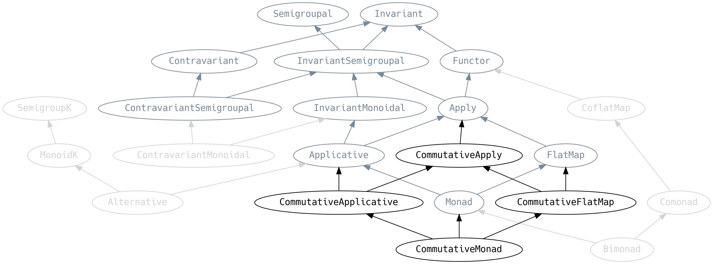

## ContravariantMonoidal

{width=100%}
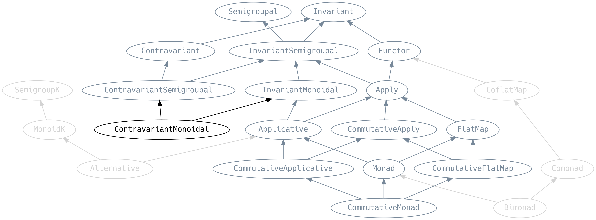

`ContravariantMonoidal` is the `Contravariant` analogue of `Apply`

{lang="text"}
~~~~~~~~
  @typeclass trait ContravariantMonoidal[F[_]] extends ContravariantSemigroupal[F] with InvariantMonoidal[F] {
    def trivial[A]: F[A] = contramap(unit)(_ => ())
  
    def contramap2[A, B, Z](f0: F[A], f1: F[B])(f: Z => (A, B)): F[Z]
    def contramap3[A, B, C, Z](f0: F[A], f1: F[B], f2: F[C])(f: Z => (A, B, C)): F[Z]
    ...
    def contramap22[...] = ...
  }
~~~~~~~~

`.contramap2` says that if we can break a `C` into an `A` and a `B`, and
we're given an `F[A]` and an `F[B]`, then we can get an `F[C]`.

This is a great way to generate contravariant typeclass instances for
product types by breaking the products into their parts. Cats has an
instance of `ContravariantMonoidal[Eq]`, let's construct an `Eq` for a new
product type `Foo`

{lang="text"}
~~~~~~~~
  scala> case class Foo(s: String, i: Int)
  scala> implicit val fooEqual: Eq[Foo] =
           ContravariantMonoidal.contramap2(Eq[String], Eq[Int]) {
             (foo: Foo) => (foo.s, foo.i)
           }
  scala> Foo("foo", 1) === Foo("bar", 1)
  res: Boolean = false
~~~~~~~~

Analagously to `.mapN`, there is a `.contramapN` that makes it even easier to
use

{lang="text"}
~~~~~~~~
  scala> case class Foo(s: String, i: Int)
  scala> implicit val fooEqual: Eq[Foo] = (Eq[String], Eq[Int]).contramapN {
           foo : Foo => (foo.s, foo.i)
         }
  scala> Foo("foo", 1) === Foo("bar", 1)
  res: Boolean = false
~~~~~~~~

Mirroring `Apply`, `ContravariantMonoidal` also has terse syntax for tuples.

{lang="text"}
~~~~~~~~
  ...
    def tuple2[A1, A2](a1: F[A1], a2: F[A2]): F[(A1, A2)] = ...
    ...
    def tuple22[...] = ...
  }
~~~~~~~~

Generally, if a typeclass author provides an instance of `ContravariantMonoidal`
or `Apply` it makes it a lot easier for users to derive instances for their
data.

`.trivial` allows creating implementations where the type parameter is ignored.
Such values are called *universally quantified*. For example, the
`ContravariantMonoidal[Eq].trivial[Nil]` returns an implementation of `Eq` for
an empty list, which is always `true`.

Be careful, because we can create broken instances if we use `.trivial` for
situations that require non-trivial logic. For example we can accidentally
create a broken `Eq`

{lang="text"}
~~~~~~~~
  scala> case class Foo(s: String, i: Int)
  scala> implicit val fooEqual: Eq[Foo] = ContravariantMonoidal[Eq].trivial
  scala> Foo("foo", 1) === Foo("bar", 1)
  res: Boolean = true // BROKEN!!
~~~~~~~~

## SemigroupK, MonoidK, Alternative

{width=100%}
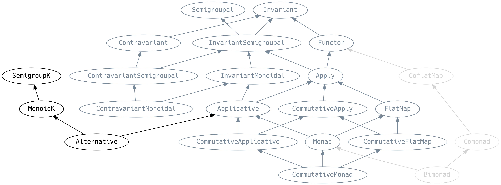

`SemigroupK` is `Semigroup` but for type constructors, and `MonoidK` is the
equivalent of `Monoid`. The `K` suffix is for Kind, as in the Higher Kinded
Types (HKT) language feature described in Chapter 1.

{lang="text"}
~~~~~~~~
  @typeclass trait SemigroupK[F[_]] {
    @op("<+>") def combineK[A](x: F[A], y: F[A]): F[A]
  
    def algebra[A]: Semigroup[F[A]]
  }
  @typeclass trait MonoidK[F[_]] extends SemigroupK[F] {
    def empty[A]: F[A]
  
    override def algebra[A]: Monoid[F[A]]
  }
~~~~~~~~

The `.algebra` method gives us a regular `Semigroup` or `Monoid` for a concrete
type parameter `A`.

A> `<+>` is spoken as the "higher kinded combine operator" or "SemigroupK combine
A> operator".

Although it may look on the surface as if `<+>` behaves like `|+|`

{lang="text"}
~~~~~~~~
  scala> List(2,3) |+| List(7)
  res = List(2, 3, 7)
  
  scala> List(2,3) <+> List(7)
  res = List(2, 3, 7)
~~~~~~~~

it is best to think of it as operating only at the `F[_]` level, never looking
into the contents. `SemigroupK` has the convention that it should ignore failures and
"pick the first winner". `<+>` can therefore be used as a mechanism for early
exit (losing information) and failure-handling via fallbacks:

{lang="text"}
~~~~~~~~
  scala> Option(1) |+| Option(2)
  res = Some(3)
  
  scala> Option(1) <+> Option(2)
  res = Some(1)
  
  scala> Option.empty[Int] <+> Option(1)
  res = Some(1)
~~~~~~~~

For example, if we have a `NonEmptyList[Option[Int]]` and we want to ignore
`None` values (failures) and pick the first winner (`Some`), we can call
`.reduceK`

{lang="text"}
~~~~~~~~
  scala> NonEmptyList.of(None, None, Some(1), Some(2), None).reduceK
  res: Option[Int] = Some(1)
~~~~~~~~

where `.reduceK` is defined on `Reducible` along with other higher-kinded
variants of fold and reduce:

{lang="text"}
~~~~~~~~
  @typeclass trait Foldable[F[_]] extends UnorderedFoldable[F] {
    def foldMapK[G[_]: MonoidK, A, B](fa: F[A])(f: A => G[B]): G[B]
    def foldK[G[_]: MonoidK, A](fga: F[G[A]]): G[A]
    ...
  }
  
  @typeclass trait Reducible[F[_]] extends Foldable[F] {
    def reduceK[G[_]: SemigroupK, A](fga: F[G[A]]): G[A]
    def reduceMapK[G[_]: SemigroupK, A, B](fa: F[A])(f: A => G[B]): G[B]
    ...
  }
~~~~~~~~

Now that we know about `SemigroupK`, we realise that we could have more easily
created an instance of `Monoid[TradeTemplate]` the section on Appendable Things.
Our objective was to "pick the last winner", which is the same as "pick the
winner" if the arguments are swapped.

Note the use of `<+>` `ccy` and `otc` with arguments swapped, and that we no
longer need to define `Monoid[Option[Currency]]`, `Monoid[Option[Boolean]]`
(which was breaking typeclass coherence) or `def lastWins[A]:
Monoid[Option[A]]`.

{lang="text"}
~~~~~~~~
  implicit val monoid: Monoid[TradeTemplate] = Monoid.instance(
    TradeTemplate(Nil, None, None),
    (a, b) => TradeTemplate(a.payments |+| b.payments,
                            b.ccy <+> a.ccy,
                            b.otc <+> a.otc)
  )
~~~~~~~~

`Applicative` has a specialised versions of `MonoidK` called `Alternative`

{lang="text"}
~~~~~~~~
  @typeclass trait Alternative[F[_]] extends Applicative[F] with MonoidK[F] {
  
    def unite[G[_]: Foldable, A](fga: F[G[A]])
          (implicit F: Monad[F]): F[A]
    def separate[G[_, _]: Bifoldable, A, B](fgab: F[G[A, B]])
          (implicit F: Monad[F]): (F[A], F[B])
  
    def separateFoldable[G[_, _]: Bifoldable, A, B](fgab: F[G[A, B]])
          (implicit F: Foldable[F]): (F[A], F[B])
  
  }
~~~~~~~~

`.unite` lets us fold a data structure using the outer container's
`MonoidK.algebra` rather than the inner content's `Monoid` (if it even has one).
For `List[Either[String, Int]]` this means `Left[String]` values are converted
into `.empty`, then everything is concatenated. A convenient way to discard
errors:

{lang="text"}
~~~~~~~~
  scala> List(Right(1), Left("boo"), Right(2)).unite
  res: List[Int] = List(1, 2)
~~~~~~~~

`.separate` is very useful if we have a collection of `Either` and we want to
reorganise them into a collection of `A` and a collection of `B`

{lang="text"}
~~~~~~~~
  scala> val list: List[Either[Int, String]] =
           List(Right("hello"), Left(1), Left(2), Right("world"))
  
  scala> list.separate
  res: (List[Int], List[String]) = (List(1, 2), List(hello, world))
~~~~~~~~

and `.separateFoldable` can be used when we have a `Foldable` rather than a
`Monad`. In the cases where we can use both, it is common to use `.separate`.

## Co-things

A *co-thing* typically has some opposite type signature to whatever
*thing* does, but is not necessarily its inverse. To highlight the
relationship between *thing* and *co-thing*, we will include the type
signature of *thing* wherever we can.

{width=100%}
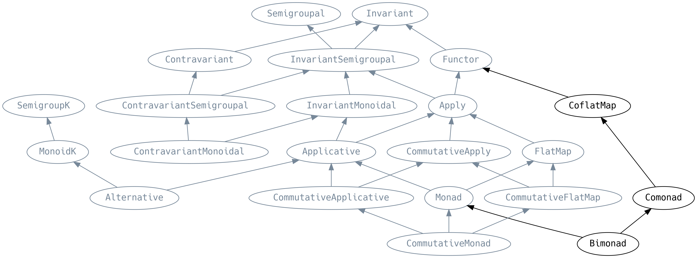

### CoflatMap

{lang="text"}
~~~~~~~~
  @typeclass trait CoflatMap[F[_]] extends Functor[F] {
    def coflatMap[A, B](fa: F[A])(f: F[A] => B): F[B]
  //def   flatMap[A, B](fa: F[A])(f: A => F[B]): F[B]
  
    def coflatten[A](fa: F[A]): F[F[A]]
  //def   flatten[A](ffa: F[F[A]]): F[A]
  }
~~~~~~~~

`.coflatMap` takes an `F[A] => B` that acts on an `F[A]` rather than its
elements. But this is not necessarily the full `fa`, it can be a substructure
that has been created by `.coflatten`.

Compelling use-cases for `CoflatMap` are rare, although when shown in the
`Functor` permutation table (for `F[_]`, `A` and `B`) it is difficult
to argue why any method should be less important than the others:

| method      | parameter          |
|----------- |------------------ |
| `map`       | `A => B`           |
| `contramap` | `B => A`           |
| `imap`      | `(A => B, B => A)` |
| `ap`        | `F[A => B]`        |
| `flatMap`   | `A => F[B]`        |
| `coflatMap` | `F[A] => B`        |

### Comonad

{lang="text"}
~~~~~~~~
  @typeclass trait Comonad[F[_]] extends CoflatMap[F] {
    def extract[A](x: F[A]): A
  //def    pure[A](a: A): F[A]
  }
~~~~~~~~

`.extract` unwraps an element from its context. The `Id` type alias that we
encountered in Chapter 1 has an instance of `Comonad`, so we can reach into an
`Id` and `.extract` the value it contains. Similarly, `Eval` has a `Comonad`
with `.extract` effectively being the `Now` strategy.

Another example of a `Comonad` is the `NonEmptyList`, where `.extract` returns
the `.head` element and `.coflatMap` operates on all the tails of the list.

Effects do not typically have an instance of `Comonad` since it would break
referential transparency to interpret an `IO[A]` into an `A`.

`Comonad` allows navigation over elements of a data structure and eventually
returning to one view of that data. Consider a *neighbourhood* (`Hood` for
short) of a list, containing all the elements to the left of an element
(`.lefts`), and all the elements to its right (`.rights`).

{lang="text"}
~~~~~~~~
  final case class Hood[A](lefts: List[A], focus: A, rights: List[A])
~~~~~~~~

The `.lefts` and `.rights` should each be ordered with the nearest element to
the `.focus` at the head, such that we can recover the original `List`
via `.toList`

{lang="text"}
~~~~~~~~
  object Hood {
    implicit class Ops[A](hood: Hood[A]) {
      def toList: List[A] = hood.lefts.reverse ::: hood.focus :: hood.rights
~~~~~~~~

We can write methods that let us move the focus one to the left
(`.previous`) and one to the right (`.next`)

{lang="text"}
~~~~~~~~
  ...
      def previous: Option[Hood[A]] = hood.lefts match {
        case Nil => None
        case head :: tail =>
          Some(Hood(tail, head, hood.focus :: hood.rights))
      }
      def next: Option[Hood[A]] = hood.rights match {
        case Nil => None
        case head :: tail =>
          Some(Hood(hood.focus :: hood.lefts, head, tail))
      }
~~~~~~~~

`.more` repeatedly applies an optional function to `Hood` such that we calculate
*all* the views that `Hood` can take on the list

{lang="text"}
~~~~~~~~
  ...
      def more(f: Hood[A] => Option[Hood[A]]): List[Hood[A]] =
        f(hood) match {
          case None => Nil
          case Some(r) => r :: r.more(f)
        }
      def positions: Hood[Hood[A]] = {
        val left  = hood.more(_.previous)
        val right = hood.more(_.next)
        Hood(left, hood, right)
      }
    }
~~~~~~~~

We can now implement `Comonad[Hood]`

{lang="text"}
~~~~~~~~
  ...
    implicit val comonad: Comonad[Hood] = new Comonad[Hood] {
      def map[A, B](fa: Hood[A])(f: A => B): Hood[B] =
        Hood(fa.lefts.map(f), f(fa.focus), fa.rights.map(f))
      def coflatMap[A, B](fa: Hood[A])(f: Hood[A] => B): Hood[B] =
        fa.positions.map(f)
      def extract[A](fa: Hood[A]): A = fa.focus
    }
  }
~~~~~~~~

`.coflatten` gives us a `Hood[Hood[List]]` containing all the possible
neighbourhoods in our initial `List`

{lang="text"}
~~~~~~~~
  scala> Hood(List(4, 3, 2, 1), 5, List(6, 7, 8, 9)).coflatten
  res = Hood(
          [Hood([3,2,1],4,[5,6,7,8,9]),
           Hood([2,1],3,[4,5,6,7,8,9]),
           Hood([1],2,[3,4,5,6,7,8,9]),
           Hood([],1,[2,3,4,5,6,7,8,9])],
          Hood([4,3,2,1],5,[6,7,8,9]),
          [Hood([5,4,3,2,1],6,[7,8,9]),
           Hood([6,5,4,3,2,1],7,[8,9]),
           Hood([7,6,5,4,3,2,1],8,[9]),
           Hood([8,7,6,5,4,3,2,1],9,[])])
~~~~~~~~

Indeed, `.coflatten` is just `.positions`! We can `override` it with a more
direct (and performant) implementation

{lang="text"}
~~~~~~~~
  override def coflatten[A](fa: Hood[A]): Hood[Hood[A]] = fa.positions
~~~~~~~~

`Comonad` generalises the concept of `Hood` to arbitrary data structures. `Hood`
is an example of a *zipper* (unrelated to `Zip`). An application of a zipper is
for *cellular automata*, which compute the value of each cell in the next
generation by performing a computation based on the neighbourhood of that cell.

Finally, `Bimonad` exists for structures that have both a `Monad` and a `Comonad`

{lang="text"}
~~~~~~~~
  @typeclass trait Bimonad[F[_]] extends Monad[F] with Comonad[F]
~~~~~~~~

Examples of `Bimonads` are `Id`, `Eval`, pure functions that have no parameters
(*thunks*), and many non-empty collections.

## Summary

That was a lot of material! We have just explored a standard library
of polymorphic functionality. But to put it into perspective: there
are more traits in the Scala stdlib Collections API than typeclasses
in Cats.

It is normal for an FP application to only touch a small percentage of the
typeclass hierarchy, with most functionality coming from domain-specific
algebras and typeclasses. Even if the domain-specific typeclasses are just
specialised clones of something in Cats, it is OK to refactor it later.

To help, we have included a cheat-sheet of the typeclasses and their
primary methods in the Appendix.

To help further, Valentin Kasas explains how to [combine `N` things](https://twitter.com/ValentinKasas/status/879414703340081156):

{width=70%}
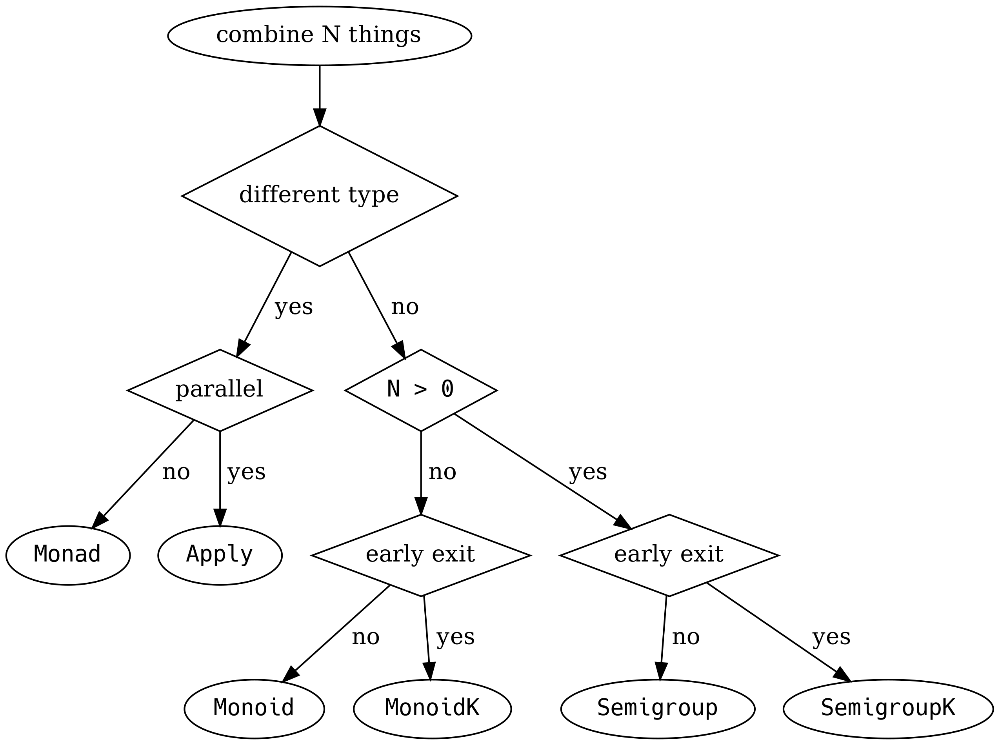

# Cats Data Types

In this chapter we will explore some Cats data types that augment the Scala
language with useful semantics and additional type safety.

## Natural Transformations

A function from one type to another is written as `A => B` in Scala, which is
syntax sugar for a `Function1[A, B]`. Cats provides similar syntax sugar `F ~>
G` for functions over type constructors `F[_]` to `G[_]`.

These `F ~> G` are called *natural transformations* and are *universally
quantified* because they don't care about the contents of `F[_]`.

{lang="text"}
~~~~~~~~
  type ~>[F[_], G[_]] = FunctionK[F, G]
  trait FunctionK[F[_], G[_]] {
    def apply[A](fa: F[A]): G[A]
  
    def compose[E[_]](f: E ~> F): E ~> G = ...
    def andThen[H[_]](f: G ~> H): F ~> H = ...
  }
~~~~~~~~

An example of a natural transformation is a function that converts a `Vector`
into a `List`

{lang="text"}
~~~~~~~~
  scala> val convert = new (Vector ~> List) {
           def apply[A](fa: Vector[A]): List[A] = fa.toList
         }
  
  scala> convert(Vector(1, 2, 3))
  res: List[Int] = List(1, 2, 3)
~~~~~~~~

Or, more concisely, making use of `kind-projector`'s syntax sugar with either of
the following:

{lang="text"}
~~~~~~~~
  scala> val convert = λ[Vector ~> List](_.toList)
  
  scala> val convert = Lambda[Vector ~> List](_.toList)
~~~~~~~~

However, in day-to-day development, it is far more likely that we will use a
natural transformation to map between algebras. For example, in
`drone-dynamic-agents` we may want to implement our Google Container Engine
`Machines` algebra with an off-the-shelf algebra, `BigMachines`. Instead of
changing all our business logic and tests to use this new `BigMachines`
interface, we may be able to write a transformation from `Machines ~>
BigMachines`. We will return to this idea in the chapter on Cats Monads.

## Containers

### Validated

At first sight, `Validated` appears to be a clone of `Either`:

{lang="text"}
~~~~~~~~
  sealed abstract class Validated[+E, +A] { ... }
  final case class Valid[+A](a: A) extends Validated[Nothing, A]
  final case class Invalid[+E](e: E) extends Validated[E, Nothing]
  
  type ValidatedNel[+E, +A] = Validated[NonEmptyList[E], A]
  
  object Validated {
    def valid[E, A](a: A): Validated[E, A] = Valid(a)
    def invalid[E, A](e: E): Validated[E, A] = Invalid(e)
    def validNel[E, A](a: A): ValidatedNel[E, A] = Valid(a)
    def invalidNel[E, A](e: E): ValidatedNel[E, A] = Validated.Invalid(NonEmptyList(e, Nil))
  
    def fromEither[E, A](e: Either[E, A]): Validated[E, A] = ...
    def fromOption[A, B](o: Option[B], ifNone: => A): Validated[A, B] = ...
    def fromIor[A, B](ior: Ior[A, B]): Validated[A, B] = ...
    ...
  }
~~~~~~~~

With convenient syntax

{lang="text"}
~~~~~~~~
  implicit class ValidatedOps[A](self: A) {
    def valid[B]: Validated[B, A] = ...
    def validNel[B]: ValidatedNel[B, A] = ...
    def invalid[B]: Validated[A, B] = ...
    def invalidNel[B]: ValidatedNel[A, B] = ...
  }
~~~~~~~~

However, the data structure itself is not the complete story. `Validated`
intentionally does not have an instance of any `Monad`, restricting itself to
success-biased versions of `Applicative`.

The big advantage of restricting to `Applicative` is that `Validated`
is explicitly for situations where we wish to report all failures,
whereas `Either` is used to stop at the first failure. To
accommodate failure accumulation, a popular form of `Validated` is
`ValidatedNel`, having a `NonEmptyList[E]` in the failure position.

Consider performing input validation of data provided by a user using
`Either` and `.flatMap`:

{lang="text"}
~~~~~~~~
  scala> :paste
         final case class Credentials(user: Username, name: Fullname)
         final case class Username(value: String) extends AnyVal
         final case class Fullname(value: String) extends AnyVal
  
         def username(in: String): Either[String, Username] =
           if (in.isEmpty) Left("empty username")
           else if (in.contains(" ")) Left("username contains spaces")
           else Right(Username(in))
  
         def realname(in: String): Either[String, Fullname] =
           if (in.isEmpty) Left("empty real name")
           else Right(Fullname(in))
  
  scala> for {
           u <- username("zara turtle")
           r <- realname("")
         } yield Credentials(u, r)
  res = Left(username contains spaces)
~~~~~~~~

If we use `.mapN` syntax

{lang="text"}
~~~~~~~~
  scala> (username("zara turtle"), realname("")).mapN (Credentials.apply)
  res = Left(username contains spaces)
~~~~~~~~

we still get back the first failure. This is because `Either` is
a `Monad`, its `.mapX` methods must be consistent with `.flatMap`
and not assume that any operations can be performed out of order.
Compare to:

{lang="text"}
~~~~~~~~
  scala> :paste
         def username(in: String): ValidatedNel[String, Username] =
           if (in.isEmpty) "empty username".invalidNel
           else if (in.contains(" ")) "username contains spaces".invalidNel
           else Username(in).valid
  
         def realname(in: String): ValidatedNel[String, Fullname] =
           if (in.isEmpty) "empty real name".invalidNel
           else Fullname(in).valid
  
  scala> (username("zara turtle") |@| realname("")) (Credentials.apply)
  res = Invalid(NonEmpty[username contains spaces,empty real name])
~~~~~~~~

This time, we get back all the failures!

`Either` and `Validated` are the more performant FP equivalent of a checked
exception for input validation, avoiding both a stacktrace and requiring the
caller to deal with the failure resulting in more robust systems.

A> One of the slowest things on the JVM is to create an exception, due to the
A> resources required to construct the stacktrace. It is traditional to use
A> exceptions for input validation and parsing, which can be thousands of times
A> slower than the equivalent functions written with `Either` or `Validated`.
A> 
A> Some people claim that predictable exceptions for input validation are
A> referentially transparent because they will occur every time. However, the
A> stacktrace inside the exception depends on the call chain, giving a different
A> value depending on who calls it, thus breaking referential transparency.
A> Regardless, throwing an exception is not pure because it means the function is
A> not *Total*.

### Ior

We encountered `Ior`, a data encoding of inclusive logical `OR`,
when we learnt about `Align`.

{lang="text"}
~~~~~~~~
  sealed abstract class Ior[+A, +B]
  final case class Left[A](a: A) extends Ior[A, Nothing]
  final case class Right[B](b: B) extends Ior[Nothing, B]
  final case class Both[A, B](a: A, b: B) extends Ior[A, B]
  
  type IorNel[+B, +A] = Ior[NonEmptyList[B], A]
  
  object Ior {
    def left[A, B](a: A): A Ior B = ...
    def right[A, B](b: B): A Ior B = ...
    def both[A, B](a: A, b: B): A Ior B = ...
    def leftNel[A, B](a: A): IorNel[A, B] = ...
    def bothNel[A, B](a: A, b: B): IorNel[A, B] = ...
  }
~~~~~~~~

`.flatMap` is right-biased (`Both` and `Right`), taking a `Semigroup`
of the `Left` content to combine rather than break early.

Although it is tempting to use `Ior` in return types, overuse is an
anti-pattern, because it is more difficult for the caller to consider three
scenarios (roughly failure, partial failure, and success) than regular failure
and success.

### Higher Kinded Either

The `EitherK` data type wraps `Either` for type constructors:

{lang="text"}
~~~~~~~~
  final case class EitherK[F[_], G[_], A](run: Either[F[A], G[A]])
  object EitherK {
    def leftc[F[_], G[_], A](x: F[A]): EitherK[F, G, A] = ...
    def rightc[F[_], G[_], A](x: G[A]): EitherK[F, G, A] = ...
  }
~~~~~~~~

Typeclass instances simply delegate to those of the `F[_]` and `G[_]`.

The most popular use case for `Coproduct` is when we want to create an anonymous
coproduct of multiple ADTs.

### Const

`Const`, for *constant*, is a wrapper for a value of type `A`, along with a
spare type parameter `B`.

{lang="text"}
~~~~~~~~
  final case class Const[A, B](getConst: A) {
    def retag[C]: Const[A, C] = ...
  }
~~~~~~~~

`Const` provides an instance of `Applicative[Const[A, ?]]` if there is a
`Monoid[A]` available:

{lang="text"}
~~~~~~~~
  implicit def applicative[A: Monoid]: Applicative[Const[A, ?]] =
    new Applicative[Const[A, ?]] {
      def pure[B](b: B): Const[A, B] = Const(Monoid[A].empty)
      def ap[A, B](f: Const[C, A => B])(fa: Const[C, A]): Const[C, B] =
        f.retag[B].combine(fa.retag[B])
      ...
    }
~~~~~~~~

The most important thing about this `Applicative` is that it ignores the `B`
parameters, continuing on without failing and only combining the constant values
that it encounters.

Going back to our example application `drone-dynamic-agents`, we should first
refactor our `logic.scala` file to use `Applicative` instead of `Monad`. We
wrote `logic.scala` before we learnt about `Applicative` and now we know better:

{lang="text"}
~~~~~~~~
  final class DynAgentsModule[F[_]: Applicative](D: Drone[F], M: Machines[F])
    extends DynAgents[F] {
    ...
    def act(world: WorldView): F[WorldView] = world match {
      case NeedsAgent(node) =>
        M.start(node) as world.copy(pending = Map(node -> world.time))
  
      case Stale(nodes) =>
        nodes.traverse { node =>
          M.stop(node) as node
        }.map { stopped =>
          val updates = stopped.strengthR(world.time).toList.toMap
          world.copy(pending = world.pending ++ updates)
        }
  
      case _ => world.pure[F]
    }
    ...
  }
~~~~~~~~

Since our business logic only requires an `Applicative`, we can write mock
implementations with `F[a]` as `Const[String, a]`. In each case, we return the
name of the function that is called:

{lang="text"}
~~~~~~~~
  object ConstImpl {
    type F[a] = Const[String, a]
  
    private val D = new Drone[F] {
      def getBacklog: F[Int] = Const("backlog")
      def getAgents: F[Int]  = Const("agents")
    }
  
    private val M = new Machines[F] {
      def getAlive: F[Map[MachineNode, Epoch]]     = Const("alive")
      def getManaged: F[NonEmptyList[MachineNode]] = Const("managed")
      def getTime: F[Epoch]                        = Const("time")
      def start(node: MachineNode): F[Unit]        = Const("start")
      def stop(node: MachineNode): F[Unit]         = Const("stop")
    }
  
    val program = new DynAgentsModule[F](D, M)
  }
~~~~~~~~

With this interpretation of our program, we can assert on the methods that are
called:

{lang="text"}
~~~~~~~~
  it should "call the expected methods" in {
    import ConstImpl._
  
    val alive    = Map(node1 -> time1, node2 -> time1)
    val world    = WorldView(1, 1, managed, alive, Map.empty, time4)
  
    program.act(world).getConst shouldBe "stopstop"
  }
~~~~~~~~

Alternatively, we could have counted total method calls by using `Const[Int, ?]`
or an `Map[String, Int]`.

With this test, we've gone beyond traditional *Mock* testing with a `Const` test
that asserts on *what is called* without having to provide implementations. This
is useful if our specification demands that we make certain calls for certain
input, e.g. for accounting purposes. Furthermore, we've achieved this with
compiletime safety.

Taking this line of thinking a little further, say we want to monitor (in
production) the nodes that we are stopping in `.act`. We can create
implementations of `Drone` and `Machines` with `Const`, calling it from our
wrapped version of `.act`

{lang="text"}
~~~~~~~~
  final class Monitored[U[_]: Functor](program: DynAgents[U]) {
    type F[a] = Const[Set[MachineNode], a]
    private val D = new Drone[F] {
      def getBacklog: F[Int] = Const(Set())
      def getAgents: F[Int]  = Const(Set())
    }
    private val M = new Machines[F] {
      def getAlive: F[Map[MachineNode, Epoch]]     = Const(Set())
      def getManaged: F[NonEmptyList[MachineNode]] = Const(Set())
      def getTime: F[Epoch]                        = Const(Set())
      def start(node: MachineNode): F[Unit]        = Const(Set())
      def stop(node: MachineNode): F[Unit]         = Const(Set(node))
    }
    val monitor = new DynAgentsModule[F](D, M)
  
    def act(world: WorldView): U[(WorldView, Set[MachineNode])] = {
      val stopped = monitor.act(world).getConst
      program.act(world).strengthR(stopped)
    }
  }
~~~~~~~~

We can do this because `monitor` is *pure* and running it produces no side
effects.

This runs the program with `ConstImpl`, extracting all the calls to
`Machines.stop`, then returning it alongside the `WorldView`. We can unit test
this:

{lang="text"}
~~~~~~~~
  it should "monitor stopped nodes" in {
    val underlying = new Mutable(needsAgents).program
  
    val alive = Map(node1 -> time1, node2 -> time1)
    val world = WorldView(1, 1, managed, alive, Map.empty, time4)
    val expected = world.copy(pending = Map(node1 -> time4, node2 -> time4))
  
    val monitored = new Monitored(underlying)
    monitored.act(world) shouldBe (expected -> Set(node1, node2))
  }
~~~~~~~~

We have used `Const` to do something that looks like *Aspect Oriented
Programming*, once popular in Java. We built on top of our business logic to
support a monitoring concern, without having to complicate the business logic.

It gets even better. We can run `ConstImpl` in production to gather what we want
to `.stop`, and then provide an **optimised** implementation of `act` that can make
use of implementation-specific batched calls.

The silent hero of this story is `Applicative`. `Const` lets us show off what is
possible. If we need to change our program to require a `Monad`, we can no
longer use `Const` and must write full mocks to be able to assert on what is
called under certain inputs. The *Rule of Least Power* demands that we use
`Applicative` instead of `Monad` wherever we can.

### Chain

`Chain` is a catenable sequence that supports `O(1)` appending, prepending and
concatenation. It is especially useful if we need to construct a collection by
concatening existing collections (that may be any `Seq`), adding individual
elements (by pre-pending or appending) or concatenating existing `Chain` values.

{lang="text"}
~~~~~~~~
  sealed abstract class Chain[+A] {
    def prepend[A2 >: A](a: A2): Chain[A2] = ...
    def append[A2 >: A](a: A2): Chain[A2] = ...
    def concat[A2 >: A](c: Chain[A2]): Chain[A2] = ...
  
    def toList: List[A] = ...
    def toVector: Vector[A] = ...
  
    def groupBy[B: Order](f: A => B): SortedMap[B, NonEmptyChain[A]] = ...
    ...
  }
  
  object Chain {
    case object Empty extends Chain[Nothing]
    final case class Singleton[A](a: A) extends Chain[A]
    final case class Append[A](left: Chain[A], right: Chain[A]) extends Chain[A]
    final case class Wrap[A](seq: Seq[A]) extends Chain[A]
  
    def empty[A]: Chain[A] = ...
    def one[A](a: A): Chain[A] = ...
    def fromSeq[A](s: Seq[A]): Chain[A] = ...
    ...
  }
~~~~~~~~

`Chain` has a `Monad` and also has a `NonEmptyChain` variant.

The user of `Chain` is expected to manually *balance* it because two `Chain` may
contain the same values but be represented different ways, and therefore have
different performance characteristics. For example, if we construct a `Chain`
entirely out of `Singleton` by using `.prepend` and `.append` then our `Chain`
will have more *links* in it but if we use `.concat` and `Chain.fromSeq` where
possible then we will have less links per datum.

The ability to control the shape of the `Chain` makes it suitable for cases
where it is useful to encode domain knowledge of a hierarchy into the data
structure. For example, in artificial intelligence, a `Chain` can be used in
[clustering algorithms](https://arxiv.org/abs/1203.3468) to organise data into a hierarchy of increasingly similar
things. It is possible to represent XML documents with a `Chain`.

When working with hierarchical data, consider using a `Chain` instead of rolling
a custom data structure.

`Chain` is also useful if we wish to build a regular data structure such as
`Vector` but the performance cost of appending `Vector` at every level is too
high. Constructing the `Vector` by first creating a `Chain` will cost `O(N)` and
thereafter the lookup cost is `O(1)`.

### `OneAnd`

Recall that `Foldable` is the Cats equivalent of a collections API and
`Reducible` is for non-empty collections. We have already seen `NonEmptyList`
and `NonEmptyChain` which provide `Reducible`, there is also `NonEmptySet`,
`NonEmptyMap` and `NonEmptyVector` which wrap the standard library collections.
The simple data structure `OneAnd` wraps any other collection to turn it into a
`Reducible`:

{lang="text"}
~~~~~~~~
  final case class OneAnd[F[_], A](head: A, tail: F[A])
~~~~~~~~

`NonEmptyList[A]` could be an alias to `OneAnd[List, A]`. Similarly, we can
create non-empty `Stream`. However it may break ordering and uniqueness
characteristics of the underlying structure: a `OneAnd[Set, A]` is not a
non-empty `Set`, it is a `Set` with a guaranteed first element that may also be
in the `Set`.

## Summary

In this chapter we have skimmed over the data types that Cats has to offer.

It is not necessary to remember everything from this chapter: think of each
section as having planted the kernel of an idea.

The world of functional data structures is an active area of research. Academic
publications appear regularly with new approaches to old problems. Implementing
a functional data structure from the literature is a good contribution to the
Cats ecosystem.

# Cats Monads

In this chapter we will study some of the most important implementations of
`Monad` and in particular those that are provided by the `cats-mtl` and
`cats-effect` libraries which can be installed with

{lang="text"}
~~~~~~~~
  libraryDependencies += "org.typelevel" %% "cats-mtl-core" % "0.7.1"
  libraryDependencies += "org.typelevel" %% "cats-free" % "2.1.1"
  libraryDependencies += "org.typelevel" %% "cats-effect" % "2.1.2"
~~~~~~~~

and the source snippets in this section assume that the following imports
are being used

{lang="text"}
~~~~~~~~
  import cats._, data._, implicits._
  import cats.free._
  import cats.mtl._
  import cats.effect._
  import cats.effect.concurrent._
  import simulacrum._
~~~~~~~~

## Always in motion is the `Future`

The biggest problem with `Future` is that it eagerly schedules work during
construction. As we discovered in the introduction, `Future` conflates the
definition of a program with *interpreting* it (i.e. running it).

`Future` is also suboptimal from a performance perspective: every time `.flatMap` is
called, a closure is submitted to an `Executor`, resulting in unnecessary thread
scheduling and context switching. It is not unusual to see 50% of our CPU power
dealing with thread scheduling, instead of doing the work. So much so that
parallelising work with `Future` can often make it *slower*.

Combined, eager evaluation and executor submission means that it is impossible
to know when a job started, when it finished, or the sub-tasks that were spawned
to calculate the final result.

Furthermore, `Future.flatMap` requires an `ExecutionContext` to be in implicit
scope: users are forced to think about business logic and execution semantics at
the same time.

## Effects and Side Effects

If we cannot call side-effecting methods in our business logic, or in `Future`
(or `Id`, or `Either`, or `Const`, etc), **when can** we write them? The answer
is: in a `Monad` that delays execution until it is interpreted at the
application's entrypoint. We can now refer to I/O and mutation as an *effect* on
the world, captured by the type system, as opposed to having a hidden
*side-effect*.

The simplest implementation of such a `Monad` is `IO`, formalising the version
we wrote in the introduction:

{lang="text"}
~~~~~~~~
  final class IO[A](val interpret: () => A)
  object IO {
    def apply[A](a: =>A): IO[A] = new IO(() => a)
  
    implicit val monad: Monad[IO] = new Monad[IO] {
      def pure[A](a: A): IO[A] = IO(a)
      def flatMap[A, B](fa: IO[A])(f: A => IO[B]): IO[B] =
        IO(f(fa.interpret()).interpret())
      ...
    }
  }
~~~~~~~~

The `.interpret` method is only called once, in the entrypoint of an
application:

{lang="text"}
~~~~~~~~
  def main(args: Array[String]): Unit = program.interpret()
~~~~~~~~

However, there are two big problems with this simple `IO`:

1.  it can stack overflow
2.  it doesn't support parallel computations

Both of these problems will be overcome in this chapter. However, no matter how
complicated the internal implementation of a `Monad`, the principles described
here remain true: we're modularising the definition of a program and its
execution, such that we can capture effects in type signatures, allowing us to
reason about them, and reuse more code.

## Stack Safety

On the JVM, every method call adds an entry to the call stack of the `Thread`,
like adding to the front of a `List`. When the method completes, the method at
the `.head` is thrown away. The maximum length of the call stack is determined by
the `-Xss` flag when starting up `java`. Tail recursive methods are detected by
the Scala compiler and do not add an entry. If we hit the limit, by calling too
many chained methods, we get a `StackOverflowError`.

Unfortunately, every nested call to our `IO`'s `.flatMap` adds another method
call to the stack. The easiest way to see this is to repeat an action forever,
and see if it survives for longer than a few seconds. We can create a (broken)
recursive `.forever` with

{lang="text"}
~~~~~~~~
  def forever[F[_]: FlatMap, A](fa: F[A]): F[Unit] =
    fa.flatMap(_ => forever(fa)).void
~~~~~~~~

and then call it on an action that just prints to the screen

{lang="text"}
~~~~~~~~
  scala> val hello = IO { println("hello") }
  scala> forever(hello).interpret()
  
  hello
  hello
  hello
  ...
  hello
  java.lang.StackOverflowError
      at java.io.FileOutputStream.write(FileOutputStream.java:326)
      at ...
      at monadio.IO$$anon$1.$anonfun$bind$1(monadio.scala:18)
      at monadio.IO$$anon$1.$anonfun$bind$1(monadio.scala:18)
      at ...
~~~~~~~~

A way to achieve stack safety is to convert method calls into references to an
ADT, the `Free` monad:

{lang="text"}
~~~~~~~~
  sealed abstract class Free[S[_], A]
  object Free {
    final case class Pure[S[_], A](a: A) extends Free[S, A]
    final case class Suspend[S[_], A](a: S[A]) extends Free[S, A]
    final case class FlatMapped[S[_], B, C](c: Free[S, C], f: C => Free[S, B]) extends Free[S, B]
    ...
  }
~~~~~~~~

The `Free` ADT is a natural data type representation of the `Monad` interface:

1.  `Pure` represents `.pure`
2.  `FlatMapped` represents `.flatMap`

When an ADT mirrors the arguments of related functions, it is called a *Church
encoding*.

`Free` is named because it can be *generated for free* for any `S[_]`. For
example, we could set `S` to be the `Drone` or `Machines` algebras from Chapter
3 and generate a data structure representation of our program. We will return to
why this is useful at the end of this chapter.

### `Trampoline`

`Free` is more general than we need for now. Setting the algebra `S[_]` to
`Function0`, a deferred calculation or *thunk*, we get `Trampoline` and can
implement a stack safe `Monad`

{lang="text"}
~~~~~~~~
  type Trampoline[A] = Free[Function0, A]
  implicit val trampoline: Monad[Trampoline] =
    new Monad[Trampoline] with Monad[Trampoline] {
      def pure[A](a: A): Trampoline[A] = Pure(a)
      def flatMap[A, B](fa: Trampoline[A])(f: A => Trampoline[B]): Trampoline[B] =
        FlatMapped(fa, f)
      def tailRecM[A, B](a: A)(f: A => Trampoline[Either[A, B]]): Trampoline[B] = flatMap(f(a)) {
        case Left(a)  => tailRecM(a)(f)
        case Right(b) => pure(b)
      }
    }
~~~~~~~~

Although this is not technically a `@tailrec` implementation of `tailRecM`, it
uses constant stack space because each call returns a heap object (`.flatMap`
will return a `FlatMapped`), which delays recursion.

A> Called `Trampoline` because every time we `.flatMap` on the stack, we *bounce*
A> back to the heap.

Convenient functions are provided to create a `Trampoline` eagerly (`.done`) or
by-name (`.delay`). We can also create a `Trampoline` from a by-name
`Trampoline` (`.defer`):

{lang="text"}
~~~~~~~~
  object Trampoline {
    def done[A](a: A): Trampoline[A]                = Pure(a)
    def delay[A](a: =>A): Trampoline[A]             = defer(done(a))
    def defer[A](a: =>Trampoline[A]): Trampoline[A] = done(()).flatMap(_ => a)
  }
~~~~~~~~

When we see `Trampoline[A]` in a codebase we can always mentally substitute it
with `A`, because it is simply adding stack safety to the pure computation. We
get the `A` by interpreting `Free`, provided by `.run`.

A> It is instructive, although not necessary, to understand how `Free.run` is
A> implemented: `.resume` evaluates a single layer of the `Free`, and `go` runs it
A> to completion.
A> 
A> In the following `Trampoline[A]` is used as a synonym for `Free[Function0, A]` to
A> make the code easier to read.
A> 
A> {lang="text"}
A> ~~~~~~~~
A>   sealed abstract class Trampoline[A] {
A>     def run: A = go(f => f())
A>   
A>     def go(f: (() => Trampoline[A]) => Trampoline[A]): A = {
A>       @tailrec def loop(t: Trampoline[A]): A = t.resume match {
A>         case Left(s) => loop(f(s))
A>         case Right(r) => r
A>       }
A>       loop(this)
A>     }
A>   
A>     @tailrec def resume: Either[S[Trampoline[A]], A] = this match {
A>       case Pure(a)    => Right(a)
A>       case Suspend(t) => Left(t.map(Pure(_)))
A>       case FlatMapped(c, f) => c match {
A>         case Pure(a)          => f(a).resume
A>         case Suspend(t)       => Left(t.map(f))
A>         case FlatMapped(d, g) => d.flatMap(dd => g(dd).flatMap(f)).resume
A>       }
A>     }
A>     ...
A>   }
A> ~~~~~~~~
A> 
A> The case that is most likely to cause confusion is when we have nested `FlatMapped`:
A> apply the inner function `g` then pass it to the outer one `f`, it is just
A> function composition.

### Stack Safe `IO`

Our `IO` can be made stack safe thanks to `Trampoline`:

{lang="text"}
~~~~~~~~
  final class IO[A](val tramp: Trampoline[A]) {
    def unsafePerformIO(): A = tramp.run
  }
  object IO {
    def apply[A](a: =>A): IO[A] = new IO(Trampoline.delay(a))
  
    implicit val monad: Monad[IO] =
      new Monad[IO] with StackSafeMonad[IO] {
        def pure[A](a: A): IO[A] = IO(a)
        def flatMap[A, B](fa: IO[A])(f: A => IO[B]): IO[B] =
          new IO(fa.tramp.flatMap(a => f(a).tramp))
      }
  }
~~~~~~~~

A> `StackSafeMonad` is a Cats mixin that implements the `.tailRecM` as previously
A> written. It should only be used when the author of the `Monad` is certain that
A> their implementation is stack safe: using it does not make an unsafe `Monad`
A> safe.

The interpreter, `.unsafePerformIO()`, has an intentionally scary name to
discourage using it except in the entrypoint of the application.

This time, using `FlatMap.foreverM` instead of our naive `.forever`, we don't
get a stack overflow error

{lang="text"}
~~~~~~~~
  scala> val hello = IO { println("hello") }
  scala> FlatMap[IO].foreverM(hello).unsafePerformIO()
  
  hello
  hello
  hello
  ...
  hello
~~~~~~~~

Using a `Trampoline` typically introduces a performance regression vs a regular
reference. It is `Free` in the sense of *freely generated*, not *free as in
gratis*.

A> Always benchmark instead of accepting sweeping statements about performance: it
A> may well be the case that the garbage collector performs better for an
A> application when using `Free` because of the reduced size of retained objects in
A> the stack.

## Monad Transformer Library

Monad transformers are data structures that wrap an underlying value and provide
a monadic *effect*.

For example, in Chapter 2 we used `OptionT` to let us use `F[Option[A]]` in a
`for` comprehension as if it was just a `F[A]`. This gave our program the effect
of an *optional* value. Alternatively, we can get the effect of optionality if
we have a `MonadPlus`.

This subset of data types and extensions to `Monad` are often referred to as the
*Monad Transformer Library* (MTL), summarised below. In this section, we will
explain each of the transformers, why they are useful, and how they work.

| Effect               | Underlying        | Transformer | Typeclass          |
|-------------------- |----------------- |----------- |------------------ |
| optionality          | `F[Option[A]]`    | `OptionT`   |                    |
| errors               | `F[Either[E, A]]` | `EitherT`   | `MonadError`       |
| a runtime value      | `A => F[B]`       | `ReaderT`   | `ApplicativeLocal` |
| journal / multitask  | `F[(W, A)]`       | `WriterT`   | `FunctorListen`    |
| evolving state       | `S => F[(S, A)]`  | `StateT`    | `MonadState`       |
| keep calm & carry on | `F[Ior[E, A]]`    | `IorT`      | `MonadChronicle`   |

### `.mapK`, `.liftF` and `.liftK`

It is typical that a transformer will implement methods named `.mapK` and
`.liftF` having the following general pattern:

{lang="text"}
~~~~~~~~
  final case class OptionT[F[_], A](value: F[Option[A]]) {
    def mapK[G[_]](f: F ~> G): OptionT[G, A] = ...
    ...
  }
  object OptionT {
    def liftF[F[_]: Functor, A](fa: F[A]): OptionT[F, A] = ...
    def liftK[F[_]: Functor]: F ~> OptionT[F, ?] = ...
    ...
  }
  
  final case class EitherT[F[_], A, B](value: F[Either[A, B]]) {
    def mapK[G[_]](f: F ~> G): EitherT[G, A, B] = ...
    ...
  }
  object EitherT {
    def liftF[F[_]: Functor, A, B](fb: F[B]): EitherT[F, A, B] = ...
    def liftK[F[_]: Functor, A]: F ~> EitherT[F, A, ?] = ...
    ...
  }
~~~~~~~~

`.mapK` lets us apply a natural transformation to the context.

`.liftF` lets us create a monad transformer if we have an `F[A]`. For example,
we can create an `OptionT[IO, String]` by calling `OptionT.liftF` on an
`IO[String]`, which we seen in Chapter 2.

`.liftK` is the same as `.liftF` but returns a natural transformation.

Generally, there are three ways to create a monad transformer:

-   from the underlying, using the transformer's constructor
-   from a single value `A`, using `.pure` from the `Monad` syntax
-   from an `F[A]`, using `.liftF` on the companion

### `OptionT`

{lang="text"}
~~~~~~~~
  final case class OptionT[F[_], A](value: F[Option[A]])
  object OptionT {
    def some[F[_]: Applicative, A](a: A): OptionT[F, A] = ...
    def none[F[_]: Applicative, A]: OptionT[F, A] = ...
    ...
  }
~~~~~~~~

providing a `MonadPlus`

{lang="text"}
~~~~~~~~
  implicit def monad[F[_]: Monad] = Monad[OptionT[F, ?]] {
    def pure[A](a: A): OptionT[F, A] = OptionT.some(a)
    def flatMap[A, B](fa: OptionT[F, A])(f: A => OptionT[F, B]): OptionT[F, B] =
      fa.flatMap(f)
  
    def tailRecM[A, B](a: A)(f: A => OptionT[F, Either[A, B]]): OptionT[F, B] =
      OptionT(a.tailRecM(a0 =>
        f(a0).value.map(_.fold(Right(None))(_.map(b => Some(b))))))
  }
~~~~~~~~

This monad looks fiddly, but it is just delegating everything to the `Monad[F]`
and then re-wrapping with an `OptionT`, with `.tailRecM` returning a heap object
to guarantee stack safety.

With this monad we can write logic that handles optionality in the `F[_]`
context, rather than carrying around `Option`.

For example, say we are interfacing with a social media website to count the
number of stars a user has, and we start with a `String` that may or may not
correspond to a user. We have this algebra:

{lang="text"}
~~~~~~~~
  trait Twitter[F[_]] {
    def getUser(name: String): F[Option[User]]
    def getStars(user: User): F[Int]
  }
  def T[F[_]](implicit t: Twitter[F]): Twitter[F] = t
~~~~~~~~

We need to call `.getUser` followed by `.getStars`. If we use `Monad` as our
context, our function is difficult because we have to handle the `Empty` case:

{lang="text"}
~~~~~~~~
  def stars[F[_]: Monad: Twitter](name: String): F[Option[Int]] = for {
    maybeUser  <- T.getUser(name)
    maybeStars <- maybeUser.traverse(T.getStars)
  } yield maybeStars
~~~~~~~~

However, we can use `OptionT` in the return type:

{lang="text"}
~~~~~~~~
  def stars[F[_]: Monad: Twitter](name: String): OptionT[F, Int] = for {
    user  <- OptionT(T.getUser(name))
    stars <- OptionT.liftF(T.getStars(user))
  } yield stars
~~~~~~~~

An optional value is a special case of a value that may be an error, where we
don't know anything about the error. The next section generalises `OptionT`.

### `EitherT`

`EitherT` allows us to use any type we want as the error value, providing
contextual information about what went wrong.

`EitherT` is a wrapper around an `F[Either[E, A]]`

{lang="text"}
~~~~~~~~
  final case class EitherT[F[_], E, A](value: F[Either[E, A]])
  object EitherT {
    def fromEither[F[_]: Applicative, E, A](d: Either[E, A]): EitherT[F, E, A] = ...
    def right[F[_]: Applicative, E, A](fb: F[E]): EitherT[F, E, A] = ...
    def left[F[_]: Functor, E, A](fa: F[A]): EitherT[F, E, A] = ...
    def rightT[F[_]: Applicative, E, A](e: E): EitherT[F, E, A] = ...
    def leftT[F[_]: Applicative, E, A](a: A): EitherT[F, E, A] = ...
    def fromOptionF[F[_]: Functor, E, A](fa: F[Option[A]], e: =>E): EitherT[F, E, A] = ...
    ...
  }
~~~~~~~~

The `Monad` is a `MonadError`

{lang="text"}
~~~~~~~~
  @typeclass trait ApplicativeError[F[_], E] extends Applicative[F] {
    def raiseError[A](e: E): F[A]
    def handleErrorWith[A](fa: F[A])(f: E => F[A]): F[A]
  
    def attempt[A](fa: F[A]): F[Either[E, A]] = ...
    def handleError[A](fa: F[A])(f: E => A): F[A] = ...
  
    def fromEither[A](x: Either[E, A]): F[A] = ...
    def fromOption[A](oa: Option[A], ifEmpty: =>E): F[A] = ...
  }
  
  @typeclass trait MonadError[F[_], E] extends Monad[F] with ApplicativeError[F]
~~~~~~~~

`.raiseError` and `.handleErrorWith` are self-descriptive: the equivalent of `throw`
and `catch` an exception, respectively.

Although `EitherT` has a `MonadError`, it is worth noting that most of the
functionality sits on `ApplicativeError`, which does not require a `Monad` and
is therefore more generally applicable.

`.attempt` brings errors into the value, which is useful for exposing errors in
subsystems as first class values.

`.handleError` is for turning an error into a value for all cases, as opposed to
`.handleErrorWith` which takes an `F[A]` and therefore allows partial recovery.

We can rewrite our `Twitter` example to make use of `MonadError`

{lang="text"}
~~~~~~~~
  def stars[F[_]: Twitter](name: String)
                          (implicit F: MonadError[F, String]): F[Int] = for {
    user <- T.getUser(name).flatMap(F.fromOption(_, s"user '$name' not found"))
    stars <- T.getStars(user)
  } yield stars
~~~~~~~~

A> It is common to use `implicit` parameter blocks instead of context bounds when
A> the signature of the typeclass has more than one parameter.
A> 
A> It is also common practice to name the implicit parameter after the primary
A> type, in this case `F`.

We can also return the transformer directly, which looks like

{lang="text"}
~~~~~~~~
  def stars[F[_]: Monad: Twitter](name: String): EitherT[F, String, Int] = for {
    user  <- EitherT.fromOptionF(T.getUser(name), s"user '$name' not found")
    stars <- EitherT.right(T.getStars(user))
  } yield stars
~~~~~~~~

The decision to require a more powerful `Monad` vs directly returning a
transformer is something that each team can decide for themselves based on the
interpreters that they plan on using for their program.

Forgetting `EitherT` for a moment, the simplest instance of `MonadError` is for
`Either`, perfect for testing business logic that requires a `MonadError` but
does not need an effect. For example,

{lang="text"}
~~~~~~~~
  final class MockTwitter extends Twitter[Either[String, ?]] {
    def getUser(name: String): Either[String, Option[User]] =
      if (name.contains(" ")) Right(None)
      else if (name === "wobble") Left("connection error")
      else Right(Some(User(name)))
  
    def getStars(user: User): Either[String, Int] =
      if (user.name.startsWith("w")) Right(10)
      else Left("stars have been replaced by hearts")
  }
~~~~~~~~

Our unit tests for `.stars` might cover these cases:

{lang="text"}
~~~~~~~~
  scala> stars("wibble")
  Right(10)
  
  scala> stars("wobble")
  Left(connection error)
  
  scala> stars("i'm a fish")
  Left(user 'i'm a fish' not found)
  
  scala> stars("typelevel")
  Left(stars have been replaced by hearts)
~~~~~~~~

As we've now seen several times, we can focus on testing the pure business logic
without distraction.

Finally, if we return to our `JsonClient` algebra from Chapter 4.3

{lang="text"}
~~~~~~~~
  trait JsonClient[F[_]] {
    def get[A: JsDecoder](
      uri: String Refined Url,
      headers: List[(String, String)]
    ): F[A]
    ...
  }
~~~~~~~~

recall that we only coded the happy path into the API. If our interpreter for
this algebra only works for an `F` having a `MonadError` we get to define the
kinds of errors as a tangential concern. Indeed, we can have **two** layers of
error if we define the interpreter for a `EitherT[IO, JsonClient.Error, ?]`

{lang="text"}
~~~~~~~~
  object JsonClient {
    sealed abstract class Error extends Throwable
    final case class ServerError(status: Int)       extends Error
    final case class DecodingError(message: String) extends Error
  }
~~~~~~~~

which cover I/O (network) problems, server status problems, and issues with our
modelling of the server's JSON payloads.

#### Choosing an error type

The community is undecided on the best strategy for the error type `E` in
`MonadError`.

One school of thought says that we should pick something general, like a
`String`. The other school says that an application should have an ADT of
errors, allowing different errors to be reported or handled differently.

There are two problems with an ADT of errors on the application level:

-   it is very awkward to create a new error. One file becomes a monolithic
    repository of errors, aggregating the ADTs of individual subsystems.
-   no matter how granular the errors are, the resolution is often the same: log
    it and try it again, or give up. We don't need an ADT for this.

An error ADT is of value if every entry allows a different kind of recovery to
be performed.

A compromise between an error ADT and a `String` is an intermediary format. JSON
is a good choice as it can be understood by most logging and monitoring
frameworks.

A problem with not having a stacktrace is that it can be hard to localise which
piece of code was the source of an error. With [`sourcecode` by Li Haoyi](https://github.com/lihaoyi/sourcecode/), we can
include contextual information as metadata in our errors:

{lang="text"}
~~~~~~~~
  final case class Meta(fqn: String, file: String, line: Int)
  object Meta {
    implicit def gen(implicit fqn: sourcecode.FullName,
                              file: sourcecode.File,
                              line: sourcecode.Line): Meta =
      new Meta(fqn.value, file.value, line.value)
  }
  
  final case class Err(msg: String)(implicit val meta: Meta)
    extends Throwable with NoStackTrace
~~~~~~~~

We extend `Throwable` for maximum compatibility.

Although `Err` is referentially transparent, the implicit construction of a
`Meta` does **not** appear to be referentially transparent from a natural reading:
two calls to `Meta.gen` (invoked implicitly when creating an `Err`) will produce
different values because the location in the source code impacts the returned
value:

{lang="text"}
~~~~~~~~
  scala> println(Err("hello world").meta)
  Meta(com.acme,<console>,10)
  
  scala> println(Err("hello world").meta)
  Meta(com.acme,<console>,11)
~~~~~~~~

To understand this, we have to appreciate that `sourcecode.*` methods are macros
that are generating source code for us. If we were to write the above explicitly
it is clear what is happening:

{lang="text"}
~~~~~~~~
  scala> println(Err("hello world")(Meta("com.acme", "<console>", 10)).meta)
  Meta(com.acme,<console>,10)
  
  scala> println(Err("hello world")(Meta("com.acme", "<console>", 11)).meta)
  Meta(com.acme,<console>,11)
~~~~~~~~

Yes, we've made a deal with the macro devil, but we could also write the `Meta`
manually and have it go out of date quicker than our documentation.

### `ReaderT`

The reader monad wraps `A => F[B]` allowing a program `F[B]` to depend on a
runtime value `A`. For those familiar with dependency injection, the reader
monad is the FP equivalent of Spring or Guice's `@Inject`, without the XML and
reflection.

`ReaderT` is just an alias to another more generally useful data type named
after the mathematician *Heinrich Kleisli*.

{lang="text"}
~~~~~~~~
  type ReaderT[F[_], A, B] = Kleisli[F, A, B]
  
  final case class Kleisli[F[_], -A, B](run: A => F[B]) {
    def dimap[C, D](f: C => A)(g: B => D)(implicit F: Functor[F]): Kleisli[F, C, D] =
      Kleisli(c => F.map(run(f(c)))(g))
  
    def flatMapF[C](f: B => F[C])(implicit F: FlatMap[F]): Kleisli[F, A, C] = ...
    ...
  }
~~~~~~~~

The most common use for `ReaderT` is to provide environment information to a
program. In `drone-dynamic-agents` we need access to the user's OAuth 2.0
Refresh Token to be able to contact Google. The obvious thing is to load the
`RefreshTokens` from disk on startup, and make every method take a
`RefreshToken` parameter. In fact, this is such a common requirement that Martin
Odersky has proposed [implicit functions](https://www.scala-lang.org/blog/2016/12/07/implicit-function-types.html) for Scala 3.

Our application could have an algebra that provides the configuration when
needed, e.g.

{lang="text"}
~~~~~~~~
  trait ConfigReader[F[_]] {
    def token: F[RefreshToken]
  }
~~~~~~~~

We have reinvented `ApplicativeAsk`, the typeclass associated to `ReaderT`,
where `.ask` is the same as our `.token`, and `E` is `RefreshToken`:

{lang="text"}
~~~~~~~~
  @typeclass trait ApplicativeAsk[F[_], E] {
    def ask: F[E]
  }
~~~~~~~~

A law of `ApplicativeAsk` is that the `E` cannot change between invocations, i.e.
`ask >> ask === ask`. For our usecase, this is to say that the configuration is
read once. If we decide later that we want to reload configuration every time we
need it, e.g. allowing us to change the token without restarting the
application, we can reintroduce `ConfigReader` which has no such law.

In our OAuth 2.0 implementation we could first move the `Monad` evidence onto the
methods:

{lang="text"}
~~~~~~~~
  def bearer(refresh: RefreshToken)(implicit F: Monad[F]): F[BearerToken] =
    for { ...
~~~~~~~~

and then refactor the `refresh` parameter to be part of the `Monad`

{lang="text"}
~~~~~~~~
  def bearer(implicit F: Monad[F], A: ApplicativeAsk[F, RefreshToken]): F[BearerToken] =
    for {
      refresh <- A.ask
~~~~~~~~

Any parameter can be moved into the `ApplicativeAsk`. This is of most value to
immediate callers when they simply want to thread through this information from
above. With `ReaderT`, we can reserve `implicit` parameter blocks entirely for
the use of typeclasses, reducing the mental burden of using Scala.

`ApplicativeLocal` extends `ApplicativeAsk` with an additional method `.local`

{lang="text"}
~~~~~~~~
  @typeclass trait ApplicativeLocal[F[_], E] extends ApplicativeAsk[F, E] {
    def local[A](f: E => E)(fa: F[A]): F[A]
  }
~~~~~~~~

We can change `E` and run a program `fa` within that local context, returning to
the original `E`. A use case for `.local` is to generate a "stack trace" that
makes sense to our domain, giving us nested logging! Leaning on the `Meta` data
structure from the previous section, we define a function to checkpoint:

{lang="text"}
~~~~~~~~
  def traced[A](fa: F[A])(implicit F: ApplicativeLocal[F, List[Meta]]): F[A] =
    F.local(Meta.gen :: _)(fa)
~~~~~~~~

and we can use it to wrap functions that operate in this context.

{lang="text"}
~~~~~~~~
  def foo: F[Foo] = traced(getBar).flatMap(barToFoo)
~~~~~~~~

automatically passing through anything that is not explicitly traced.

If we access `.ask` we can see the breadcrumb trail of exactly how we were
called, without the distraction of bytecode implementation details. A
referentially transparent stacktrace!

A defensive programmer may wish to truncate the `List[Meta]` at a certain
length to avoid the equivalent of a stack overflow.

`.local` can also be used to keep track of contextual information that is
directly relevant to the task at hand, like the number of spaces that must
indent a line when pretty printing a human readable file format, bumping it by
two spaces when we enter a nested structure.

Finally, if we cannot request a `ApplicativeLocal` because our application does not
provide one, we can always return a `ReaderT`

{lang="text"}
~~~~~~~~
  def bearer(implicit F: Monad[F]): ReaderT[F, RefreshToken, BearerToken] =
    ReaderT( token => for {
    ...
~~~~~~~~

If a caller receives a `ReaderT`, and they have the `token` parameter to hand,
they can call `access.run(token)` and get back an `F[BearerToken]`.

Admittedly, since we don't have many callers, we should just revert to a regular
function parameter. `ApplicativeAsk` is of most use when:

1.  we may wish to refactor the code later to reload config
2.  the value is not needed by intermediate callers
3.  or, we want to locally scope some variable

### `WriterT`

The opposite to reading is writing. The `WriterT` monad transformer is typically
for writing to a journal `L`

{lang="text"}
~~~~~~~~
  final case class WriterT[F[_], L, V](run: F[(L, V)])
~~~~~~~~

There is not just one associated typeclass, but two!

{lang="text"}
~~~~~~~~
  @typeclass trait FunctorTell[F[_], L] extends Functor[F] {
    def tell(l: L): F[Unit]
    def writer[A](a: A, l: L): F[A]
  }
  
  @typeclass trait FunctorListen[F[_], L] extends FunctorTell[F, W] {
    def listen[A](fa: F[A]): F[(A, L)]
  }
~~~~~~~~

`FunctorTell` is for writing to the journal and `FunctorListen` is to recover it.

The most obvious example is to use `MonadTell` for logging, or audit reporting.
Reusing `Meta` from our error reporting we could imagine creating a log
structure like

{lang="text"}
~~~~~~~~
  sealed trait Log
  final case class Debug(msg: String)(implicit m: Meta)   extends Log
  final case class Info(msg: String)(implicit m: Meta)    extends Log
  final case class Warning(msg: String)(implicit m: Meta) extends Log
~~~~~~~~

and use `List[Log]` as our journal type. We could change our OAuth2
`authenticate` method to

{lang="text"}
~~~~~~~~
  def debug(msg: String)(implicit m: Meta): List[Log] = List(Debug(msg))
  
  def authenticate: F[CodeToken] =
    for {
      callback <- user.start <* debug("started the webserver").tell
      params   = AuthRequest(callback, config.scope, config.clientId)
      url      = config.auth.withQuery(params.toUrlQuery)
      _        <- user.open(url) <* debug(s"user visiting $url").tell
      code     <- user.stop <* debug("stopped the webserver").tell
    } yield code
~~~~~~~~

We could even combine this with the `ReaderT` traces and get structured logs.

However, there is a strong argument that logging deserves its own algebra. The
log level is often needed at the point of creation for performance reasons and
writing out the logs is typically managed at the application level rather than
something each component needs to be concerned about.

The `L` in `WriterT` has a `Monoid`, allowing us to journal any kind of
*monoidic* calculation as a secondary value along with our primary program. For
example, counting the number of times we do something, building up an
explanation of a calculation, or building up a `TradeTemplate` for a new trade
while we price it.

A popular specialisation of `WriterT` is when the monad is `Id`, meaning the
underlying `run` value is just a simple tuple `(L, A)`.

{lang="text"}
~~~~~~~~
  type Writer[L, A] = WriterT[Id, L, A]
~~~~~~~~

which allows us to let any value carry around a secondary monoidal calculation,
without needing a context `F[_]`.

In a nutshell, `WriterT` / `FunctorListen` is how to multi-task in FP.

### `StateT`

`StateT` lets us `.set`, `.get` and `.modify` a value that is handled by the
monadic context. It is the FP replacement of `var`.

If we were to write an impure method that has access to some mutable state, held
in a `var`, it might have the signature `() => F[A]` and return a different
value on every call, breaking referential transparency. With pure FP the
function takes the state as input and returns the updated state as output, which
is why the underlying type of `StateT` is `S => F[(S, A)]`.

The associated monad is `MonadState`

{lang="text"}
~~~~~~~~
  @typeclass trait MonadState[F[_], S] extends Monad[F] {
    def get: F[S]
    def set(s: S): F[Unit]
  
    def modify(f: S => S): F[Unit]
    ...
  }
~~~~~~~~

A> `S` must be an immutable type: `.modify` is not an escape hatch to update a
A> mutable data structure. Mutability is impure and is only allowed within an `IO`
A> block.

A common variant of `StateT` is when `F = Eval`, giving the underlying type
signature `S => (S, A)`. Cats provides a type alias and convenience functions
for interacting with the `State` monad transformer directly, and mirroring
`MonadState`:

{lang="text"}
~~~~~~~~
  type State[a] = StateT[Eval, a]
  object State {
    def apply[S, A](f: S => (S, A)): State[S, A] = StateT[Id, S, A](f)
    def pure[S, A](a: A): State[S, A] = State((_, a))
  
    def get[S]: State[S, S] = State(s => (s, s))
    def set[S](s: S): State[S, Unit] = State(_ => (s, ()))
    def modify[S](f: S => S): State[S, Unit] = ...
    ...
  }
~~~~~~~~

For an example we can return to the business logic tests of
`drone-dynamic-agents`. Recall from Chapter 3 that we created `Mutable` as test
interpreters for our application and we stored the number of `started` and
`stoped` nodes in `var`.

{lang="text"}
~~~~~~~~
  class Mutable(state: WorldView) {
    var started, stopped: Int = 0
  
    implicit val drone: Drone[Id] = new Drone[Id] { ... }
    implicit val machines: Machines[Id] = new Machines[Id] { ... }
    val program = new DynAgentsModule[Id]
  }
~~~~~~~~

We now know that we can write a much better test simulator with `State`. We will
take the opportunity to upgrade the accuracy of the simulation at the same time.
Recall that a core domain object is our application's view of the world:

{lang="text"}
~~~~~~~~
  final case class WorldView(
    backlog: Int,
    agents: Int,
    managed: NonEmptyList[MachineNode],
    alive: Map[MachineNode, Epoch],
    pending: Map[MachineNode, Epoch],
    time: Epoch
  )
~~~~~~~~

Since we're writing a simulation of the world for our tests, we can create a
data type that captures the ground truth of everything

{lang="text"}
~~~~~~~~
  final case class World(
    backlog: Int,
    agents: Int,
    managed: NonEmptyList[MachineNode],
    alive: Map[MachineNode, Epoch],
    started: Set[MachineNode],
    stopped: Set[MachineNode],
    time: Epoch
  )
~~~~~~~~

The key difference being that the `started` and `stopped` nodes can be separated
out. Our interpreter can be implemented in terms of `State[World, a]` and we can
write our tests to assert on what both the `World` and `WorldView` looks like
after the business logic has run.

The interpreters, which are mocking out contacting external Drone and Google
services, may be implemented like this:

{lang="text"}
~~~~~~~~
  import State.{ get, modify }
  object StateImpl {
    type F[a] = State[World, a]
  
    private val D = new Drone[F] {
      def getBacklog: F[Int] = get.map(_.backlog)
      def getAgents: F[Int]  = get.map(_.agents)
    }
  
    private val M = new Machines[F] {
      def getAlive: F[Map[MachineNode, Epoch]]     = get.map(_.alive)
      def getManaged: F[NonEmptyList[MachineNode]] = get.map(_.managed)
      def getTime: F[Epoch]                        = get.map(_.time)
  
      def start(node: MachineNode): F[Unit] =
        modify(w => w.copy(started = w.started + node))
      def stop(node: MachineNode): F[Unit] =
        modify(w => w.copy(stopped = w.stopped + node))
    }
  
    val program: DynAgents[F] = new DynAgentsModule[F](D, M)
  }
~~~~~~~~

and we can rewrite our tests to follow a convention where:

-   `world1` is the state of the world before running the program
-   `view1` is the application's belief about the world
-   `world2` is the state of the world after running the program
-   `view2` is the application's belief after running the program

For example,

{lang="text"}
~~~~~~~~
  it.should("request agents when needed").in {
    val world1          = hungry
    val view1           = needsAgents
    val (world2, view2) = act(view1).run(world1).value
  
    view2.shouldBe(view1.copy(pending = Map(node1 -> time1)))
  
    world2.stopped.shouldBe(world1.stopped)
    world2.started.shouldBe(Set(node1))
  }
~~~~~~~~

We would be forgiven for looking back to our business logic loop

{lang="text"}
~~~~~~~~
  state = initial()
  while True:
    state = update(state)
    state = act(state)
~~~~~~~~

and use `StateT` to manage the `state`. However, our `DynAgents` business logic
requires only `Applicative` and we would be violating the *Rule of Least Power*
to require the more powerful `MonadState`. It is therefore entirely reasonable
to handle the state manually by passing it in to `.update` and `.act`, and let
whoever calls us use a `StateT` if they wish.

### `IndexedStateT`

The code that we have studied thus far is not how Cats implements `StateT`.
Instead, a type alias points to `IndexedStateT`

{lang="text"}
~~~~~~~~
  type StateT[F[_], S, A] = IndexedStateT[F, S, S, A]
~~~~~~~~

`IndexedStateT` does not have a `MonadState` when `S1 != S2`, although it has a
`Monad`.

Consider the scenario where we must design an algebraic interface for an `Int`
to `String` lookup. This may have a networked implementation and the order of
calls is essential. Our first attempt at the API may look something like:

{lang="text"}
~~~~~~~~
  trait Cache[F[_]] {
    def read(k: Int): F[Maybe[String]]
  
    def lock: F[Unit]
    def update(k: Int, v: String): F[Unit]
    def commit: F[Unit]
  }
~~~~~~~~

with runtime errors if `.update` or `.commit` is called without a `.lock`. A
more complex design may involve multiple traits and a custom DSL that nobody
remembers how to use.

Instead, we can use `IndexedStateT` to require that the caller is in the correct
state. First we define our possible states as an ADT

{lang="text"}
~~~~~~~~
  sealed abstract class Status
  final case class Ready()                           extends Status
  final case class Locked(on: Set[Int])              extends Status
  final case class Updated(values: Map[Int, String]) extends Status
~~~~~~~~

and then revisit our algebra

{lang="text"}
~~~~~~~~
  trait Cache[M[_]] {
    type F[in, out, a] = IndexedStateT[M, in, out, a]
  
    def read(k: Int): F[Ready, Ready, Option[String]]
    def readLocked(k: Int): F[Locked, Locked, Option[String]]
    def readUncommitted(k: Int): F[Updated, Updated, Option[String]]
  
    def lock: F[Ready, Locked, Unit]
    def update(k: Int, v: String): F[Locked, Updated, Unit]
    def commit: F[Updated, Ready, Unit]
  }
~~~~~~~~

which will give a compiletime error if we try to `.update` without a `.lock`

{lang="text"}
~~~~~~~~
  for {
        a1 <- C.read(13)
        _  <- C.update(13, "wibble")
        _  <- C.commit
      } yield a1
  
  [error]  found   : IndexedStateT[M,Locked,Ready,Option[String]]
  [error]  required: IndexedStateT[M,Ready,?,?]
  [error]       _  <- C.update(13, "wibble")
  [error]          ^
~~~~~~~~

but allowing us to construct functions that can be composed by explicitly
including their state:

{lang="text"}
~~~~~~~~
  def wibbleise[M[_]: Monad](C: Cache[M]): F[Ready, Ready, String] =
    for {
      _  <- C.lock
      a1 <- C.readLocked(13)
      a2 = a1 match {
        case None    => "wibble"
        case Some(a) => a + "'"
      }
      _  <- C.update(13, a2)
      _  <- C.commit
    } yield a2
~~~~~~~~

### `IndexedReaderWriterStateT`

Those wanting to have a combination of `ReaderT`, `WriterT` and `IndexedStateT`
will not be disappointed. The transformer `IndexedReaderWriterStateT` wraps `(R,
S1) => F[(W, A, S2)]` with `R` having `Reader` semantics, `W` for monoidic
writes, and the `S` parameters for indexed state updates.

Abbreviations are provided for convenience:

{lang="text"}
~~~~~~~~
  type IRWST[F[_], E, L, SA, SB, A] = IndexedReaderWriterStateT[F, E, L, SA, SB, A]
  val IRWST = IndexedReaderWriterStateT
  
  type RWST[F[_], E, L, S, A] = ReaderWriterStateT[F, E, L, S, A]
  val RWST = ReaderWriterStateT
~~~~~~~~

`IRWST` is a more efficient implementation than a manually created transformer
*stack* of `ReaderT[WriterT[IndexedStateT[F, ...], ...], ...]`.

### `IorT`

`IorT` allows errors to either abort the calculation or to be accumulated if
there is some partial success. Hence *keep calm and carry on*.

The underlying data type is `F[Ior[A, B]]` with `A` being the error type,
requiring a `Semigroup` to enable the accumulation of errors.

{lang="text"}
~~~~~~~~
  final case class IorT[F[_], A, B](run: F[Ior[A, B]])
  object IorT {
    def left[F[_]: Functor, A, B](a: F[A]): IorT[F, A, B] = ...
    def right[F[_]: Functor, A, B](b: F[B]): IorT[F, A, B] = ...
    def both[F[_]: Functor, A, B](ab: F[(A, B)]): IorT[F, A, B] = ...
  
    def leftT[F[_]: Applicative, A, B](a: A): IorT[F, A, B] = ...
    def rightT[F[_]: Applicative, A, B](b: B): IorT[F, A, B] = ...
    def bothT[F[_]: Applicative, A, B](ab: (A, B)): IorT[F, A, B] = ...
    ...
  }
~~~~~~~~

If we wish to abort a calculation we can return a `Left` value, but we
accumulate errors when we return a `Both` which also contains a successful part
of the calculation.

The accompanying monad is

{lang="text"}
~~~~~~~~
  trait MonadChronicle[F[_], E] {
    def chronicle[A](ior: E Ior A): F[A]
    def confess[A](c: E): F[A]
  
    def materialize[A](fa: F[A]): F[E Ior A]
    def memento[A](fa: F[A]): F[Either[E, A]]
  
    def absolve[A](fa: F[A])(a: => A): F[A]
    def condemn[A](fa: F[A]): F[A]
    def retcon[A](fa: F[A])(cc: E => E): F[A]
  }
~~~~~~~~

`.chronicle` and `.confess` are ways to construct a fresh `MonadChronicle`,
complementing `.pure`.

`.materialize` is similar to `MonadError.attempt` in that it surfaces any
underlying errors. `.memento` has even greater similarity to `.attempt` in that
it returns an `Either` which will be `Left` only if the underlying `Ior` is
`Left`.

`.absolve` erases any error data, using the provided value in the case that the
underlying is a `Left`. `.condemn` coerces the `Both` into a `Left` by erasing
the partial success, and `.retcon` applies a map to the errors.

`IorT` can also be thought of from a different angle: `A` does not need to be
an *error*. Similarly to `WriterT`, the `A` may be a secondary calculation that
we are computing along with the primary calculation `B`. `IorT` allows early
exit when something special about `A` demands it, like when Charlie Bucket found
the last golden ticket (`A`) he threw away his chocolate bar (`B`).

### Transformer Stacks and Ambiguous Implicits

This concludes our tour of the monad transformers in Cats.

When multiple transformers are combined, we call this a *transformer stack* and
although it is verbose, it is possible to read off the features by reading the
transformers. For example if we construct an `F[_]` context which is a set of
composed transformers, such as

{lang="text"}
~~~~~~~~
  type Ctx[A] = StateT[EitherT[IO, E, ?], S, A]
~~~~~~~~

we know that we are adding error handling with error type `E` (there is a
`MonadError[Ctx, E]`) and we are managing state `S` (there is a `MonadState[Ctx,
S]`).

But there are unfortunately practical drawbacks to using monad transformers and
their companion typeclasses:

1.  Monads do not compose in the general case, which means that the order of
    nesting of the transformers is important.

2.  All the interpreters must be lifted into the common context. For example, we
    might have an implementation of some algebra that uses for `IO` and now we
    need to wrap it with `StateT` and `EitherT` even though they are unused
    inside the interpreter.

3.  There is a performance cost associated to each layer. And some monad
    transformers are worse than others. `StateT` is particularly bad but even
    `EitherT` can cause memory allocation problems for high throughput
    applications.

#### Composing Transformers

An `EitherT[StateT[...], ...]` has a `MonadError` but does not have a
`MonadState`, whereas `StateT[EitherT[...], ...]` can provide both.

The workaround is to study the implicit derivations on the companion of the
transformers and to make sure that the outer most transformer provides
everything we need.

A rule of thumb is that more complex transformers go on the outside, with this
chapter presenting transformers in increasing order of complex.

#### Lifting Interpreters

Say we have a `Lookup` algebra and an `IO` interpreter

{lang="text"}
~~~~~~~~
  trait Lookup[F[_]] {
    def look: F[Int]
  }
  
  object LookupRandom extends Lookup[IO] {
    def look: IO[Int] = IO { util.Random.nextInt }
  }
~~~~~~~~

and some data types

{lang="text"}
~~~~~~~~
  final case class Problem(bad: Int)
  final case class Table(last: Int)
~~~~~~~~

However, rather than `IO`, we want our context to be

{lang="text"}
~~~~~~~~
  type Ctx[A] = StateT[EitherT[IO, Problem, ?], Table, A]
~~~~~~~~

to give us a `MonadError` and a `MonadState`. This means we need to wrap
`LookupRandom` to operate over `Ctx`.

There are two parts to this. Firstly, we need to implement a `.mapK` for our
algebra, much like we seen for `OptionT` and `EitherT`

{lang="text"}
~~~~~~~~
  trait Lookup[F[_]] { self =>
    def look: F[Int]
  
    def mapK[G[_]](f: F ~> G): Lookup[G] = new Lookup[G] {
      def look: G[Int] = f(self.look)
    }
  }
~~~~~~~~

which is a general pattern that we can follow for any algebra.

A> The [`cats-tagless`](https://typelevel.org/cats-tagless) macro can automatically generate `.mapK` for an algebra.

Then we need to implement a natural transformation `IO ~> Ctx`

{lang="text"}
~~~~~~~~
  def liftK: IO ~> Ctx = ...
~~~~~~~~

Ideally we would be able to compose the `.liftK` provided by the two transformers

{lang="text"}
~~~~~~~~
  def liftK: IO ~> Ctx = StateT.liftK compose EitherT.liftK
~~~~~~~~

but unfortunately the compiler is unable to infer the types.

A workaround is to introduce an intermediate type to give a hint

{lang="text"}
~~~~~~~~
  def liftK: IO ~> Ctx = {
    type Ctx1[A] = EitherT[IO, Problem, A]
    val first : IO ~> Ctx1 = EitherT.liftK
    val second : Ctx1 ~> Ctx = StateT.liftK
    second.compose(first)
  }
~~~~~~~~

Now we can create a `Lookup[Ctx]` by mapping over the lifter

{lang="text"}
~~~~~~~~
  val L: Lookup[Ctx] = LookupRandom.mapK(liftK)
~~~~~~~~

Another way to achieve this, in a single step, is to use `LiftIO` which enables
lifting an `IO` into a transformer stack:

{lang="text"}
~~~~~~~~
  @typeclass trait LiftIO[F[_]] {
    def liftIO[A](ioa: IO[A]): F[A]
  }
~~~~~~~~

`LiftIO` instances are provided for all the common combinations of transformers.

The following helper

{lang="text"}
~~~~~~~~
  def liftIoK[F[_]](implicit L: LiftIO[F]): IO ~> F = FunctionK.lift(L.liftIO)
~~~~~~~~

may be used as the natural transformation instead of the one that we composed
manually from composed `.liftK` calls

{lang="text"}
~~~~~~~~
  val L: Lookup[Ctx] = LookupRandom.mapK(liftIoK)
~~~~~~~~

#### Performance

The biggest problem with Monad Transformers is their performance overhead.
`EitherT` has a reasonably low overhead, with every `.flatMap` call generating a
handful of objects, but this can impact high throughput applications where every
object allocation matters.

A> Some applications do not care about allocations if they are bounded by network
A> or I/O. Always measure.

## A Free Lunch

Our industry craves safe high-level languages, trading developer efficiency and
reliability for reduced runtime performance.

The Just In Time (JIT) compiler on the JVM performs so well that simple
functions can have comparable performance to their C or C++ equivalents,
ignoring the cost of garbage collection. However, the JIT only performs *low
level optimisations*: branch prediction, inlining methods, unrolling loops, and
so on.

The JIT does not perform optimisations of our business logic, for example
batching network calls or parallelising independent tasks. The developer is
responsible for writing the business logic and optimisations at the same time,
reducing readability and making it harder to maintain. It would be good if
optimisation was a tangential concern.

If instead, we have a data structure that describes our business logic in terms
of high level concepts, not machine instructions, we can perform *high level
optimisation*. Data structures of this nature are typically called *Free*
structures and can be generated for free for the members of the algebraic
interfaces of our program. For example, a *Free Applicative* can be generated
that allows us to batch or de-duplicate expensive network I/O.

In this section we will learn how to create free structures, and how they can be
used.

### `Free` (`Monad`)

Fundamentally, a monad describes a sequential program where every step depends
on the previous one. We are therefore limited to modifications that only know
about things that we've already run and the next thing we are going to run.

A> It was trendy, circa 2015, to write FP programs in terms of `Free` so this is as
A> much an exercise in how to understand `Free` code as it is to be able to write
A> or use it.
A> 
A> There is a lot of boilerplate to create a free structure. We shall use this
A> study of `Free` to learn how to generate the boilerplate.

As a refresher, `Free` is the data structure representation of a `Monad` and is
defined by three members

{lang="text"}
~~~~~~~~
  sealed abstract class Free[S[_], A] {
    def mapK[T[_]](f: S ~> T): Free[T, A] = ...
    def foldMap[M[_]: Monad](f: S ~> M): M[A] = ...
  }
  object Free {
    implicit def monad[F[_], A]: Monad[Free[F, A]] = ...
  
    final case class Pure[S[_], A](a: A) extends Free[S, A]
    final case class Suspend[S[_], A](a: S[A]) extends Free[S, A]
    final case class FlatMapped[S[_], B, C](c: Free[S, C], f: C => Free[S, B]) extends Free[S, B]
  
    def liftF[S[_], A](value: S[A]): Free[S, A] = Suspend(value)
    ...
  }
~~~~~~~~

-   `Suspend` represents a program that has not yet been interpreted
-   `Pure` is `.pure`
-   `FlatMapped` is `.flatMap`

A `Free[S, A]` can be *freely generated* for any algebra `S`. To make this
explicit, consider our application's `Machines` algebra

{lang="text"}
~~~~~~~~
  trait Machines[F[_]] {
    def getTime: F[Epoch]
    def getManaged: F[NonEmptyList[MachineNode]]
    def getAlive: F[Map[MachineNode, Epoch]]
    def start(node: MachineNode): F[Unit]
    def stop(node: MachineNode): F[Unit]
  }
~~~~~~~~

We define a freely generated `Free` for `Machines` by creating an ADT with a
data type for each element of the algebra. Each data type has the same input
parameters as its corresponding element, is parameterised over the return type,
and has the same name:

{lang="text"}
~~~~~~~~
  object Machines {
    sealed abstract class Ast[A]
    final case class GetTime()                extends Ast[Epoch]
    final case class GetManaged()             extends Ast[NonEmptyList[MachineNode]]
    final case class GetAlive()               extends Ast[Map[MachineNode, Epoch]]
    final case class Start(node: MachineNode) extends Ast[Unit]
    final case class Stop(node: MachineNode)  extends Ast[Unit]
    ...
~~~~~~~~

The ADT defines an Abstract Syntax Tree (AST) because each member is
representing a computation in a program.

W> The freely generated `Free` for `Machines` is `Free[Machines.Ast, ?]`, i.e. for
W> the AST, not `Free[Machines, ?]`. It is easy to make a mistake, since the latter
W> is a valid type, but is meaningless.

We then define `.liftF`, an implementation of `Machines`, with `Free[Ast, ?]` as
the context. Every method simply delegates to `Free.liftT` to create a `Suspend`

{lang="text"}
~~~~~~~~
  ...
    def liftF = new Machines[Free[Ast, ?]] {
      def getTime = Free.liftF(GetTime())
      def getManaged = Free.liftF(GetManaged())
      def getAlive = Free.liftF(GetAlive())
      def start(node: MachineNode) = Free.liftF(Start(node))
      def stop(node: MachineNode) = Free.liftF(Stop(node))
    }
  }
~~~~~~~~

When we construct our program, parameterised over a `Free`, we run it by
providing an *interpreter* (a natural transformation `Ast ~> M`) to the
`.foldMap` method. For example, if we could provide an interpreter that maps to
`IO` we can construct an `IO[Unit]` program via the free AST

{lang="text"}
~~~~~~~~
  def program[F[_]: Monad](M: Machines[F]): F[Unit] = ...
  
  val interpreter: Machines.Ast ~> IO = ...
  
  val app: IO[Unit] = program[Free[Machines.Ast, ?]](Machines.liftF)
                        .foldMap(interpreter)
~~~~~~~~

For completeness, an interpreter that delegates to a direct implementation is
easy to write. This might be useful if the rest of the application is using
`Free` as the context and we already have an `IO` implementation that we want to
use:

{lang="text"}
~~~~~~~~
  def interpreter[F[_]](f: Machines[F]): Ast ~> F = λ[Ast ~> F] {
    case GetTime()    => f.getTime
    case GetManaged() => f.getManaged
    case GetAlive()   => f.getAlive
    case Start(node)  => f.start(node)
    case Stop(node)   => f.stop(node)
  }
~~~~~~~~

But our business logic needs more than just `Machines`, we also need access to
the `Drone` algebra, recall defined as

{lang="text"}
~~~~~~~~
  trait Drone[F[_]] {
    def getBacklog: F[Int]
    def getAgents: F[Int]
  }
  object Drone {
    sealed abstract class Ast[A]
    ...
    def liftF = ...
    def interpreter = ...
  }
~~~~~~~~

What we want is for our AST to be a combination of the `Machines` and `Drone`
ASTs. We studied `EitherK` in Chapter 6, a higher kinded `Either`:

{lang="text"}
~~~~~~~~
  final case class EitherK[F[_], G[_], A](run: Either[F[A], G[A]])
~~~~~~~~

We can use the context `Free[EitherK[Machines.Ast, Drone.Ast, ?], ?]`.

The `InjectK` typeclass helps us to create larger combinations of algebras:

{lang="text"}
~~~~~~~~
  type :<:[F[_], G[_]] = InjectK[F, G]
  sealed abstract class InjectK[F[_], G[_]] {
    def inj: F ~> G
    def prj: G ~> λ[α => Option[F[α]]]
  }
~~~~~~~~

`implicit` rules on the `InjectK` companion will create the combination of
nested `EitherK` that we need, letting us rewrite our `.liftF` to work for any
combination of ASTs:

{lang="text"}
~~~~~~~~
  def liftF[F[_]](implicit I: Ast :<: F) = new Machines[Free[F, ?]] {
    def getTime                  = Free.liftF(I.inj(GetTime()))
    def getManaged               = Free.liftF(I.inj(GetManaged()))
    def getAlive                 = Free.liftF(I.inj(GetAlive()))
    def start(node: MachineNode) = Free.liftF(I.inj(Start(node)))
    def stop(node: MachineNode)  = Free.liftF(I.inj(Stop(node)))
  }
~~~~~~~~

It is nice that `F :<: G` reads as if our `Ast` is a member of the complete `F`
instruction set: this syntax is intentional.

A> A macro that automatically produces the `Free` boilerplate would be a great
A> contribution to the ecosystem!

Putting it all together, lets say we have a program that we wrote abstracting over `Monad`

{lang="text"}
~~~~~~~~
  def program[F[_]: Monad](M: Machines[F], D: Drone[F]): F[Unit] = ...
~~~~~~~~

and we have some existing implementations of `Machines` and `Drone`, we can
create interpreters from them:

{lang="text"}
~~~~~~~~
  val MachinesIO: Machines[IO] = ...
  val DroneIO: Drone[IO]       = ...
  
  val M: Machines.Ast ~> IO = Machines.interpreter(MachinesIO)
  val D: Drone.Ast ~> IO    = Drone.interpreter(DroneIO)
~~~~~~~~

and combine them into the larger instruction set using a convenience method from
`FunctionK`

{lang="text"}
~~~~~~~~
  trait FunctionK[F[_], G[_]] {
    def or[H[_]](h: H ~> G): EitherK[F, H, ?] ~> G = ...
    ...
  }
  
  type Ast[a] = EitherK[Machines.Ast, Drone.Ast, a]
  
  val interpreter: Ast ~> IO = M or D
~~~~~~~~

Then use it to produce an `IO`

{lang="text"}
~~~~~~~~
  val app: IO[Unit] = program[Free[Ast, ?]](Machines.liftF, Drone.liftF)
                        .foldMap(interpreter)
~~~~~~~~

But we've gone in circles! We could have used `IO` as the context for our
program in the first place and avoided `Free`. So why did we do this? Here are
some examples of where `Free` might be useful.

#### Testing: Mocks and Stubs

It might sound hypocritical to propose that `Free` can be used to reduce
boilerplate, given how much code we have written. However, there is a tipping
point where the `Ast` pays for itself when we have many tests that require stub
implementations.

If the `.Ast` and `.liftF` is defined for an algebra, we can create *partial
interpreters*

{lang="text"}
~~~~~~~~
  val M: Machines.Ast ~> Id = stub[Map[MachineNode, Epoch]] {
    case Machines.GetAlive() => Map.empty
  }
  val D: Drone.Ast ~> Id = stub[Int] {
    case Drone.GetBacklog() => 1
  }
~~~~~~~~

which can be used to test our `program`

{lang="text"}
~~~~~~~~
  program[Free[Ast, ?]](Machines.liftF, Drone.liftF)
    .foldMap(M or D)
    .shouldBe(1)
~~~~~~~~

By using partial functions, and not total functions, we are exposing ourselves
to runtime errors. Many teams are happy to accept this risk in their unit tests
since the test would fail if there is a programmer error.

Arguably we could also achieve the same thing with implementations of our
algebras that implement every method with `???`, overriding what we need on a
case by case basis.

A> `stub` is defined using a type inference trick. The reason for `Stub` being a
A> separate class is so that we only need to provide the `A` type parameter, with
A> `F` and `G` inferred from the callsite:
A> 
A> {lang="text"}
A> ~~~~~~~~
A>   object Mocker {
A>     final class Stub[A] {
A>       def apply[F[_], G[_]](pf: PartialFunction[F[A], G[A]]): F ~> G = new (F ~> G) {
A>         def apply[α](fa: F[α]) = pf.asInstanceOf[PartialFunction[F[α], G[α]]](fa)
A>       }
A>     }
A>     def stub[A]: Stub[A] = new Stub[A]
A>   }
A> ~~~~~~~~

#### Monitoring

It is typical for server applications to be monitored by runtime agents that
manipulate bytecode to insert profilers and extract various kinds of usage or
performance information.

If our application's context is `Free`, we do not need to resort to bytecode
manipulation, we can instead implement a side-effecting monitor as an
interpreter that we have complete control over.

A> Runtime introspection is one of the few cases that can justify use of a
A> side-effect. If the monitoring is not visible to the program itself, referential
A> transparency will still hold. This is also the argument used by teams that use
A> side-effecting debug logging.

For example, consider using this `Ast ~> Ast` "agent"

{lang="text"}
~~~~~~~~
  val Monitor = λ[Demo.Ast ~> Demo.Ast](
    _.run match {
      case Right(m @ Drone.GetBacklog()) =>
        JmxUtils.count("backlog")
        EitherK.rightc(m)
      case other =>
        EitherK(other)
    }
  )
~~~~~~~~

which records method invocations: we would use a vendor-specific routine in real
code. We could also watch for specific messages of interest and log them as a
debugging aid.

We can attach `Monitor` to our production `Free` application with

{lang="text"}
~~~~~~~~
  .mapK(Monitor).foldMap(interpreter)
~~~~~~~~

or combine the natural transformations and run with a single

{lang="text"}
~~~~~~~~
  .foldMap(Monitor.andThen(interpreter))
~~~~~~~~

#### Monkey Patching

As engineers, we are used to requests for bizarre workarounds to be added to the
core logic of the application. We might want to codify such corner cases as
*exceptions to the rule* and handle them tangentially to our core logic.

For example, suppose we get a memo from accounting telling us

> *URGENT: Bob is using node `#c0ffee` to run the year end. DO NOT STOP THIS
> MACHINE!1!*

There is no possibility to discuss why Bob shouldn't be using our machines for
his super-important accounts, so we have to hack our business logic and put out
a release to production as soon as possible.

Our monkey patch can map into a `Free` structure, allowing us to return a
pre-canned result (`Free.pure`) instead of scheduling the instruction. We
special case the instruction in a custom natural transformation with its return
value:

{lang="text"}
~~~~~~~~
  val monkey = λ[Machines.Ast ~> Free[Machines.Ast, ?]] {
    case Machines.Stop(MachineNode("#c0ffee")) => Free.pure(())
    case other                                 => Free.liftF(other)
  }
~~~~~~~~

eyeball that it works, push it to prod, and set an alarm for next week to remind
us to remove it, and revoke Bob's access to our servers.

Our unit test could use `State` as the target context, so we can keep track of
all the nodes we stopped:

{lang="text"}
~~~~~~~~
  type S = Set[MachineNode]
  val M: Machines.Ast ~> State[S, ?] = Mocker.stub[Unit] {
    case Machines.Stop(node) => State.modify[S](_ + node)
  }
  
  Machines
    .liftF[Machines.Ast]
    .stop(MachineNode("#c0ffee"))
    .foldMap(monkey)
    .foldMap(M)
    .runS(Set())
    .shouldBe(Set())
~~~~~~~~

along with a test that "normal" nodes are not affected.

An advantage of using `Free` to avoid stopping the `#c0ffee` nodes is that we
can be sure to catch all the usages instead of having to go through the business
logic and look for all usages of `.stop`. If our application context is just an
`IO` we could, of course, implement this logic in the `Machines[IO]`
implementation but an advantage of using `Free` is that we don't need to touch
the existing code and can instead isolate and test this (temporary) behaviour,
without being tied to the `IO` implementations.

### `FreeApplicative` (`Applicative`)

Despite this chapter being called **Cats Monads**, the takeaway is: *we
shouldn't use monads unless we really **really** have to*. In this section, we
will see why `FreeApplicative` is preferable to `Free` monads.

`FreeApplicative` is defined as the data structure representation of the `ap`
and `pure` methods from the `Applicative` typeclass:

{lang="text"}
~~~~~~~~
  sealed abstract class FreeApplicative[S[_], A] {
    def compile[G[_]](f: S ~> G): FreeApplicative[G,A] = ...
    def foldMap[G[_]: Applicative](f: S ~> G): G[A] = ...
    def monad: Free[S, A] = ...
    def analyze[M:Monoid](f: F ~> λ[α => M]): M = ...
    ...
  }
  object FreeApplicative {
    implicit def applicative[F[_], A]: Applicative[FreeApplicative[F, A]] = ...
  
    def lift[F[_], A](fa: F[A]): FreeApplicative[F, A] = ...
  }
~~~~~~~~

The methods `.compile` and `.foldMap` are like their `Free` analogues
`.mapK` and `.foldMap`.

As a convenience, we can generate a `Free[S, A]` from our `FreeApplicative[S,
A]` with `.monad`. This is especially useful to optimise smaller `Applicative`
subsystems yet use them as part of a larger `Free` program.

Like `Free`, we must create a `FreeApplicative` for our ASTs

{lang="text"}
~~~~~~~~
  def liftA[F[_]](implicit I: Ast :<: F) = new Machines[FreeApplicative[F, ?]] {
    def getTime = FreeApplicative.lift(I.inj(GetTime()))
    ...
  }
~~~~~~~~

#### Batching Network Calls

We opened this chapter with grand claims about performance. Time to deliver.

[Philip Stark](https://gist.github.com/hellerbarde/2843375#file-latency_humanized-markdown)'s Humanised version of [Peter Norvig's Latency Numbers](http://norvig.com/21-days.html#answers) serve as
motivation for why we should focus on reducing network calls to optimise an
application:

| Computer                          | Human Timescale | Human Analogy                  |
|--------------------------------- |--------------- |------------------------------ |
| L1 cache reference                | 0.5 secs        | One heart beat                 |
| Branch mispredict                 | 5 secs          | Yawn                           |
| L2 cache reference                | 7 secs          | Long yawn                      |
| Mutex lock/unlock                 | 25 secs         | Making a cup of tea            |
| Main memory reference             | 100 secs        | Brushing your teeth            |
| Compress 1K bytes with Zippy      | 50 min          | Scala compiler CI pipeline     |
| Send 2K bytes over 1Gbps network  | 5.5 hr          | Train London to Edinburgh      |
| SSD random read                   | 1.7 days        | Weekend                        |
| Read 1MB sequentially from memory | 2.9 days        | Long weekend                   |
| Round trip within same datacenter | 5.8 days        | Long US Vacation               |
| Read 1MB sequentially from SSD    | 11.6 days       | Short EU Holiday               |
| Disk seek                         | 16.5 weeks      | Term of university             |
| Read 1MB sequentially from disk   | 7.8 months      | Fully paid maternity in Norway |
| Send packet CA->Netherlands->CA   | 4.8 years       | Government's term              |

Although `Free` and `FreeApplicative` incur a memory allocation overhead, the
equivalent of 100 seconds in the humanised chart, every time we can turn two
sequential network calls into one batch call, we save nearly 5 years.

When we are in a `Applicative` context, we can safely optimise our application
without breaking any of the expectations of the original program, and without
cluttering the business logic.

Luckily, our main business logic only requires an `Applicative`, recall

{lang="text"}
~~~~~~~~
  final class DynAgentsModule[F[_]: Applicative](D: Drone[F], M: Machines[F])
      extends DynAgents[F] {
    def act(world: WorldView): F[WorldView] = ...
    ...
  }
~~~~~~~~

To begin, we create the `.lift` boilerplate for a new `Batch` algebra

{lang="text"}
~~~~~~~~
  trait Batch[F[_]] {
    def start(nodes: NonEmptyList[MachineNode]): F[Unit]
  }
  object Batch {
    sealed abstract class Ast[A]
    final case class Start(nodes: NonEmptyList[MachineNode]) extends Ast[Unit]
  
    def liftA[F[_]](implicit I: Ast :<: F) = new Batch[FreeApplicative[F, ?]] {
      def start(nodes: NonEmptyList[MachineNode]) = FreeApplicative.lift(I.inj(Start(nodes)))
    }
  }
~~~~~~~~

and then we will create an instance of `DynAgentsModule` with `FreeApplicative` as the context

{lang="text"}
~~~~~~~~
  type Orig[a] = EitherK[Machines.Ast, Drone.Ast, a]
  
  val world: WorldView = ...
  val program = new DynAgentsModule(Drone.liftA[Orig], Machines.liftA[Orig])
  val freeap  = program.act(world)
~~~~~~~~

In Chapter 6, we studied the `Const` data type, which allows us to analyse a
program. It should not be surprising that `.analyze` is implemented in terms of
`Const`:

{lang="text"}
~~~~~~~~
  sealed abstract class FreeApplicative[S[_], A] {
    ...
    def analyze[M: Monoid](f: S ~> λ[α => M]): M =
      foldMap(λ[S ~> Const[M, ?]](x => Const(f(x)))).getConst
  }
~~~~~~~~

We provide a natural transformation to record all node starts and `.analyze` our
program to get all the nodes that need to be started:

{lang="text"}
~~~~~~~~
  val gather = λ[Orig ~> λ[α => List[MachineNode]]] {
    case EitherK(Left(Machines.Start(node))) => List(node)
    case _                                   => Nil
  }
  val gathered: List[MachineNode] = freeap.analyze(gather)
~~~~~~~~

The next step is to extend the instruction set from `Orig` to `Extended`, which
includes the `Batch.Ast` and write a `FreeApplicative` program that starts all our
`gathered` nodes in a single network call

{lang="text"}
~~~~~~~~
  type Extended[a] = EitherK[Batch.Ast, Orig, a]
  def batch(nodes: List[MachineNode]): FreeApplicative[Extended, Unit] =
    nodes.toNel match {
      case None        => FreeApplicative.pure(())
      case Some(nodes) => FreeApplicative.lift(EitherK.leftc(Batch.Start(nodes)))
    }
~~~~~~~~

We also need to remove all the calls to `Machines.Start`, which we can do with a natural transformation

{lang="text"}
~~~~~~~~
  val nostart = λ[Orig ~> FreeApplicative[Extended, ?]] {
    case EitherK(Left(Machines.Start(_))) => FreeApplicative.pure(())
    case other                            => FreeApplicative.lift(EitherK.rightc(other))
  }
~~~~~~~~

Now we have two programs, and need to combine them. Recall the `productR`
operator (`*>`) from `Apply`

{lang="text"}
~~~~~~~~
  val patched = batch(gathered) *> freeap.foldMap(nostart)
~~~~~~~~

Putting it all together under a single method:

{lang="text"}
~~~~~~~~
  def optimise[A](orig: FreeApplicative[Orig, A]): FreeApplicative[Extended, A] =
    (batch(orig.analyze(gather)) *> orig.foldMap(nostart))
~~~~~~~~

That Is it! We `.optimise` every time we call `act` in our main loop, which is
just a matter of plumbing.

### `Coyoneda` (`Functor`)

Named after mathematician Nobuo Yoneda, we can freely generate a `Functor` data
structure for any algebra `S[_]`

{lang="text"}
~~~~~~~~
  sealed abstract class Coyoneda[F[_], A] {
    def run(implicit F: Functor[F]): F[A] = ...
    def mapK[G[_]](f: F ~> G): Coyoneda[G, A] = ...
    ...
  }
  object Coyoneda {
    implicit def functor[F[_], A]: Functor[Coyoneda[F, A]] = ...
  
    type Aux[F[_], A, B] = Coyoneda[F, A] { type Pivot = B }
    def apply[F[_], A, B](fa: F[A])(f: A => B): Aux[F, B, A] =
    def lift[F[_], A](fa: F[A]): Coyoneda[F, A] = ...
    ...
  }
~~~~~~~~

and there is also a contravariant version

{lang="text"}
~~~~~~~~
  sealed abstract class ContravariantCoyoneda[F[_], A] {
    def run(implicit F: Contravariant[F]): F[A] = ...
    def mapK[G[_]](f: F ~> G): ContravariantCoyoneda[G, A] = ...
    ...
  }
  object ContravariantCoyoneda {
    implicit def contravariant[F[_], A]: Contravariant[ContravariantCoyoneda[F, A]] = ...
  
    type Aux[F[_], A, B] = ContravariantCoyoneda[F, A] { type Pivot = B }
    def apply[F[_], A, B](fa: F[A])(f: B => A): Aux[F, B, A] = ...
    def lift[F[_], A](fa: F[A]): ContravariantCoyoneda[F, A] = ...
    ...
  }
~~~~~~~~

A> The colloquial for `Coyoneda` is *coyo* and `ContravariantCoyoneda` is *cocoyo*.
A> Just some Free Fun.

The API is somewhat simpler than `Free` and `FreeApplicative`, allowing a natural
transformation with `.mapK` and a `.run` (taking an actual `Functor` or
`Contravariant`, respectively) to escape the free structure.

Coyo and cocoyo can be a useful utility if we want to `.map` or `.contramap`
over a type, and we know that we can convert into a data type that has a Functor
but we don't want to commit to the final data structure too early. For example,
we create a `Coyoneda[Set, ?]` (note that `Set` does not have a `Functor`) to
use methods that require a `Functor`, then convert into `List` later on.

If we want to optimise a program with coyo or cocoyo we have to provide the
expected boilerplate for each algebra:

{lang="text"}
~~~~~~~~
  def liftCoyo[F[_]](implicit I: Ast :<: F) = new Machines[Coyoneda[F, ?]] {
    def getTime = Coyoneda.lift(I.inj(GetTime()))
    ...
  }
  def liftCocoyo[F[_]](implicit I: Ast :<: F) = new Machines[ContravariantCoyoneda[F, ?]] {
    def getTime = ContravariantCoyoneda.lift(I.inj(GetTime()))
    ...
  }
~~~~~~~~

An optimisation we get by using `Coyoneda` is *map fusion* (and *contramap
fusion*), which allows us to rewrite

{lang="text"}
~~~~~~~~
  xs.map(a).map(b).map(c)
~~~~~~~~

into

{lang="text"}
~~~~~~~~
  xs.map(x => c(b(a(x))))
~~~~~~~~

avoiding intermediate representations. For example, if `xs` is a `List` of a
thousand elements, we save two thousand object allocations because we only map
over the data structure once.

## `Parallel`

There are two effectful operations that we almost always want to run in
parallel:

1.  `.map` over a collection of effects, returning a single effect. This is
    achieved by `.traverse`.
2.  running a fixed number of effects with `.mapN` and combining their output,
    delegating to `.map2`.

However, in practice, neither of these operations execute in parallel by
default. The reason is that if our `F[_]` is implemented by a `Monad`, then the
derived combinator laws for `.map2` must be satisfied, which say

{lang="text"}
~~~~~~~~
  @typeclass trait FlatMap[F[_]] extends Apply[F] {
    ...
    override def map2[A, B, Z](fa: F[A], fb: F[B])(f: (A, B) => Z): F[Z] =
      flatMap(fa)(a => map(fb)(b => f(a, b)))
    ...
  }
~~~~~~~~

In other words, **`Monad` is explicitly forbidden from running effects in
parallel.**

However, if we have an `F[_]` that is **not** monadic, then it may implement
`.map2` in parallel. However, this is very impractical for most applications, so
Cats provides the `Parallel` typeclass which gives us a way of moving from the
current (sequential) context into a parallel one where `.traverse` and `.mapN`
run effects in parallel:

{lang="text"}
~~~~~~~~
  trait NonEmptyParallel[M[_]] {
    type F[_]
  
    def sequential: F ~> M
    def parallel: M ~> F
  }
  trait Parallel[M[_]] extends NonEmptyParallel[M]
~~~~~~~~

Monadic programs can then request an implicit `Parallel` in addition to their `Monad`

{lang="text"}
~~~~~~~~
  def foo[F[_]: Monad: Parallel]: F[Unit] = ...
~~~~~~~~

There are also convenience functions `.parTraverse`, `.parMapN` (and more) that
can be used as direct replacements for `.traverse` and `.mapN`.

If the implicit `Parallel[IO]` is in scope, we can choose between
sequential and parallel traversal:

{lang="text"}
~~~~~~~~
  val input: List[String] = ...
  def network(in: String): IO[Int] = ...
  
  input.traverse(network): IO[List[Int]] // one at a time
  input.parTraverse(network): IO[List[Int]] // all in parallel
~~~~~~~~

Similarly, we can call `.parMapN`

{lang="text"}
~~~~~~~~
  val fa: IO[String] = ...
  val fb: IO[String] = ...
  val fc: IO[String] = ...
  
  (fa, fb, fc).parMapN { case (a, b, c) => a + b + c }: IO[String]
~~~~~~~~

It is worth noting that when we have `Applicative` programs, such as

{lang="text"}
~~~~~~~~
  def foo[F[_]: Applicative]: F[Unit] = ...
~~~~~~~~

we can use the `F[_]` that we obtain from `Parallel.parallel` as our program's
context and get parallelism as the default on `.traverse` and `.mapN`.
Converting between the raw and `Parallel` context must be handled manually in
the glue code.

### Breaking the Law

We can take a more daring approach to parallelism: opt-out of the law that
`.map2` must be sequential for `Monad`. This is highly controversial, but
works well for the majority of real world applications. We must first audit our
codebase (including third party dependencies) to ensure that nothing is making
use of the `.map2` implied law.

We wrap `IO`

{lang="text"}
~~~~~~~~
  final class MyIO[A](val io: IO[A]) extends AnyVal
~~~~~~~~

and provide our own implementation of `Monad` which runs `.map2` to `.map22` in
parallel by delegating to the `Parallel` instance

{lang="text"}
~~~~~~~~
  object MyIO {
    implicit val monad: Monad[MyIO] = new Monad[MyIO] {
      override def map2[A, B, C](fa: MyIO[A], fb: MyIO[B])(f: (A, B) => C): MyIO[C] =
        (fa.io, fb.io).parMapN(f)
      ...
    }
  }
~~~~~~~~

We can now use `MyIO` as our application's context instead of `IO`, and **get
parallelism by default**.

A> Wrapping an existing type and providing custom typeclass instances is known as
A> *newtyping*.
A> 
A> The `@newtype` macro [by Cary Robbins](https://github.com/estatico/scala-newtype) has an optimised runtime representation
A> (more efficient than `extends AnyVal`), that makes it easy to delegate
A> typeclasses that we do not wish to customise. For example, we can customise
A> `Monad` but delegate the `Alternative`:
A> 
A> {lang="text"}
A> ~~~~~~~~
A>   @newtype class MyIO[A](io: IO[A])
A>   object MyIO {
A>     implicit val monad: Monad[MyIO] = ...
A>     implicit val alternative: Alternative[MyIO] = derived
A>   }
A> ~~~~~~~~

For completeness: a naive and inefficient implementation of the implementation
of `.parMap2` for our toy `IO` could use `Future`:

{lang="text"}
~~~~~~~~
  def parMap2[A, B, C](fa: IO[A], fb: IO[B])(f: (A, B) => C): IO[C] = IO {
    val forked = Future { fa.interpret() }
    val b      = fb.interpret()
    val a      = Await.result(forked, Duration.Inf)
    f(a, b)
  }
~~~~~~~~

In the final section of this chapter we will see how Cats' `IO` is actually
implemented.

## `IO`

`IO` is a free data structure specialised for use as a general effect monad.

{lang="text"}
~~~~~~~~
  sealed abstract class IO[A] { ... }
  object IO {
    private final class Pure         ... extends IO[A]
    private final class Delay        ... extends IO[A]
    private final class RaiseError   ... extends IO[A]
    private final class Suspend      ... extends IO[A]
    private final class Bind         ... extends IO[A]
    private final class Map          ... extends IO[A]
    ...
  }
~~~~~~~~

### Creating

There are multiple ways to create an `IO` that cover a variety of eager, lazy,
safe and unsafe code blocks:

{lang="text"}
~~~~~~~~
  object IO {
    // delayed evaluation of side-effecting / non-total code block
    def apply[A](a: =>A): IO[A] = ...
    // eager evaluation of an existing value
    def pure[E, A](a: A): IO[A] = ...
    // create a failed IO
    def raiseError[A](error: Throwable): IO[A] = ...
    // convert a delayed Future into an IO
    def fromFuture[A](iof: IO[Future[A]])(implicit C: ContextShift[IO]): IO[A] = ...
    // asynchronously sleeps for a specific period of time
    def sleep(d: FiniteDuration)(implicit T: Timer[IO]): IO[Unit] = ...
    ...
  }
~~~~~~~~

We would typically create one `ContextShift` and `Timer` to be shared by the
entire application with

{lang="text"}
~~~~~~~~
  import scala.concurrent.ExecutionContext.global
  
  implicit val shift: ContextShift[IO] = IO.shift(global)
  implicit val timer: Timer[IO] = IO.timer(global)
~~~~~~~~

but specific implementations can be provided during testing to override the
behaviour or if a custom thread pool is required in production.

The most common constructors, by far, when dealing with legacy code are
`IO.apply` and `IO.fromFuture`:

{lang="text"}
~~~~~~~~
  val fa: IO[Future[String]] = IO { ... impure code here ... }
  
  IO.fromFuture(fa): IO[String]
~~~~~~~~

We cannot pass around raw `Future`, because it eagerly evaluates, so must always
be constructed inside a safe block.

### Running

`IO` is just a data structure, and is interpreted *at the end of the world* by
extending `IOApp` and implementing `.run`

{lang="text"}
~~~~~~~~
  trait IOApp {
    def run(args: List[String]): IO[ExitCode]
  
    final def main(args: Array[String]): Unit = ... calls run ...
  }
  
  sealed abstract class ExitCode
  object ExitCode {
    object Success extends ExitCode
    object Error extends ExitCode
  }
~~~~~~~~

If we are integrating with a legacy system and are not in control of the entry
point of our application, we can also call a variety of `.unsafe*` methods
depending on our usecase, the most commonly used being:

{lang="text"}
~~~~~~~~
  sealed abstract class IO[A] {
    def unsafeRunSync(): A = ...
    def unsafeToFuture(): Future[A] = ...
    ...
  }
~~~~~~~~

### Features

`IO` provides a typeclass instance for `MonadError[Throwable, ?]` along with new
typeclasses that are introduced by `cats-effect`

{width=70%}
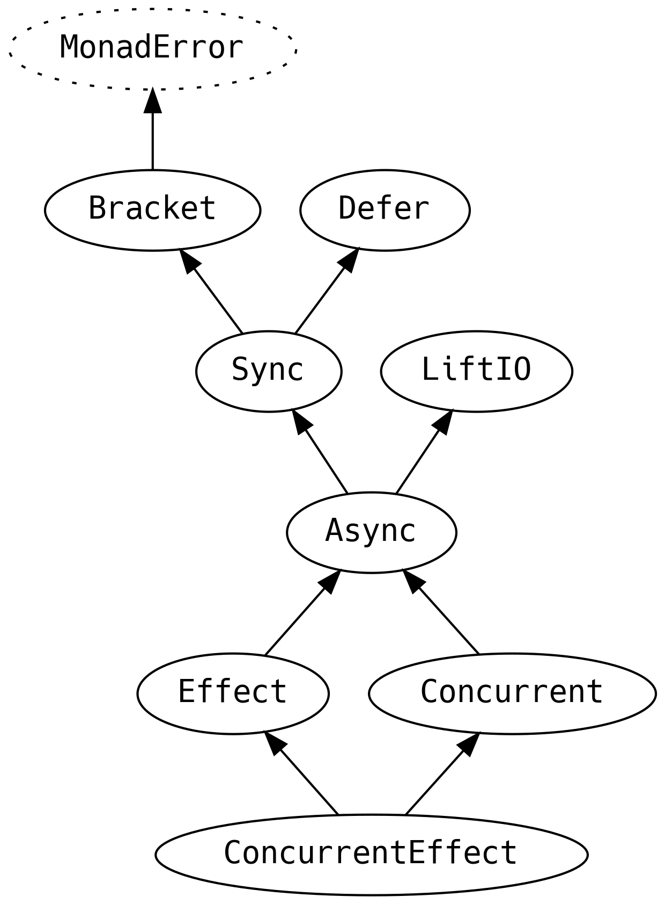

#### `Bracket`

`Bracket` is for safe resource acquisition and release.

{lang="text"}
~~~~~~~~
  @typeclass trait Bracket[F[_], E] extends MonadError[F, E] {
    def bracket[A, B](acquire: F[A])(use: A => F[B])(release: A => F[Unit]): F[B]
    def guarantee[A](fa: F[A])(finalizer: F[Unit]): F[A] = ...
    ...
  }
~~~~~~~~

`.bracket` is the most powerful part of the interface, allowing us to define how
we obtain a resource, what we do with it, and anything we need to do to release
it. The `release` is guaranteed to be called even if the `use` fails, the
convenience `.guarantee` can be used if we only need a cleanup step without the
`acquire`.

In addition to success and failure, a calculation can also be canceled and we
may cleanup differently depending on these three scenarios with `.bracketCase`:

{lang="text"}
~~~~~~~~
  sealed abstract class ExitCase[+E]
  object ExitCase {
    case object Completed extends ExitCase[Nothing]
    final case class Error[+E](e: E) extends ExitCase[E]
    case object Canceled extends ExitCase[Nothing]
    ...
  }
  
  @typeclass trait Bracket[F[_], E] extends MonadError[F, E] {
    ...
    def bracketCase[A, B](acquire: F[A])(use: A => F[B])
          (release: (A, ExitCase[E]) => F[Unit]): F[B]
  
    def uncancelable[A](fa: F[A]): F[A]
  }
~~~~~~~~

The ability to `.cancel` a calculation is left up to the implementation and is
not part of the `Bracket` interface.

#### `Defer`

`Defer` is the higher kinded equivalent of `Eval.always`

{lang="text"}
~~~~~~~~
  @typeclass trait Defer[F[_]] {
    def defer[A](fa: => F[A]): F[A]
  }
~~~~~~~~

and is useful when we want to avoid an expensive calculation until it is
necessary.

#### `Sync`

`Sync` refines the `Bracket` (and `MonadError`) error type to `Throwable` and
introduces `.suspend`, which is effectively the same as `Defer.defer` but
explicitly for effects, and `.delay` as the mechanism for side-effecting blocks
of code. `Sync.delay` is the generalised version of `IO { ... }`

{lang="text"}
~~~~~~~~
  @typeclass trait Sync[F[_]] extends Bracket[F, Throwable] with Defer[F] {
    def suspend[A](thunk: => F[A]): F[A]
    def delay[A](thunk: => A): F[A] = ...
  }
~~~~~~~~

#### `LiftIO`

We have already been introduced to `LiftIO` in the context of lifting `IO`
interpreters into an arbitrary context, here we see it in its correct place
within the typeclass hierarchy:

{lang="text"}
~~~~~~~~
  @typeclass trait LiftIO[F[_]] {
    def liftIO[A](ioa: IO[A]): F[A]
  }
~~~~~~~~

#### `Async`

`Async` is primarily for legacy integration and describes callbacks that perform
a side-effect.

{lang="text"}
~~~~~~~~
  @typeclass trait Async[F[_]] extends Sync[F] with LiftIO[F] {
    def async[A](k: (Either[Throwable, A] => Unit) => Unit): F[A]
    ...
  }
~~~~~~~~

The `k` in `.async` is a function that should be called with a callback for
signaling the result once it is ready.

For example, we might have a GUI that triggers an event `A` when the user moves
the mouse or presses a key and puts it onto an impure queue. We need to be able
to turn that event into an `F[A]` that we can treat like any other source of
data.

{lang="text"}
~~~~~~~~
  val eventQueue = ... // impure queue
  
  F.async { callback =>
    eventQueue.nextEvent(e => callback(e))
  }
~~~~~~~~

Be careful of thread usage when dealing with legacy APIs that use blocking I/O,
if the `eventQueue.nextEvent` blocks on a thread then this will too.

#### `Effect`

`Effect` is the opposite of `LiftIO` and means that the effect can be converted
into the concrete `IO` implementation.

{lang="text"}
~~~~~~~~
  @typeclass trait Effect[F[_]] extends Async[F] {
    def toIO[A](fa: F[A]): IO[A]
  }
~~~~~~~~

#### `Concurrent`

Contexts that implement `Concurrent` may start *fibers*, a lightweight
abstraction over a JVM `Thread`.

{lang="text"}
~~~~~~~~
  @typeclass trait Concurrent[F[_]] extends Async[F] {
    def start[A](fa: F[A]): F[Fiber[F, A]]
    ...
  }
~~~~~~~~

When we have a `Fiber` we can `.join` back into the `IO`, or `.cancel` the
underlying work.

{lang="text"}
~~~~~~~~
  trait Fiber[F[_], A] {
    def join: F[A]
    def cancel: CancelToken[F]
  }
~~~~~~~~

A `CancelToken` is just a type alias to aid with readibility.

{lang="text"}
~~~~~~~~
  type CancelToken[F[_]] = F[Unit]
~~~~~~~~

We can use fibers to achieve a form of optimistic concurrency control. Consider
the case where we have `data` that we need to analyse, but we also need to
validate it. We can optimistically begin the analysis and cancel the work if the
validation fails, which is performed in parallel.

{lang="text"}
~~~~~~~~
  final class BadData(data: Data) extends Throwable with NoStackTrace
  
  for {
    fiber1   <- analysis(data).start
    fiber2   <- validate(data).start
    valid    <- fiber2.join
    _        <- if (!valid) fiber1.cancel
                else IO.unit
    result   <- fiber1.join
  } yield result
~~~~~~~~

For the common case where we have two pieces of work and we only care which one
completes first, we can use `.race`, which will always cancel the one that comes
second

{lang="text"}
~~~~~~~~
  @typeclass trait Concurrent[F[_]] extends Async[F] {
    def race[A, B](fa: F[A], fb: F[B]): F[Either[A, B]] = ...
    ...
  }
~~~~~~~~

Finally, `Concurrent` provides more refined control over parallelism than the
`Parallel` typeclass offering variants of `.parTraverse` (and more) with a
number that caps the maximum level of parallelism to use:

{lang="text"}
~~~~~~~~
  def parTraverseN[T[_]: Traverse, M[_]: Concurrent, A, B]
        (n: Long)(ta: T[A])(f: A => M[B]): M[T[B]]
~~~~~~~~

#### `ConcurrentEffect`

`ConcurrentEffect` is a convenient combination of both `Concurrent` and `Effect`
that provides most everything that we can want out of `IO`.

{lang="text"}
~~~~~~~~
  @typeclass trait ConcurrentEffect[F[_]] extends Concurrent[F] with Effect[F]
~~~~~~~~

It is considered good practice to prefer typeclasses instead of directly using
`IO` because it allows for implementations to be replaced. Effect implementation
is a very active area of research for the community, we would not want to miss
out on future improvements by limiting ourselves to today's implementation!

There is one caveat to using the typeclasses: `Sync` sets the error type to
`Throwable`. If a custom error type is required, it is recommended to use the
`IO` type directly instead of the typeclasses, and capture the business domain
error with an `EitherT`, the underlying `Throwable` errors are still accessible
on the `IO`.

### Concurrency

Cats effect provides several components that are useful for concurrent
programming that do not fit into the typeclass hierarchy.

#### `Deferred`

`Deferred` is a primitive which represents a value that may not yet be
available, it is the FP equivalent of a `Promise`.

{lang="text"}
~~~~~~~~
  abstract class Deferred[F[_], A] {
    def get: F[A]
    def complete(a: A): F[Unit]
  }
~~~~~~~~

calling `.complete` more than once will give an action that throws an
`IllegalStateException`.

`Deferred` is not something that we typically use in application code. It is a
building block for high level concurrency frameworks or for integrating with
legacy systems.

### `MVar`

`MVar` is the FP equivalent of an atomic mutable variable.

We can read the variable and we have a variety of ways to write or update it.

{lang="text"}
~~~~~~~~
  abstract class MVar[F[_], A] {
    def put(a: A): F[Unit]
    def take: F[A]
    def read: F[A]
  
    def tryPut(a: A): F[Boolean]
    def tryTake: F[Option[A]]
  }
~~~~~~~~

`MVar` is another building block and is very useful to provide collections-based
mocks for database-like algebras.

## Summary

1.  The `Future` is broke, don't go there.
2.  Manage stack safety with a `Trampoline`.
3.  The Monad Transformer Library (MTL) abstracts over common effects with typeclasses.
4.  Monad Transformers provide default implementations of the MTL.
5.  `Free` data structures let us analyse, optimise and easily test our programs.
6.  `IO` gives us the ability to implement algebras as effects on the world.
7.  `IO` can perform effects in parallel and is a high performance backbone for any application.
8.  Prefer `Effect`,  `Parallel`, and related typeclasses, to using `IO` directly.

# Typeclass Derivation

Typeclasses provide polymorphic functionality to our applications. But to use a
typeclass we need instances for our business domain objects.

The creation of a typeclass instance from existing instances is known as
*typeclass derivation* and is the topic of this chapter.

There are four approaches to typeclass derivation:

1.  Manual instances for every domain object. This is infeasible for real world
    applications as it results in hundreds of lines of boilerplate for every line
    of a `case class`. It is useful only for educational purposes and adhoc
    performance optimisations.

2.  Abstract over the typeclass by an existing Cats typeclass.

3.  Macros. However, writing a macro for each typeclass requires an advanced and
    experienced developer. Fortunately, Jon Pretty's [Magnolia](https://github.com/propensive/magnolia) library abstracts
    over hand-rolled macros with a simple API, centralising the complex
    interaction with the compiler.

4.  Write a generic program using the [Shapeless](https://github.com/milessabin/shapeless/) library. The `implicit` mechanism
    is a language within the Scala language and can be used to write programs at
    the type level.

In this chapter we will study increasingly complex typeclasses and their
derivations. We will begin with typeclasses of typeclasses as the most principled
mechanism, repeating some lessons from Chapter 5 "Cats Typeclasses", then
Magnolia (the easiest to use), finishing with Shapeless (the most powerful) for
typeclasses with complex derivation logic.

## Running Examples

This chapter will show how to define derivations for five specific typeclasses.
Each example exhibits a feature that can be generalised:

{lang="text"}
~~~~~~~~
  @typeclass trait Equal[A]  {
    // type parameter is in contravariant (parameter) position
    @op("===") def eqv(a1: A, a2: A): Boolean
  }
  
  // for requesting default values of a type when testing
  @typeclass trait Default[A] {
    // type parameter is in covariant (return) position
    def default: Either[String, A]
  }
  
  @typeclass trait Semigroup[A] {
    // type parameter is in both covariant and contravariant position (invariant)
    @op("|+|") def combine(x: A, y: A): A
  }
  
  @typeclass trait JsEncoder[T] {
    // type parameter is in contravariant position and needs access to field names
    def toJson(t: T): JsValue
  }
  
  @typeclass trait JsDecoder[T] {
    // type parameter is in covariant position and needs access to field names
    def fromJson(j: JsValue): Either[String, T]
  }
~~~~~~~~

A> There is a school of thought that says serialisation formats, such as JSON and
A> XML, should **not** have typeclass encoders and decoders, because it can lead to
A> typeclass decoherence (i.e. more than one encoder or decoder may exist for the
A> same type). The alternative is to use algebras and avoid using the `implicit`
A> language feature entirely.
A> 
A> Although it is possible to apply the techniques in this chapter to either
A> typeclass or algebra derivation, the latter involves a **lot** more boilerplate.
A> We therefore consciously choose to restrict our study to encoders and decoders
A> that are coherent. As we will see later in this chapter, use-site automatic
A> derivation with Magnolia and Shapeless, combined with limitations of the Scala
A> compiler's implicit search, commonly leads to typeclass decoherence.

## Typeclasses of Typeclasses

Before we proceed, here is a quick recap of the core Cats typeclasses, focussed
on just the typeclasses that are relevant for this chapter:

{lang="text"}
~~~~~~~~
  @typeclass trait Invariant[F[_]] {
    def imap[A, B](fa: F[A], f: A => B, g: B => A): F[B]
  }
  
  @typeclass trait Contravariant[F[_]] extends Invariant[F] {
    def contramap[A, B](fa: F[A])(f: B => A): F[B]
  }
  
  @typeclass trait ContravariantMonoidal[F[_]] extends Contravariant[F] {
    def trivial[A]: F[A] = contramap(unit)(_ => ())
  
    def contramap2[A, B, Z](f0: F[A], f1: F[B])(f: Z => (A, B)): F[Z]
    def contramap3[A, B, C, Z](f0: F[A], f1: F[B], f2: F[C])(f: Z => (A, B, C)): F[Z]
    ...
    def contramap22[...] = ...
  }
  
  @typeclass trait Functor[F[_]] extends Invariant[F] {
    def map[A, B](fa: F[A])(f: A => B): F[B]
  }
  
  @typeclass trait Apply[F[_]] extends Functor[F] {
    def map2[A,B,Z](fa: F[A], fb: F[B])(f: (A, B) => Z): F[Z] = ...
    def map3[A,B,C,Z](fa: F[A], fb: F[B], fc: F[C])(f: (A,B,C) => Z): F[Z] = ...
    ...
    def map22[...]
  }
  
  @typeclass trait Monad[F[_]] extends Apply[F] {
    def flatMap[A, B](fa: F[A])(f: A => F[B]): F[B]
  }
  
  @typeclass trait MonadError[F[_], E] extends Monad[F] {
    def raiseError[A](e: E): F[A]
    def fromEither[A](x: Either[E, A]): F[A] = ...
  }
~~~~~~~~

### Don't Repeat Yourself

The simplest way to derive a typeclass is to reuse one that already exists.

The `Eq` typeclass has an instance of `Contravariant[Eq]`, providing
`.contramap`:

{lang="text"}
~~~~~~~~
  object Eq {
    implicit val contravariant = new Contravariant[Eq] {
      def contramap[A, B](fa: Eq[A])(f: B => A): Eq[B] =
        (b1, b2) => fa.eqv(f(b1), f(b2))
    }
    ...
  }
~~~~~~~~

As users of `Eq`, we can use `.contramap` for our single parameter data
types. Recall that typeclass instances go on the data type companions to be in
their implicit scope:

{lang="text"}
~~~~~~~~
  final case class Foo(s: String)
  object Foo {
    implicit val equal: Eq[Foo] = Eq[String].contramap(_.s)
  }
  
  scala> Foo("hello") === Foo("world")
  false
~~~~~~~~

However, not all typeclasses can have an instance of `Contravariant`. In
particular, typeclasses with type parameters in covariant position may have a
`Functor` instead:

{lang="text"}
~~~~~~~~
  object Default {
    def instance[A](d: => Either[String, A]) = new Default[A] { def default = d }
    implicit val string: Default[String] = instance(Right(""))
  
    implicit val functor: Functor[Default] = new Functor[Default] {
      def map[A, B](fa: Default[A])(f: A => B): Default[B] = instance(fa.default.map(f))
    }
    ...
  }
~~~~~~~~

We can now derive a `Default[Foo]`

{lang="text"}
~~~~~~~~
  object Foo {
    implicit val default: Default[Foo] = Default[String].map(Foo(_))
    ...
  }
~~~~~~~~

If a typeclass has parameters in both covariant and contravariant position, as
is the case with `Semigroup`, it may provide an `Invariant`

{lang="text"}
~~~~~~~~
  object Semigroup {
    implicit val invariant = new Invariant[Semigroup] {
      def imap[A, B](ma: Semigroup[A], f: A => B, g: B => A) = new Semigroup[B] {
        def combine(x: B, y: B): B = f(ma.combine(g(x), g(y)))
      }
    }
    ...
  }
~~~~~~~~

and we can call `.imap`

{lang="text"}
~~~~~~~~
  object Foo {
    implicit val semigroup: Semigroup[Foo] = Semigroup[String].imap(Foo(_), _.s)
    ...
  }
~~~~~~~~

Generally, it is simpler to just use `.imap` instead of `.map` or `.contramap`:

{lang="text"}
~~~~~~~~
  final case class Foo(s: String)
  object Foo {
    implicit val equal: Eq[Foo]            = Eq[String].imap(Foo(_), _.s)
    implicit val default: Default[Foo]     = Default[String].imap(Foo(_), _.s)
    implicit val semigroup: Semigroup[Foo] = Semigroup[String].imap(Foo(_), _.s)
  }
~~~~~~~~

### `MonadError`

Typically things that *write* from a polymorphic value have a `Contravariant`,
and things that *read* into a polymorphic value have a `Functor`. However, it is
very much expected that reading can fail. For example, if we have a default
`String` it does not mean that we can simply derive a default `String Refined
NonEmpty` from it

We start by introducing a convenience function that we will use a lot

{lang="text"}
~~~~~~~~
  import eu.timepit.refined.refineV
  import eu.timepit.refined.api._
  import eu.timepit.refined.collection._
  
  implicit val nes: Default[String Refined NonEmpty] =
    Default[String].map(refineV[NonEmpty](_))
~~~~~~~~

fails to compile with

{lang="text"}
~~~~~~~~
  [error] default.scala:41:32: polymorphic expression cannot be instantiated to expected type;
  [error]  found   : Either[String, String Refined NonEmpty]
  [error]  required: String Refined NonEmpty
  [error]     Default[String].map(refineV[NonEmpty](_))
  [error]                                          ^
~~~~~~~~

Recall from Chapter 4.1 that `refineV` returns an `Either`, as the compiler has
reminded us.

As the typeclass author of `Default`, we can do better than `Functor` and
provide a `MonadError[Default, String]`:

{lang="text"}
~~~~~~~~
  implicit val monad = new MonadError[Default, String] {
    def pure[A](a: A): Default[A] = instance(Right(a))
    def flatMap[A, B](fa: Default[A])(f: A => Default[B]): Default[B] =
      instance((fa.flatMap(f)).default)
    def handleErrorWith[A](fa: Default[A])(f: String => Default[A]): Default[A] =
      instance(fa.default.handleErrorWith(e => f(e).default))
    def raiseError[A](e: String): Default[A] =
      instance(Left(e))
    ...
  }
~~~~~~~~

If we introduce the general purpose helper function `.emap`

{lang="text"}
~~~~~~~~
  implicit class MonadErrorOps[F[_]: MonadError, E](fa: F[A]) {
    def emap[B](f: A => Either[E, B]): F[B] =
      fa.flatMap(a => fromEither(f(a)))
  }
~~~~~~~~

we have access to `.emap` syntax and can derive our refined type

{lang="text"}
~~~~~~~~
  implicit val nes: Default[String Refined NonEmpty] =
    Default[String].emap(refineV[NonEmpty](_))
~~~~~~~~

In fact, we can provide a derivation rule for all refined types

{lang="text"}
~~~~~~~~
  implicit def refined[A: Default, P](
    implicit V: Validate[A, P]
  ): Default[A Refined P] = Default[A].emap(refineV[P](_))
~~~~~~~~

where `Validate` is from the refined library and is required by `refineV`.

A> The `refined-cats` extension to `refined` provides support for automatically
A> deriving all typeclasses for refined types with the following import
A> 
A> {lang="text"}
A> ~~~~~~~~
A>   import eu.timepit.refined.cats._
A> ~~~~~~~~
A> 
A> if there is a `Contravariant` or `MonadError[?, String]` in the implicit scope.

Similarly we can use `.emap` to derive an `Int` decoder from a `Long`, with
protection around the non-total `.toInt` stdlib method.

{lang="text"}
~~~~~~~~
  implicit val long: Default[Long] = instance(Right(0L))
  implicit val int: Default[Int] = Default[Long].emap {
    case n if (Int.MinValue <= n && n <= Int.MaxValue) => Right(n.toInt)
    case big => Left(s"$big does not fit into 32 bits")
  }
~~~~~~~~

As authors of the `Default` typeclass, we might want to reconsider our API
design so that it can never fail, e.g. with the following type signature

{lang="text"}
~~~~~~~~
  @typeclass trait Default[A] {
    def default: A
  }
~~~~~~~~

We would not be able to define a `MonadError`, forcing us to provide instances
that always succeed. This will result in more boilerplate but gains compiletime
safety. However, we will continue with `Either[String, A]` as the return type as
it is a more general example.

### `ContravariantMonoidal` and `Applicative`

To derive the `Eq` for our case class with two parameters, we reused the
instance that Cats provides for tuples. But where did the tuple instance come
from?

A more specific typeclass than `Contravariant` is `ContravariantMonoidal`. `Eq`
has an instance:

{lang="text"}
~~~~~~~~
  implicit val contramonoidal = new ContravariantMonoidal[Eq] {
    ...
    def contramap2[A1, A2, Z](a1: Eq[A1], a2: Eq[A2])(
      f: Z => (A1, A2)
    ): Eq[Z] = { (z1, z2) =>
      val (s1, s2) = f(z1)
      val (t1, t2) = f(z2)
      a1.eqv(s1, t1) && a2.eqv(s2, t2)
    }
    def trivial[A]: Eq[A] = (_, _) => true
  }
~~~~~~~~

And from `contramap2`, `ContravariantMonoidal` is able to build up derivations
all the way to `contramap22` (and the `.contramapN` helper for tuples). We can
call these methods directly for our data types:

{lang="text"}
~~~~~~~~
  final case class Bar(s: String, i: Int)
  object Bar {
    implicit val equal: Eq[Bar] =
      (Eq[String], Eq[Int]).contramapN(b => (b.s, b.i))
  }
~~~~~~~~

The equivalent for type parameters in covariant position is `Applicative`:

{lang="text"}
~~~~~~~~
  object Bar {
    ...
    implicit val default: Default[Bar] =
      (Default[String], Default[Int]).mapN(Bar(_, _))
  }
~~~~~~~~

But we must be careful that we do not break the typeclass laws when we implement
`ContravariantMonoidal` or `Applicative`. In particular, it is easy to break the
*law of composition* which says that the following two codepaths must yield
exactly the same output

-   `contramap2(contramap2(a1, a2)(dupe), a3)(dupe)`
-   `contramap2(a1, contramap2(a2, a3)(dupe))(dupe)`
-   for any `dupe: A => (A, A)`

with similar laws for `Applicative`.

Consider `JsEncoder` and a proposed instance of `ContravariantMonoidal`

{lang="text"}
~~~~~~~~
  new ContravariantMonoidal[JsEncoder] {
    ...
    def contramap2[A, B, C](fa: JsEncoder[A], fb: JsEncoder[B])(
      f: C => (A, B)
    ): JsEncoder[C] = { c =>
      val (a, b) = f(c)
      JsArray(List(fa.toJson(a), fb.toJson(b)))
    }
  
    def trivial[A]: JsEncoder[A] = _ => JsNull
  }
~~~~~~~~

On one side of the composition laws, for a `String` input, we get

{lang="text"}
~~~~~~~~
  JsArray([JsArray([JsString(hello),JsString(hello)]),JsString(hello)])
~~~~~~~~

and on the other

{lang="text"}
~~~~~~~~
  JsArray([JsString(hello),JsArray([JsString(hello),JsString(hello)])])
~~~~~~~~

which are different. We could experiment with variations of the `.contramap2`
implementation, but it will never satisfy the laws for all inputs.

We therefore cannot provide a `ContravariantMonoidal[JsEncoder]` because it
would break the mathematical laws and invalidates all the assumptions that users
of `ContravariantMonoidal` rely upon.

On the other hand, a similar `JsDecoder` test meets the `Applicative`
composition laws so we can be reasonably confident that our `MonadError` is
lawful.

One way of generating a wide variety of test data is to use the [scalacheck](https://github.com/rickynils/scalacheck)
library, which provides an `Arbitrary` typeclass that integrates with most
testing frameworks to repeat a test with randomly generated data.

The `jsonformat` ADT can provide an `Arbitrary[JsValue]` allowing us to make use
of Scalatest's `.forAll` feature:

{lang="text"}
~~~~~~~~
  forAll(SizeRange(10))((j: JsValue) => composeTest(j))
~~~~~~~~

This test gives us even more confidence that our typeclass meets the
`Applicative` composition laws. By checking all the laws on
`ContravariantMonoidal` and `MonadError` we also get **a lot** of smoke tests for
free.

A> We must restrict `forAll` to have a `SizeRange` of `10`, which limits both
A> `JsObject` and `JsArray` to a maximum size of 10 elements. This avoids stack
A> overflows as larger numbers can generate gigantic JSON documents.

## Magnolia

The Magnolia macro library provides a clean API for writing typeclass
derivations. It is installed with the following `build.sbt` entry

{lang="text"}
~~~~~~~~
  libraryDependencies += "com.propensive" %% "magnolia" % "0.14.4"
~~~~~~~~

A typeclass author implements the following members:

{lang="text"}
~~~~~~~~
  import magnolia._
  
  object MyDerivation {
    type Typeclass[A]
  
    def combine[A](ctx: CaseClass[Typeclass, A]): Typeclass[A]
    def dispatch[A](ctx: SealedTrait[Typeclass, A]): Typeclass[A]
  
    def gen[A]: Typeclass[A] = macro Magnolia.gen[A]
  }
~~~~~~~~

The Magnolia API is:

{lang="text"}
~~~~~~~~
  class CaseClass[TC[_], A] {
    def typeName: TypeName
    def construct[B](f: Param[TC, A] => B): A
    def constructMonadic[F[_]: Monadic, B](f: Param[TC, A] => F[B]): F[A]
    def parameters: Seq[Param[TC, A]]
    def annotations: Seq[Any]
  }
  
  class SealedTrait[TC[_], A] {
    def typeName: TypeName
    def subtypes: Seq[Subtype[TC, A]]
    def dispatch[B](value: A)(handle: Subtype[TC, A] => B): B
    def annotations: Seq[Any]
  }
~~~~~~~~

with helpers

{lang="text"}
~~~~~~~~
  final case class TypeName(short: String, full: String)
  
  class Param[TC[_], A] {
    type PType
    def label: String
    def index: Int
    def typeclass: TC[PType]
    def dereference(param: A): PType
    def default: Option[PType]
    def annotations: Seq[Any]
  }
  
  class Subtype[TC[_], A] {
    type SType <: A
    def typeName: TypeName
    def index: Int
    def typeclass: TC[SType]
    def cast(a: A): SType
    def annotations: Seq[Any]
  }
~~~~~~~~

The `Monadic` typeclass, used in `constructMonadic`, is automatically generated
if our data type has a `.map` and `.flatMap` method when we `import mercator._`

It does not make sense to use Magnolia for typeclasses that can be abstracted by
`ContravariantMonoidal`, `Decidable`, `Applicative` or `Alt`, since those
abstractions provide a lot of extra structure and tests for free. However,
Magnolia offers features that Cats cannot provide: access to field names, type
names, annotations and default values.

### Example: JSON

We have some design choices to make with regards to JSON serialisation:

1.  Should we include fields with `null` values?
2.  Should decoding treat missing vs `null` differently?
3.  How do we encode the name of a coproduct?
4.  How do we deal with coproducts that are not `JsObject`?

We choose sensible defaults

-   do not include fields if the value is a `JsNull`.
-   handle missing fields the same as `null` values.
-   use a special field `"type"` to disambiguate coproducts using the type name.
-   put primitive values into a special field `"xvalue"`.

and let the users attach an annotation to coproducts and product fields to
customise their formats:

{lang="text"}
~~~~~~~~
  sealed class json extends Annotation
  object json {
    final case class nulls()          extends json
    final case class field(f: String) extends json
    final case class hint(f: String)  extends json
  }
~~~~~~~~

A> Magnolia is not limited to one annotation family. This encoding is so that we
A> can do a like-for-like comparison with Shapeless in the next section.

For example

{lang="text"}
~~~~~~~~
  @json.field("TYPE")
  sealed abstract class Cost
  final case class Time(s: String) extends Cost
  final case class Money(@json.field("integer") i: Int) extends Cost
~~~~~~~~

Start with a `JsEncoder` that handles only our sensible defaults:

{lang="text"}
~~~~~~~~
  object JsMagnoliaEncoder {
    type Typeclass[A] = JsEncoder[A]
  
    def combine[A](ctx: CaseClass[JsEncoder, A]): JsEncoder[A] = { a =>
      val empty: List[(String, JsValue)] = Nil
      val fields = ctx.parameters.foldRight(empty) { (p, acc) =>
        p.typeclass.toJson(p.dereference(a)) match {
          case JsNull => acc
          case value  => (p.label -> value) :: acc
        }
      }
      JsObject(fields)
    }
  
    def dispatch[A](ctx: SealedTrait[JsEncoder, A]): JsEncoder[A] = a =>
      ctx.dispatch(a) { sub =>
        val hint = "type" -> JsString(sub.typeName.short)
        sub.typeclass.toJson(sub.cast(a)) match {
          case JsObject(fields) => JsObject(hint :: fields)
          case other            => JsObject(List(hint, "xvalue" -> other))
        }
      }
  
    def gen[A]: JsEncoder[A] = macro Magnolia.gen[A]
  }
~~~~~~~~

We can see how the Magnolia API makes it easy to access field names and
typeclasses for each parameter.

Now add support for annotations to handle user preferences. To avoid looking up
the annotations on every encoding, we will cache them in an array. Although field
access to an array is non-total, we are guaranteed that the indices will always
align. Performance is usually the victim in the trade-off between specialisation
and generalisation.

{lang="text"}
~~~~~~~~
  object JsMagnoliaEncoder {
    type Typeclass[A] = JsEncoder[A]
  
    def combine[A](ctx: CaseClass[JsEncoder, A]): JsEncoder[A] =
      new JsEncoder[A] {
        private val anns = ctx.parameters.map { p =>
          val nulls = p.annotations.collectFirst {
            case json.nulls() => true
          }.getOrElse(false)
          val field = p.annotations.collectFirst {
            case json.field(name) => name
          }.getOrElse(p.label)
          (nulls, field)
        }.toArray
  
        def toJson(a: A): JsValue = {
          val empty: List[(String, JsValue)] = Nil
          val fields = ctx.parameters.foldRight(empty) { (p, acc) =>
            val (nulls, field) = anns(p.index)
            p.typeclass.toJson(p.dereference(a)) match {
              case JsNull if !nulls => acc
              case value            => (field -> value) :: acc
            }
          }
          JsObject(fields)
        }
      }
  
    def dispatch[A](ctx: SealedTrait[JsEncoder, A]): JsEncoder[A] =
      new JsEncoder[A] {
        private val field = ctx.annotations.collectFirst {
          case json.field(name) => name
        }.getOrElse("type")
        private val anns = ctx.subtypes.map { s =>
          val hint = s.annotations.collectFirst {
            case json.hint(name) => field -> JsString(name)
          }.getOrElse(field -> JsString(s.typeName.short))
          val xvalue = s.annotations.collectFirst {
            case json.field(name) => name
          }.getOrElse("xvalue")
          (hint, xvalue)
        }.toArray
  
        def toJson(a: A): JsValue = ctx.dispatch(a) { sub =>
          val (hint, xvalue) = anns(sub.index)
          sub.typeclass.toJson(sub.cast(a)) match {
            case JsObject(fields) => JsObject(hint :: fields)
            case other            => JsObject(hint :: (xvalue -> other) :: Nil)
          }
        }
      }
  
    def gen[A]: JsEncoder[A] = macro Magnolia.gen[A]
  }
~~~~~~~~

For the decoder we use `.constructMonadic` which has a type signature similar to
`.traverse`

{lang="text"}
~~~~~~~~
  object JsMagnoliaDecoder {
    type Typeclass[A] = JsDecoder[A]
  
    def combine[A](ctx: CaseClass[JsDecoder, A]): JsDecoder[A] = {
      case obj @ JsObject(_) =>
        ctx.constructMonadic(
          p => p.typeclass.fromJson(obj.get(p.label).getOrElse(JsNull))
        )
      case other => fail("JsObject", other)
    }
  
    def dispatch[A](ctx: SealedTrait[JsDecoder, A]): JsDecoder[A] = {
      case obj @ JsObject(_) =>
        obj.get("type") match {
          case Right(JsString(hint)) =>
            ctx.subtypes.find(_.typeName.short == hint) match {
              case None => fail(s"a valid '$hint'", obj)
              case Some(sub) =>
                val value = obj.get("xvalue").getOrElse(obj)
                sub.typeclass.fromJson(value)
            }
          case _ => fail("JsObject with type", obj)
        }
      case other => fail("JsObject", other)
    }
  
    def gen[A]: JsDecoder[A] = macro Magnolia.gen[A]
  }
~~~~~~~~

Again, adding support for user preferences and default field values, along with
some optimisations:

{lang="text"}
~~~~~~~~
  object JsMagnoliaDecoder {
    type Typeclass[A] = JsDecoder[A]
  
    def combine[A](ctx: CaseClass[JsDecoder, A]): JsDecoder[A] =
      new JsDecoder[A] {
        private val nulls = ctx.parameters.map { p =>
          p.annotations.collectFirst {
            case json.nulls() => true
          }.getOrElse(false)
        }.toArray
  
        private val fieldnames = ctx.parameters.map { p =>
          p.annotations.collectFirst {
            case json.field(name) => name
          }.getOrElse(p.label)
        }.toArray
  
        def fromJson(j: JsValue): Either[String, A] = j match {
          case obj @ JsObject(_) =>
            import mercator._
            val lookup = obj.fields.toMap
            ctx.constructMonadic { p =>
              val field = fieldnames(p.index)
              lookup
                .get(field)
                .into {
                  case Maybe.Just(value) => p.typeclass.fromJson(value)
                  case _ =>
                    p.default match {
                      case Some(default) => Right(default)
                      case None if nulls(p.index) =>
                        Left(s"missing field '$field'")
                      case None => p.typeclass.fromJson(JsNull)
                    }
                }
            }
          case other => fail("JsObject", other)
        }
      }
  
    def dispatch[A](ctx: SealedTrait[JsDecoder, A]): JsDecoder[A] =
      new JsDecoder[A] {
        private val subtype = ctx.subtypes.map { s =>
          s.annotations.collectFirst {
            case json.hint(name) => name
          }.getOrElse(s.typeName.short) -> s
        }.toMap
        private val typehint = ctx.annotations.collectFirst {
          case json.field(name) => name
        }.getOrElse("type")
        private val xvalues = ctx.subtypes.map { sub =>
          sub.annotations.collectFirst {
            case json.field(name) => name
          }.getOrElse("xvalue")
        }.toArray
  
        def fromJson(j: JsValue): Either[String, A] = j match {
          case obj @ JsObject(_) =>
            obj.get(typehint) match {
              case Right(JsString(h)) =>
                subtype.get(h) match {
                  case None => fail(s"a valid '$h'", obj)
                  case Some(sub) =>
                    val xvalue = xvalues(sub.index)
                    val value  = obj.get(xvalue).getOrElse(obj)
                    sub.typeclass.fromJson(value)
                }
              case _ => fail(s"JsObject with '$typehint' field", obj)
            }
          case other => fail("JsObject", other)
        }
      }
  
    def gen[A]: JsDecoder[A] = macro Magnolia.gen[A]
  }
~~~~~~~~

We call the `JsMagnoliaEncoder.gen` or `JsMagnoliaDecoder.gen` method from the
companion of our data types. For example, the Google Maps API

{lang="text"}
~~~~~~~~
  final case class Value(text: String, value: Int)
  final case class Elements(distance: Value, duration: Value, status: String)
  final case class Rows(elements: List[Elements])
  final case class DistanceMatrix(
    destination_addresses: List[String],
    origin_addresses: List[String],
    rows: List[Rows],
    status: String
  )
  
  object Value {
    implicit val encoder: JsEncoder[Value] = JsMagnoliaEncoder.gen
    implicit val decoder: JsDecoder[Value] = JsMagnoliaDecoder.gen
  }
  object Elements {
    implicit val encoder: JsEncoder[Elements] = JsMagnoliaEncoder.gen
    implicit val decoder: JsDecoder[Elements] = JsMagnoliaDecoder.gen
  }
  object Rows {
    implicit val encoder: JsEncoder[Rows] = JsMagnoliaEncoder.gen
    implicit val decoder: JsDecoder[Rows] = JsMagnoliaDecoder.gen
  }
  object DistanceMatrix {
    implicit val encoder: JsEncoder[DistanceMatrix] = JsMagnoliaEncoder.gen
    implicit val decoder: JsDecoder[DistanceMatrix] = JsMagnoliaDecoder.gen
  }
~~~~~~~~

### Fully Automatic Derivation

Generating `implicit` instances on the companion of the data type is
historically known as *semi-auto* derivation, in contrast to *full-auto* which
is when the `.gen` is made `implicit`

{lang="text"}
~~~~~~~~
  object JsMagnoliaEncoder {
    ...
    implicit def gen[A]: JsEncoder[A] = macro Magnolia.gen[A]
  }
  object JsMagnoliaDecoder {
    ...
    implicit def gen[A]: JsDecoder[A] = macro Magnolia.gen[A]
  }
~~~~~~~~

Users can import these methods into their scope and get magical derivation at
the point of use

{lang="text"}
~~~~~~~~
  scala> final case class Value(text: String, value: Int)
  scala> import JsMagnoliaEncoder.gen
  scala> Value("hello", 1).toJson
  res = JsObject([("text","hello"),("value",1)])
~~~~~~~~

This may sound tempting, as it involves the least amount of typing, but there
are two caveats:

1.  the macro is invoked at every use site, i.e. every time we call `.toJson`.
    This slows down compilation and also produces more objects at runtime, which
    will impact runtime performance.
2.  unexpected things may be derived.

The first caveat is self evident, but unexpected derivations manifests as
subtle bugs. Consider what would happen for

{lang="text"}
~~~~~~~~
  final case class Foo(s: Option[String])
  object Foo {
    implicit val jsencoder: JsEncoder[Foo] = gen
  }
~~~~~~~~

if we forgot to provide an implicit derivation for `Option`. We might expect a
`Foo(Some("hello"))` to look like

{lang="text"}
~~~~~~~~
  {
    "s":"hello"
  }
~~~~~~~~

But it would instead be

{lang="text"}
~~~~~~~~
  {
    "s": {
      "type":"Some",
      "get":"hello"
    }
  }
~~~~~~~~

because Magnolia derived an `Option` encoder for us.

This is confusing, we would rather have the compiler tell us if we forgot
something. Full auto is therefore not recommended.

## Shapeless

The [Shapeless](https://github.com/milessabin/shapeless/) library is notoriously the most complicated library in Scala. The
reason why it has such a reputation is because it takes the `implicit` language
feature to the extreme: creating a kind of *generic programming* language at the
level of the types.

A> It is not necessary to understand Shapeless to be a Functional Programmer. If
A> this chapter becomes too much, just skip to the next section.

To install Shapeless, add the following to `build.sbt`

{lang="text"}
~~~~~~~~
  libraryDependencies += "com.chuusai" %% "shapeless" % "2.3.3"
~~~~~~~~

At the core of Shapeless are the `HList` and `Coproduct` data types

{lang="text"}
~~~~~~~~
  package shapeless
  
  sealed trait HList
  final case class ::[+H, +T <: HList](head: H, tail: T) extends HList
  sealed trait NNil extends HList
  case object HNil extends HNil {
    def ::[H](h: H): H :: HNil = ::(h, this)
  }
  
  sealed trait Coproduct
  sealed trait :+:[+H, +T <: Coproduct] extends Coproduct
  final case class Inl[+H, +T <: Coproduct](head: H) extends :+:[H, T]
  final case class Inr[+H, +T <: Coproduct](tail: T) extends :+:[H, T]
  sealed trait CNil extends Coproduct // no implementations
~~~~~~~~

which are *generic* representations of products and coproducts, respectively.
The `sealed trait HNil` is for convenience so we never need to type `HNil.type`.

Shapeless has a `Generic` typeclass, which allows us to move between an ADT and
its generic representation:

{lang="text"}
~~~~~~~~
  trait Generic[T] {
    type Repr
    def to(t: T): Repr
    def from(r: Repr): T
  }
  object Generic {
    type Aux[T, R] = Generic[T] { type Repr = R }
    def apply[T](implicit G: Generic[T]): Aux[T, G.Repr] = G
    implicit def materialize[T, R]: Aux[T, R] = macro ...
  }
~~~~~~~~

Many of the types in Shapeless have a type member (`Repr`) and an `.Aux` type
alias on their companion that makes the second type visible. This allows us to
request the `Generic[Foo]` for a type `Foo` without having to provide the
generic representation, which is generated by a macro.

{lang="text"}
~~~~~~~~
  scala> import shapeless._
  scala> final case class Foo(a: String, b: Long)
         Generic[Foo].to(Foo("hello", 13L))
  res: String :: Long :: HNil = hello :: 13 :: HNil
  
  scala> Generic[Foo].from("hello" :: 13L :: HNil)
  res: Foo = Foo(hello,13)
  
  scala> sealed abstract class Bar
         case object Irish extends Bar
         case object English extends Bar
  
  scala> Generic[Bar].to(Irish)
  res: English.type :+: Irish.type :+: CNil.type = Inl(Irish)
  
  scala> Generic[Bar].from(Inl(Irish))
  res: Bar = Irish
~~~~~~~~

There is a complementary `LabelledGeneric` that includes the field names

{lang="text"}
~~~~~~~~
  scala> import shapeless._, labelled._
  scala> final case class Foo(a: String, b: Long)
  
  scala> LabelledGeneric[Foo].to(Foo("hello", 13L))
  res: String with KeyTag[Symbol with Tagged[String("a")], String] ::
       Long   with KeyTag[Symbol with Tagged[String("b")],   Long] ::
       HNil =
       hello :: 13 :: HNil
  
  scala> sealed abstract class Bar
         case object Irish extends Bar
         case object English extends Bar
  
  scala> LabelledGeneric[Bar].to(Irish)
  res: Irish.type   with KeyTag[Symbol with Tagged[String("Irish")],     Irish.type] :+:
       English.type with KeyTag[Symbol with Tagged[String("English")], English.type] :+:
       CNil.type =
       Inl(Irish)
~~~~~~~~

Note that the **value** of a `LabelledGeneric` representation is the same as the
`Generic` representation: field names only exist in the type and are erased at
runtime.

We never need to type `KeyTag` manually, we use the type alias:

{lang="text"}
~~~~~~~~
  type FieldType[K, +V] = V with KeyTag[K, V]
~~~~~~~~

If we want to access the field name from a `FieldType[K, A]`, we ask for
implicit evidence `Witness.Aux[K]`, which allows us to access the value of `K`
at runtime.

Superficially, this is all we need to know about Shapeless to be able to derive
a typeclass. However, things get increasingly complex, so we will proceed with
increasingly complex examples.

### Example: Eq

A typical pattern to follow is to extend the typeclass that we wish to derive,
and put the Shapeless code on its companion. This gives us an implicit scope
that the compiler can search without requiring complex imports

{lang="text"}
~~~~~~~~
  trait DerivedEq[A] extends Eq[A]
  object DerivedEq {
    ...
  }
~~~~~~~~

The entry point to a Shapeless derivation is a method, `gen`, requiring two type
parameters: the `A` that we are deriving and the `R` for its generic
representation. We then ask for the `Generic.Aux[A, R]`, relating `A` to `R`,
and an instance of the `Derived` typeclass for the `R`. We begin with this
signature and simple implementation:

{lang="text"}
~~~~~~~~
  import shapeless._
  
  object DerivedEq {
    def gen[A, R: DerivedEq](implicit G: Generic.Aux[A, R]): Eq[A] =
      (a1, a2) => Eq[R].eqv(G.to(a1), G.to(a2))
  }
~~~~~~~~

We've reduced the problem to providing an implicit `Eq[R]` for an `R` that is
the `Generic` representation of `A`. First consider products, where `R <:
HList`. This is the signature we want to implement:

{lang="text"}
~~~~~~~~
  implicit def hcons[H: Eq, T <: HList: DerivedEq]: DerivedEq[H :: T]
~~~~~~~~

because if we can implement it for a head and a tail, the compiler will be able
to recurse on this method until it reaches the end of the list. Where we will
need to provide an instance for the empty `HNil`

{lang="text"}
~~~~~~~~
  implicit def hnil: DerivedEq[HNil]
~~~~~~~~

We implement these methods

{lang="text"}
~~~~~~~~
  implicit def hcons[H: Eq, T <: HList: DerivedEq]: DerivedEq[H :: T] =
    (h1, h2) => Eq[H].eqv(h1.head, h2.head) && Eq[T].eqv(h1.tail, h2.tail)
  
  implicit val hnil: DerivedEq[HNil] = (_, _) => true
~~~~~~~~

and for coproducts we want to implement these signatures

{lang="text"}
~~~~~~~~
  implicit def ccons[H: Eq, T <: Coproduct: DerivedEq]: DerivedEq[H :+: T]
  implicit def cnil: DerivedEq[CNil]
~~~~~~~~

`.cnil` will never be called for a typeclass like `Eq` with type parameters
only in contravariant position, but the compiler doesn't know that so we have to
provide a stub:

{lang="text"}
~~~~~~~~
  implicit val cnil: DerivedEq[CNil] = (_, _) => sys.error("impossible")
~~~~~~~~

For the coproduct case we can only compare two things if they align, which is
when they are both `Inl` or `Inr`

{lang="text"}
~~~~~~~~
  implicit def ccons[H: Eq, T <: Coproduct: DerivedEq]: DerivedEq[H :+: T] = {
    case (Inl(c1), Inl(c2)) => Eq[H].eqv(c1, c2)
    case (Inr(c1), Inr(c2)) => Eq[T].eqv(c1, c2)
    case _                  => false
  }
~~~~~~~~

It is noteworthy that our methods align with the concept of `.trivial` (`hnil`)
and `.contramap2` (`hlist`)! However, we don't get any of the advantages of
implementing `ContravariantMonoidal`, as now we must start from scratch when
writing tests for this code.

So let's test this thing with a simple ADT

{lang="text"}
~~~~~~~~
  sealed abstract class Foo
  final case class Bar(s: String)          extends Foo
  final case class Faz(b: Boolean, i: Int) extends Foo
  final case object Baz                    extends Foo
~~~~~~~~

We need to provide instances on the companions:

{lang="text"}
~~~~~~~~
  object Foo {
    implicit val equal: Eq[Foo] = DerivedEq.gen
  }
  object Bar {
    implicit val equal: Eq[Bar] = DerivedEq.gen
  }
  object Faz {
    implicit val equal: Eq[Faz] = DerivedEq.gen
  }
  final case object Baz extends Foo {
    implicit val equal: Eq[Baz.type] = DerivedEq.gen
  }
~~~~~~~~

But it doesn't compile

{lang="text"}
~~~~~~~~
  [error] shapeless.scala:41:38: ambiguous implicit values:
  [error]  both value hnil in object DerivedEq of type => DerivedEq[HNil]
  [error]  and value cnil in object DerivedEq of type => DerivedEq[CNil]
  [error]  match expected type DerivedEq[R]
  [error]     : Eq[Baz.type] = DerivedEq.gen
~~~~~~~~

The problem, which is not at all evident from the error, is that the compiler is
unable to work out what `R` is.
We need to provide the explicit type parameters when calling `gen`, e.g.

{lang="text"}
~~~~~~~~
  implicit val equal: Eq[Baz.type] = DerivedEq.gen[Baz.type, HNil]
~~~~~~~~

or we can use the `Generic` macro to help us and let the compiler infer the generic representation

{lang="text"}
~~~~~~~~
  final case object Baz extends Foo {
    implicit val generic             = Generic[Baz.type]
    implicit val equal: Eq[Baz.type] = DerivedEq.gen[Baz.type, generic.Repr]
  }
  ...
~~~~~~~~

The reason why this fixes the problem is because the type signature

{lang="text"}
~~~~~~~~
  def gen[A, R: DerivedEq](implicit G: Generic.Aux[A, R]): Eq[A]
~~~~~~~~

desugars into

{lang="text"}
~~~~~~~~
  def gen[A, R](implicit R: DerivedEq[R], G: Generic.Aux[A, R]): Eq[A]
~~~~~~~~

The Scala compiler solves type constraints left to right, so it finds many
different solutions to `DerivedEq[R]` before constraining it with the
`Generic.Aux[A, R]`. Another way to solve this is to not use context bounds.

However, this implementation still has a bug: it fails for recursive types **at
runtime**, e.g.

{lang="text"}
~~~~~~~~
  sealed trait ATree
  object ATree {
    implicit val equal: Eq[ATree] = gen
  }
  final case class Leaf(value: String)               extends ATree
  object Leaf {
    implicit val equal: Eq[Leaf] = gen
  }
  final case class Branch(left: ATree, right: ATree) extends ATree
  object Branch {
    implicit val equal: Eq[Branch] = gen
  }
~~~~~~~~

{lang="text"}
~~~~~~~~
  scala> val leaf1: Leaf    = Leaf("hello")
         val leaf2: Leaf    = Leaf("goodbye")
         val branch: Branch = Branch(leaf1, leaf2)
         val tree1: ATree   = Branch(leaf1, branch)
         val tree2: ATree   = Branch(leaf2, branch)
  
  scala> assert(tree1 =!= tree2)
  [error] java.lang.NullPointerException
  [error] at DerivedEq$.shapes$DerivedEq$$$anonfun$hcons$1(shapeless.scala:16)
          ...
~~~~~~~~

The reason why this happens is because `Eq[Tree]` depends on the
`Eq[Branch]`, which depends on the `Eq[Tree]`. Recursion and BANG!
It must be loaded lazily, not eagerly.

The macro types `Cached`, `Strict` and `Lazy` modify the compiler's type
inference behaviour allowing us to achieve the laziness we require. The pattern
to follow is to use `Cached[Strict[_]]` on the entry point and `Lazy[_]` around
the `H` instances.

{lang="text"}
~~~~~~~~
  sealed trait DerivedEq[A] extends Eq[A]
  object DerivedEq {
    def gen[A, R](
      implicit G: Generic.Aux[A, R],
      R: Cached[Strict[DerivedEq[R]]]
    ): Eq[A] = new Eq[A] {
      def eqv(a1: A, a2: A) =
        quick(a1, a2) || R.value.value.eqv(G.to(a1), G.to(a2))
    }
  
    implicit def hcons[H, T <: HList](
      implicit H: Lazy[Eq[H]],
      T: DerivedEq[T]
    ): DerivedEq[H :: T] = new DerivedEq[H :: T] {
      def eqv(ht1: H :: T, ht2: H :: T) =
        (quick(ht1.head, ht2.head) || H.value.eqv(ht1.head, ht2.head)) &&
          T.eqv(ht1.tail, ht2.tail)
    }
  
    implicit val hnil: DerivedEq[HNil] = new DerivedEq[HNil] {
      def eqv(h1: HNil, h2: HNil) = true
    }
  
    implicit def ccons[H, T <: Coproduct](
      implicit H: Lazy[Eq[H]],
      T: DerivedEq[T]
    ): DerivedEq[H :+: T] = new DerivedEq[H :+: T] {
      def eqv(ht1: H :+: T, ht2: H :+: T) = (ht1, ht2) match {
        case (Inl(c1), Inl(c2)) => quick(c1, c2) || H.value.eqv(c1, c2)
        case (Inr(c1), Inr(c2)) => T.eqv(c1, c2)
        case _                  => false
      }
    }
  
    implicit val cnil: DerivedEq[CNil] = new DerivedEq[CNil] {
      def eqv(c1: CNil, c2: CNil) = sys.error("impossible")
    }
  
    @inline private final def quick(a: Any, b: Any): Boolean =
      a.asInstanceOf[AnyRef].eq(b.asInstanceOf[AnyRef])
  }
~~~~~~~~

We can now call

{lang="text"}
~~~~~~~~
  assert(tree1 =!= tree2)
~~~~~~~~

without a runtime exception.

### Example: `Default`

Here we create `HList` and `Coproduct` values, and must provide a value for the
`CNil` case as it corresponds to the case where no coproduct is able to provide
a value.

{lang="text"}
~~~~~~~~
  sealed trait DerivedDefault[A] extends Default[A]
  object DerivedDefault {
    def gen[A, R](
      implicit G: Generic.Aux[A, R],
      R: Cached[Strict[DerivedDefault[R]]]
    ): Default[A] = new Default[A] {
      def default = R.value.value.default.map(G.from)
    }
  
    implicit def hcons[H, T <: HList](
      implicit H: Lazy[Default[H]],
      T: DerivedDefault[T]
    ): DerivedDefault[H :: T] = new DerivedDefault[H :: T] {
      def default =
        for {
          head <- H.value.default
          tail <- T.default
        } yield head :: tail
    }
  
    implicit val hnil: DerivedDefault[HNil] = new DerivedDefault[HNil] {
      def default = Right(HNil)
    }
  
    implicit def ccons[H, T <: Coproduct](
      implicit H: Lazy[Default[H]],
      T: DerivedDefault[T]
    ): DerivedDefault[H :+: T] = new DerivedDefault[H :+: T] {
      def default = H.value.default.map(Inl(_)).orElse(T.default.map(Inr(_)))
    }
  
    implicit val cnil: DerivedDefault[CNil] = new DerivedDefault[CNil] {
      def default = Left("not a valid coproduct")
    }
  }
~~~~~~~~

Much as we could draw an analogy between `Eq` and `ContravariantMonoidal`, we
can see the relationship to `Applicative` in `.point` (`hnil`) and `.map2`
(`.hcons`).

There is little to be learned from an example like `Semigroup`, so we will skip
to encoders and decoders.

### Example: `JsEncoder`

To be able to reproduce our Magnolia JSON encoder, we must be able to access:

1.  field names and class names
2.  annotations for user preferences
3.  default values on a `case class`

We will begin by creating an encoder that handles only the sensible defaults.

To get field names, we use `LabelledGeneric` instead of `Generic`, and when
defining the type of the head element, use `FieldType[K, H]` instead of just
`H`. A `Witness.Aux[K]` provides the value of the field name at runtime.

All of our methods are going to return `JsObject`, so rather than returning a
`JsValue` we can specialise and create `DerivedJsEncoder` that has a different
type signature to `JsEncoder`.

{lang="text"}
~~~~~~~~
  import shapeless._, labelled._
  
  sealed trait DerivedJsEncoder[R] {
    def toJsFields(r: R): List[(String, JsValue)]
  }
  object DerivedJsEncoder {
    def gen[A, R](
      implicit G: LabelledGeneric.Aux[A, R],
      R: Cached[Strict[DerivedJsEncoder[R]]]
    ): JsEncoder[A] = new JsEncoder[A] {
      def toJson(a: A) = JsObject(R.value.value.toJsFields(G.to(a)))
    }
  
    implicit def hcons[K <: Symbol, H, T <: HList](
      implicit
      K: Witness.Aux[K],
      H: Lazy[JsEncoder[H]],
      T: DerivedJsEncoder[T]
    ): DerivedJsEncoder[FieldType[K, H] :: T] =
      new DerivedJsEncoder[A, FieldType[K, H] :: T] {
        private val field = K.value.name
        def toJsFields(ht: FieldType[K, H] :: T) =
          ht match {
            case head :: tail =>
              val rest = T.toJsFields(tail)
              H.value.toJson(head) match {
                case JsNull => rest
                case value  => (field -> value) :: rest
              }
          }
      }
  
    implicit val hnil: DerivedJsEncoder[HNil] =
      new DerivedJsEncoder[HNil] {
        def toJsFields(h: HNil) = Nil
      }
  
    implicit def ccons[K <: Symbol, H, T <: Coproduct](
      implicit
      K: Witness.Aux[K],
      H: Lazy[JsEncoder[H]],
      T: DerivedJsEncoder[T]
    ): DerivedJsEncoder[FieldType[K, H] :+: T] =
      new DerivedJsEncoder[FieldType[K, H] :+: T] {
        private val hint = ("type" -> JsString(K.value.name))
        def toJsFields(ht: FieldType[K, H] :+: T) = ht match {
          case Inl(head) =>
            H.value.toJson(head) match {
              case JsObject(fields) => hint :: fields
              case v                => List("xvalue" -> v)
            }
  
          case Inr(tail) => T.toJsFields(tail)
        }
      }
  
    implicit val cnil: DerivedJsEncoder[CNil] =
      new DerivedJsEncoder[CNil] {
        def toJsFields(c: CNil) = sys.error("impossible")
      }
  
  }
~~~~~~~~

Shapeless selects codepaths at compiletime based on the presence of annotations,
which can lead to more optimised code, at the expense of code repetition. This
means that the number of annotations we are dealing with, and their subtypes,
must be manageable or we can find ourselves writing 10x the amount of code. We
change our three annotations into one containing all the customisation
parameters:

{lang="text"}
~~~~~~~~
  case class json(
    nulls: Boolean,
    field: Option[String],
    hint: Option[String]
  ) extends Annotation
~~~~~~~~

All users of the annotation must provide all three values since default values
and convenience methods are not available to annotation constructors. We can
write custom extractors so we don't have to change our Magnolia code

{lang="text"}
~~~~~~~~
  object json {
    object nulls {
      def unapply(j: json): Boolean = j.nulls
    }
    object field {
      def unapply(j: json): Option[String] = j.field
    }
    object hint {
      def unapply(j: json): Option[String] = j.hint
    }
  }
~~~~~~~~

We can request `Annotation[json, A]` for a `case class` or `sealed trait` to get access to the annotation, but we must write an `hcons` and a `ccons` dealing with both cases because the evidence will not be generated if the annotation is not present. We therefore have to introduce a lower priority implicit scope and put the "no annotation" evidence there.

We can also request `Annotations.Aux[json, A, J]` evidence to obtain an `HList`
of the `json` annotation for type `A`. Again, we must provide `hcons` and
`ccons` dealing with the case where there is and is not an annotation.

To support this one annotation, we must write four times as much code as before!

Lets start by rewriting the `JsEncoder`, only handling user code that doesn't
have any annotations. Now any code that uses the `@json` will fail to compile,
which is a good safety net.

We must add an `A` and `J` type to the `DerivedJsEncoder` and thread through the
annotations on its `.toJsObject` method. Our `.hcons` and `.ccons` evidence now
provides instances for `DerivedJsEncoder` with a `None.type` annotation and we
move them to a lower priority so that we can deal with `Annotation[json, A]` in
the higher priority.

Note that the evidence for `J` is listed before `R`. This is important, since
the compiler must first fix the type of `J` before it can solve for `R`.

{lang="text"}
~~~~~~~~
  sealed trait DerivedJsEncoder[A, R, J <: HList] {
    def toJsFields(r: R, anns: J): List[(String, JsValue)]
  }
  object DerivedJsEncoder extends DerivedJsEncoder1 {
    def gen[A, R, J <: HList](
      implicit
      G: LabelledGeneric.Aux[A, R],
      J: Annotations.Aux[json, A, J],
      R: Cached[Strict[DerivedJsEncoder[A, R, J]]]
    ): JsEncoder[A] = new JsEncoder[A] {
      def toJson(a: A) = JsObject(R.value.value.toJsFields(G.to(a), J()))
    }
  
    implicit def hnil[A]: DerivedJsEncoder[A, HNil, HNil] =
      new DerivedJsEncoder[A, HNil, HNil] {
        def toJsFields(h: HNil, a: HNil) = Nil
      }
  
    implicit def cnil[A]: DerivedJsEncoder[A, CNil, HNil] =
      new DerivedJsEncoder[A, CNil, HNil] {
        def toJsFields(c: CNil, a: HNil) = sys.error("impossible")
      }
  }
  private[jsonformat] trait DerivedJsEncoder1 {
    implicit def hcons[A, K <: Symbol, H, T <: HList, J <: HList](
      implicit
      K: Witness.Aux[K],
      H: Lazy[JsEncoder[H]],
      T: DerivedJsEncoder[A, T, J]
    ): DerivedJsEncoder[A, FieldType[K, H] :: T, None.type :: J] =
      new DerivedJsEncoder[A, FieldType[K, H] :: T, None.type :: J] {
        private val field = K.value.name
        def toJsFields(ht: FieldType[K, H] :: T, anns: None.type :: J) =
          ht match {
            case head :: tail =>
              val rest = T.toJsFields(tail, anns.tail)
              H.value.toJson(head) match {
                case JsNull => rest
                case value  => (field -> value) :: rest
              }
          }
      }
  
    implicit def ccons[A, K <: Symbol, H, T <: Coproduct, J <: HList](
      implicit
      K: Witness.Aux[K],
      H: Lazy[JsEncoder[H]],
      T: DerivedJsEncoder[A, T, J]
    ): DerivedJsEncoder[A, FieldType[K, H] :+: T, None.type :: J] =
      new DerivedJsEncoder[A, FieldType[K, H] :+: T, None.type :: J] {
        private val hint = ("type" -> JsString(K.value.name))
        def toJsFields(ht: FieldType[K, H] :+: T, anns: None.type :: J) =
          ht match {
            case Inl(head) =>
              H.value.toJson(head) match {
                case JsObject(fields) => hint :: fields
                case v                => List("xvalue" -> v)
              }
            case Inr(tail) => T.toJsFields(tail, anns.tail)
          }
      }
  }
~~~~~~~~

Now we can add the type signatures for the six new methods, covering all the
possibilities of where the annotation can be. Note that we only support **one**
annotation in each position. If the user provides multiple annotations, anything
after the first will be silently ignored.

We're now running out of names for things, so we will arbitrarily call it
`Annotated` when there is an annotation on the `A`, and `Custom` when there is
an annotation on a field:

{lang="text"}
~~~~~~~~
  object DerivedJsEncoder extends DerivedJsEncoder1 {
    ...
    implicit def hconsAnnotated[A, K <: Symbol, H, T <: HList, J <: HList](
      implicit
      A: Annotation[json, A],
      K: Witness.Aux[K],
      H: Lazy[JsEncoder[H]],
      T: DerivedJsEncoder[A, T, J]
    ): DerivedJsEncoder[A, FieldType[K, H] :: T, None.type :: J]
  
    implicit def cconsAnnotated[A, K <: Symbol, H, T <: Coproduct, J <: HList](
      implicit
      A: Annotation[json, A],
      K: Witness.Aux[K],
      H: Lazy[JsEncoder[H]],
      T: DerivedJsEncoder[A, T, J]
    ): DerivedJsEncoder[A, FieldType[K, H] :+: T, None.type :: J]
  
    implicit def hconsAnnotatedCustom[A, K <: Symbol, H, T <: HList, J <: HList](
      implicit
      A: Annotation[json, A],
      K: Witness.Aux[K],
      H: Lazy[JsEncoder[H]],
      T: DerivedJsEncoder[A, T, J]
    ): DerivedJsEncoder[A, FieldType[K, H] :: T, Some[json] :: J]
  
    implicit def cconsAnnotatedCustom[A, K <: Symbol, H, T <: Coproduct, J <: HList](
      implicit
      A: Annotation[json, A],
      K: Witness.Aux[K],
      H: Lazy[JsEncoder[H]],
      T: DerivedJsEncoder[A, T, J]
    ): DerivedJsEncoder[A, FieldType[K, H] :+: T, Some[json] :: J]
  }
  private[jsonformat] trait DerivedJsEncoder1 {
    ...
    implicit def hconsCustom[A, K <: Symbol, H, T <: HList, J <: HList](
      implicit
      K: Witness.Aux[K],
      H: Lazy[JsEncoder[H]],
      T: DerivedJsEncoder[A, T, J]
    ): DerivedJsEncoder[A, FieldType[K, H] :: T, Some[json] :: J] = ???
  
    implicit def cconsCustom[A, K <: Symbol, H, T <: Coproduct, J <: HList](
      implicit
      K: Witness.Aux[K],
      H: Lazy[JsEncoder[H]],
      T: DerivedJsEncoder[A, T, J]
    ): DerivedJsEncoder[A, FieldType[K, H] :+: T, Some[json] :: J]
  }
~~~~~~~~

We don't actually need `.hconsAnnotated` or `.hconsAnnotatedCustom` for
anything, since an annotation on a `case class` does not mean anything to the
encoding of that product, it is only used in `.cconsAnnotated*`. We can therefore
delete two methods.

`.cconsAnnotated` and `.cconsAnnotatedCustom` can be defined as

{lang="text"}
~~~~~~~~
  new DerivedJsEncoder[A, FieldType[K, H] :+: T, None.type :: J] {
    private val hint = A().field.getOrElse("type") -> JsString(K.value.name)
    def toJsFields(ht: FieldType[K, H] :+: T, anns: None.type :: J) = ht match {
      case Inl(head) =>
        H.value.toJson(head) match {
          case JsObject(fields) => hint :: fields
          case v                => List("xvalue" -> v)
        }
      case Inr(tail) => T.toJsFields(tail, anns.tail)
    }
  }
~~~~~~~~

and

{lang="text"}
~~~~~~~~
  new DerivedJsEncoder[A, FieldType[K, H] :+: T, Some[json] :: J] {
    private val hintfield = A().field.getOrElse("type")
    def toJsFields(ht: FieldType[K, H] :+: T, anns: Some[json] :: J) = ht match {
      case Inl(head) =>
        val ann = anns.head.get
        H.value.toJson(head) match {
          case JsObject(fields) =>
            val hint = (hintfield -> JsString(ann.hint.getOrElse(K.value.name)))
            hint :: fields
          case v =>
            val xvalue = ann.field.getOrElse("xvalue")
            List(xvalue -> v)
        }
      case Inr(tail) => T.toJsFields(tail, anns.tail)
    }
  }
~~~~~~~~

The use of `.head` and `.get` may be concerned but recall that the types here
are `::` and `Some` meaning that these methods are total and safe to use.

`.hconsCustom` and `.cconsCustom` are written

{lang="text"}
~~~~~~~~
  new DerivedJsEncoder[A, FieldType[K, H] :: T, Some[json] :: J] {
    def toJsFields(ht: FieldType[K, H] :: T, anns: Some[json] :: J) = ht match {
      case head :: tail =>
        val ann  = anns.head.get
        val next = T.toJsFields(tail, anns.tail)
        H.value.toJson(head) match {
          case JsNull if !ann.nulls => next
          case value =>
            val field = ann.field.getOrElse(K.value.name)
            (field -> value) :: next
        }
    }
  }
~~~~~~~~

and

{lang="text"}
~~~~~~~~
  new DerivedJsEncoder[A, FieldType[K, H] :+: T, Some[json] :: J] {
    def toJsFields(ht: FieldType[K, H] :+: T, anns: Some[json] :: J) = ht match {
      case Inl(head) =>
        val ann = anns.head.get
        H.value.toJson(head) match {
          case JsObject(fields) =>
            val hint = ("type" -> JsString(ann.hint.getOrElse(K.value.name)))
            hint :: fields
          case v =>
            val xvalue = ann.field.getOrElse("xvalue")
            List(xvalue -> v)
        }
      case Inr(tail) => T.toJsFields(tail, anns.tail)
    }
  }
~~~~~~~~

Obviously, there is a lot of boilerplate, but looking closely one can see that
each method is implemented as efficiently as possible with the information it
has available: codepaths are selected at compiletime rather than runtime.

The performance obsessed may be able to refactor this code so all annotation
information is available in advance, rather than injected via the `.toJsFields`
method, with another layer of indirection. For absolute performance, we could
also treat each customisation as a separate annotation, but that would multiply
the amount of code we've written yet again, with additional cost to compilation
time on downstream users. Such optimisations are beyond the scope of this book,
but they are possible and people do them: the ability to shift work from runtime
to compiletime is one of the most appealing things about generic programming.

### `JsDecoder`

The decoding side is much as we can expect based on previous examples. We can
construct an instance of a `FieldType[K, H]` with the helper `field[K](h: H)`.
Supporting only the sensible defaults means we write:

{lang="text"}
~~~~~~~~
  sealed trait DerivedJsDecoder[A] {
    def fromJsObject(j: JsObject): Either[String, A]
  }
  object DerivedJsDecoder {
    def gen[A, R](
      implicit G: LabelledGeneric.Aux[A, R],
      R: Cached[Strict[DerivedJsDecoder[R]]]
    ): JsDecoder[A] = new JsDecoder[A] {
      def fromJson(j: JsValue) = j match {
        case o @ JsObject(_) => R.value.value.fromJsObject(o).map(G.from)
        case other           => fail("JsObject", other)
      }
    }
  
    implicit def hcons[K <: Symbol, H, T <: HList](
      implicit
      K: Witness.Aux[K],
      H: Lazy[JsDecoder[H]],
      T: DerivedJsDecoder[T]
    ): DerivedJsDecoder[FieldType[K, H] :: T] =
      new DerivedJsDecoder[FieldType[K, H] :: T] {
        private val fieldname = K.value.name
        def fromJsObject(j: JsObject) = {
          val value = j.get(fieldname).getOrElse(JsNull)
          for {
            head  <- H.value.fromJson(value)
            tail  <- T.fromJsObject(j)
          } yield field[K](head) :: tail
        }
      }
  
    implicit val hnil: DerivedJsDecoder[HNil] = new DerivedJsDecoder[HNil] {
      private val nil               = Right(HNil)
      def fromJsObject(j: JsObject) = nil
    }
  
    implicit def ccons[K <: Symbol, H, T <: Coproduct](
      implicit
      K: Witness.Aux[K],
      H: Lazy[JsDecoder[H]],
      T: DerivedJsDecoder[T]
    ): DerivedJsDecoder[FieldType[K, H] :+: T] =
      new DerivedJsDecoder[FieldType[K, H] :+: T] {
        private val hint = ("type" -> JsString(K.value.name))
        def fromJsObject(j: JsObject) =
          if (j.fields.element(hint)) {
            j.get("xvalue")
              .into {
                case Right(xvalue) => H.value.fromJson(xvalue)
                case Left(_)      => H.value.fromJson(j)
              }
              .map(h => Inl(field[K](h)))
          } else
            T.fromJsObject(j).map(Inr(_))
      }
  
    implicit val cnil: DerivedJsDecoder[CNil] = new DerivedJsDecoder[CNil] {
      def fromJsObject(j: JsObject) = fail(s"JsObject with 'type' field", j)
    }
  }
~~~~~~~~

Adding user preferences via annotations follows the same route as
`DerivedJsEncoder` and is mechanical, so left as an exercise to the reader.

One final thing is missing: `case class` default values. We can request evidence
but a big problem is that we can no longer use the same derivation mechanism for
products and coproducts: the evidence is never created for coproducts.

The solution is quite drastic. We must split our `DerivedJsDecoder` into
`DerivedCoproductJsDecoder` and `DerivedProductJsDecoder`. We will focus our
attention on the `DerivedProductJsDecoder`, and while we are at it we will
use a `Map` for faster field lookup:

{lang="text"}
~~~~~~~~
  sealed trait DerivedProductJsDecoder[A, R, J <: HList, D <: HList] {
    private[jsonformat] def fromJsObject(
      j: Map[String, JsValue],
      anns: J,
      defaults: D
    ): Either[String, R]
  }
~~~~~~~~

We can request evidence of default values with `Default.Aux[A, D]` and duplicate
all the methods to deal with the case where we do and do not have a default
value. However, Shapeless is merciful and provides
`Default.AsOptions.Aux[A, D]` letting us handle defaults at runtime.

{lang="text"}
~~~~~~~~
  object DerivedProductJsDecoder {
    def gen[A, R, J <: HList, D <: HList](
      implicit G: LabelledGeneric.Aux[A, R],
      J: Annotations.Aux[json, A, J],
      D: Default.AsOptions.Aux[A, D],
      R: Cached[Strict[DerivedProductJsDecoder[A, R, J, D]]]
    ): JsDecoder[A] = new JsDecoder[A] {
      def fromJson(j: JsValue) = j match {
        case o @ JsObject(_) =>
          R.value.value.fromJsObject(o.fields.toMap, J(), D()).map(G.from)
        case other => fail("JsObject", other)
      }
    }
    ...
  }
~~~~~~~~

We must move the `.hcons` and `.hnil` methods onto the companion of the new
sealed typeclass, which can handle default values

{lang="text"}
~~~~~~~~
  object DerivedProductJsDecoder {
    ...
      implicit def hnil[A]: DerivedProductJsDecoder[A, HNil, HNil, HNil] =
      new DerivedProductJsDecoder[A, HNil, HNil, HNil] {
        private val nil = Right(HNil)
        def fromJsObject(j: StringyMap[JsValue], a: HNil, defaults: HNil) = nil
      }
  
    implicit def hcons[A, K <: Symbol, H, T <: HList, J <: HList, D <: HList](
      implicit
      K: Witness.Aux[K],
      H: Lazy[JsDecoder[H]],
      T: DerivedProductJsDecoder[A, T, J, D]
    ): DerivedProductJsDecoder[A, FieldType[K, H] :: T, None.type :: J, Option[H] :: D] =
      new DerivedProductJsDecoder[A, FieldType[K, H] :: T, None.type :: J, Option[H] :: D] {
        private val fieldname = K.value.name
        def fromJsObject(
          j: StringyMap[JsValue],
          anns: None.type :: J,
          defaults: Option[H] :: D
        ) =
          for {
            head <- j.get(fieldname) match {
                     case Maybe.Just(v) => H.value.fromJson(v)
                     case _ =>
                       defaults.head match {
                         case Some(default) => Right(default)
                         case None          => H.value.fromJson(JsNull)
                       }
                   }
            tail <- T.fromJsObject(j, anns.tail, defaults.tail)
          } yield field[K](head) :: tail
      }
    ...
  }
~~~~~~~~

### Example: `UrlQueryWriter`

Our `drone-dynamic-agents` application could
benefit from a typeclass derivation of the `UrlQueryWriter` typeclass, which is
built out of `UrlEncodedWriter` instances for each field entry. It does not
support coproducts:

{lang="text"}
~~~~~~~~
  @typeclass trait UrlQueryWriter[A] {
    def toUrlQuery(a: A): UrlQuery
  }
  trait DerivedUrlQueryWriter[T] extends UrlQueryWriter[T]
  object DerivedUrlQueryWriter {
    def gen[T, Repr](
      implicit
      G: LabelledGeneric.Aux[T, Repr],
      CR: Cached[Strict[DerivedUrlQueryWriter[Repr]]]
    ): UrlQueryWriter[T] = { t =>
      CR.value.value.toUrlQuery(G.to(t))
    }
  
    implicit val hnil: DerivedUrlQueryWriter[HNil] = { _ =>
      UrlQuery(Nil)
    }
    implicit def hcons[Key <: Symbol, A, Remaining <: HList](
      implicit Key: Witness.Aux[Key],
      LV: Lazy[UrlEncodedWriter[A]],
      DR: DerivedUrlQueryWriter[Remaining]
    ): DerivedUrlQueryWriter[FieldType[Key, A] :: Remaining] = {
      case head :: tail =>
        val first =
          Key.value.name -> URLDecoder.decode(LV.value.toUrlEncoded(head).value, "UTF-8")
        val rest = DR.toUrlQuery(tail)
        UrlQuery(first :: rest.params)
    }
  }
~~~~~~~~

It is reasonable to ask if these 30 lines are actually an improvement over the 8
lines for the 2 manual instances our application needs: a decision to be taken
on a case by case basis.

For completeness, the `UrlEncodedWriter` derivation can be written with Magnolia

{lang="text"}
~~~~~~~~
  object UrlEncodedWriterMagnolia {
    type Typeclass[a] = UrlEncodedWriter[a]
    def combine[A](ctx: CaseClass[UrlEncodedWriter, A]) = a =>
      Refined.unsafeApply(ctx.parameters.map { p =>
        p.label + "=" + p.typeclass.toUrlEncoded(p.dereference(a))
      }.toList.intercalate("&"))
    def gen[A]: UrlEncodedWriter[A] = macro Magnolia.gen[A]
  }
~~~~~~~~

### Drawbacks

Not only is fully automatic
Shapeless derivation [the most common cause of slow compiles](https://www.scala-lang.org/blog/2018/06/04/scalac-profiling.html), it is also a
painful source of typeclass coherence bugs.

Fully automatic derivation is when the `def gen` are `implicit` such that a call
will recurse for all entries in the ADT. Because of the way that implicit scopes
work, an imported `implicit def` will have a higher priority than custom
instances on companions, creating a source of typeclass decoherence. For
example, consider this code if our `.gen` were implicit

{lang="text"}
~~~~~~~~
  import DerivedJsEncoder._
  
  final case class Foo(s: String)
  object Foo {
    implicit val jsencoder: JsEncoder[Foo] = JsEncoder[String].contramap(_.s)
  }
  
  final case class Bar(foo: Foo)
~~~~~~~~

We might expect the full-auto encoded form of `Bar("hello")` to look like

{lang="text"}
~~~~~~~~
  {
    "foo":"hello"
  }
~~~~~~~~

because we have used `.contramap` for `Foo`. But it can instead be

{lang="text"}
~~~~~~~~
  {
    "foo": {
      "s":"hello"
    }
  }
~~~~~~~~

Worse yet is when implicit methods are added to the companion of the typeclass,
meaning that the typeclass is always derived at the point of use and users are
unable opt out.

Fundamentally, when writing generic programs, implicits can be ignored by the
compiler depending on scope, meaning that we lose the compiletime safety that
was our motivation for programming at the type level in the first place!

Everything is much simpler when `implicit` is only used for
coherent, globally unique, typeclasses.

## Performance

There is no silver bullet when it comes to typeclass derivation. An axis to
consider is performance: both at compiletime and runtime.

#### Compile Times

When it comes to compilation times, Shapeless is the outlier. It is not uncommon
to see a small project expand from a one second compile to a one minute compile.
To investigate compilation issues, we can profile our applications with the
`scalac-profiling` plugin

{lang="text"}
~~~~~~~~
  addCompilerPlugin("ch.epfl.scala" %% "scalac-profiling" % "1.0.0")
  scalacOptions ++= Seq("-Ystatistics:typer", "-P:scalac-profiling:no-profiledb")
~~~~~~~~

It produces output that can generate a *flame graph*.

For a typical Shapeless derivation, we get a lively chart

{width=90%}

almost the entire compile time is spent in implicit resolution. Note that this
also includes compiling the Magnolia and manual instances,
but the Shapeless computations dominate.

And this is when it works. If there is a problem with a shapeless derivation,
the compiler can get stuck in an infinite loop and must be killed.

#### Runtime Performance

If we move to runtime performance, the answer is always *it depends*.

Assuming that the derivation logic has been written in an efficient way, it is
only possible to know which is faster through experimentation.

The `jsonformat` library uses the [Java Microbenchmark Harness (JMH)](http://openjdk.java.net/projects/code-tools/jmh/) on models
that map to GeoJSON, Google Maps, and Twitter, contributed by Andriy
Plokhotnyuk. There are three tests per model:

-   encoding the `ADT` to a `JsValue`
-   a successful decoding of the same `JsValue` back into an ADT
-   a failure decoding of a `JsValue` with a data error

applied to the following implementations:

-   Magnolia
-   Shapeless
-   manually written

with the equivalent optimisations in each. The results are in operations per
second (higher is better), on a powerful desktop computer, using a single
thread:

{lang="text"}
~~~~~~~~
  > jsonformat/jmh:run -i 5 -wi 5 -f1 -t1 -w1 -r1 .*encode*
  Benchmark                                 Mode  Cnt       Score      Error  Units
  
  GeoJSONBenchmarks.encodeMagnolia         thrpt    5   70527.223 ±  546.991  ops/s
  GeoJSONBenchmarks.encodeShapeless        thrpt    5   65925.215 ±  309.623  ops/s
  GeoJSONBenchmarks.encodeManual           thrpt    5   96435.691 ±  334.652  ops/s
  
  GoogleMapsAPIBenchmarks.encodeMagnolia   thrpt    5   73107.747 ±  439.803  ops/s
  GoogleMapsAPIBenchmarks.encodeShapeless  thrpt    5   53867.845 ±  510.888  ops/s
  GoogleMapsAPIBenchmarks.encodeManual     thrpt    5  127608.402 ± 1584.038  ops/s
  
  TwitterAPIBenchmarks.encodeMagnolia      thrpt    5  133425.164 ± 1281.331  ops/s
  TwitterAPIBenchmarks.encodeShapeless     thrpt    5   84233.065 ±  352.611  ops/s
  TwitterAPIBenchmarks.encodeManual        thrpt    5  281606.574 ± 1975.873  ops/s
~~~~~~~~

We see that the manual implementations are in the lead, followed by Magnolia,
with Shapeless from 30% to 70% the performance of the manual instances. Now for
decoding

{lang="text"}
~~~~~~~~
  > jsonformat/jmh:run -i 5 -wi 5 -f1 -t1 -w1 -r1 .*decode.*Success
  Benchmark                                        Mode  Cnt       Score      Error  Units
  
  GeoJSONBenchmarks.decodeMagnoliaSuccess         thrpt    5   40850.270 ±  201.457  ops/s
  GeoJSONBenchmarks.decodeShapelessSuccess        thrpt    5   41173.199 ±  373.048  ops/s
  GeoJSONBenchmarks.decodeManualSuccess           thrpt    5  110961.246 ±  468.384  ops/s
  
  GoogleMapsAPIBenchmarks.decodeMagnoliaSuccess   thrpt    5   44577.796 ±  457.861  ops/s
  GoogleMapsAPIBenchmarks.decodeShapelessSuccess  thrpt    5   31649.792 ±  861.169  ops/s
  GoogleMapsAPIBenchmarks.decodeManualSuccess     thrpt    5   56250.913 ±  394.105  ops/s
  
  TwitterAPIBenchmarks.decodeMagnoliaSuccess      thrpt    5   55868.832 ± 1106.543  ops/s
  TwitterAPIBenchmarks.decodeShapelessSuccess     thrpt    5   47711.161 ±  356.911  ops/s
  TwitterAPIBenchmarks.decodeManualSuccess        thrpt    5   71962.394 ±  465.752  ops/s
~~~~~~~~

This is a tighter race for second place, with Shapeless and Magnolia keeping
pace. Finally, decoding from a `JsValue` that contains invalid data (in an
intentionally awkward position)

{lang="text"}
~~~~~~~~
  > jsonformat/jmh:run -i 5 -wi 5 -f1 -t1 -w1 -r1 .*decode.*Error
  Benchmark                                      Mode  Cnt        Score       Error  Units
  
  GeoJSONBenchmarks.decodeMagnoliaError         thrpt    5   981094.831 ± 11051.370  ops/s
  GeoJSONBenchmarks.decodeShapelessError        thrpt    5   816704.635 ±  9781.467  ops/s
  GeoJSONBenchmarks.decodeManualError           thrpt    5   586733.762 ±  6389.296  ops/s
  
  GoogleMapsAPIBenchmarks.decodeMagnoliaError   thrpt    5  1288888.446 ± 11091.080  ops/s
  GoogleMapsAPIBenchmarks.decodeShapelessError  thrpt    5  1010145.363 ±  9448.110  ops/s
  GoogleMapsAPIBenchmarks.decodeManualError     thrpt    5  1417662.720 ±  1197.283  ops/s
  
  TwitterAPIBenchmarks.decodeMagnoliaError      thrpt    5   128704.299 ±   832.122  ops/s
  TwitterAPIBenchmarks.decodeShapelessError     thrpt    5   109715.865 ±   826.488  ops/s
  TwitterAPIBenchmarks.decodeManualError        thrpt    5   148814.730 ±  1105.316  ops/s
~~~~~~~~

Just when we thought we were seeing a pattern, both Magnolia and Shapeless win
the race when decoding invalid GeoJSON data, but manual instances win the Google
Maps and Twitter challenges.

The runtime performance of Magnolia and Shapeless is usually
good enough. We should be realistic: we are not writing applications that need to
be able to encode more than 130,000 values to JSON, per second, on a single
core, on the JVM. If that is a problem, look into C++.

It is unlikely that derived instances will be an application's bottleneck. Even
if it is, there is the manually written escape hatch, which is more powerful and
therefore more dangerous: it is easy to introduce typos, bugs, and even
performance regressions by accident when writing a manual instance.

A> We could spend a lifetime with the [`async-profiler`](https://github.com/jvm-profiling-tools/async-profiler) investigating CPU and object
A> allocation flame graphs to make any of these implementations faster. For
A> example, there are some optimisations in the actual `jsonformat` codebase not
A> reproduced here, such as a more optimised `JsObject` field lookup, and inclusion
A> of `.imap`, `.map` and `.contramap` on the relevant typeclasses, but it is fair
A> to say that the codebase primarily focuses on readability over optimisation and
A> still achieves incredible performance.

## Summary

When deciding on a technology to use for typeclass derivation, this feature
chart may help:

| Feature        | Cats | Magnolia | Shapeless    | Manual |
|-------------- |---- |-------- |------------ |------ |
| Laws           | yes  |          |              |        |
| Fast compiles  | yes  | yes      |              | yes    |
| Field names    |      | yes      | yes          |        |
| Annotations    |      | yes      | partially    |        |
| Default values |      | yes      | with caveats |        |
| Complicated    |      |          | yes          |        |
| Performance    |      |          |              | yes    |

Prefer Cats typeclasses of typeclasses if possible, using Magnolia for encoders
/ decoders or if performance is a larger concern, escalating to Shapeless for
complicated derivations only if compilation times are not a concern.

There is no need to write derivation rules for Cats core typeclasses: the
[Typelevel Kittens](https://github.com/typelevel/kittens) project provides Shapeless-based derivation rules and
[Magnolify](https://github.com/spotify/magnolify) has Magnolia based rules.

Manual instances are always an escape hatch for special cases and to achieve the
ultimate performance. Avoid introducing typo bugs with manual instances by using
a code generation tool.

# Wiring up the Application

To finish, we will apply what we have learnt to wire up the example application,
and implement an HTTP client and server using the [http4s](https://http4s.org/) pure FP library.

The source code to the `drone-dynamic-agents` application is available along
with the book's source code at `https://github.com/turt13/fpmortals-cats` under the
`examples` folder. It is not necessary to be at a computer to read this chapter,
but many readers may prefer to explore the codebase in addition to this text.

Some parts of the application have been left unimplemented, as an exercise to
the reader.

## Overview

Our main application only requires an implementation of the `DynAgents` algebra.

{lang="text"}
~~~~~~~~
  trait DynAgents[F[_]] {
    def initial: F[WorldView]
    def update(old: WorldView): F[WorldView]
    def act(world: WorldView): F[WorldView]
  }
~~~~~~~~

We have an implementation already, `DynAgentsModule`, which requires
implementations of the `Drone` and `Machines` algebras, which require a
`JsonClient`, `LocalClock` and OAuth2 algebras, etc, etc, etc.

It is helpful to get a complete picture of all the algebras, modules and
interpreters of the application. This is the layout of the source code:

{lang="text"}
~~~~~~~~
  ├── dda
  │   ├── algebra.scala
  │   ├── DynAgents.scala
  │   ├── main.scala
  │   └── interpreters
  │       ├── DroneModule.scala
  │       └── GoogleMachinesModule.scala
  ├── http
  │   ├── JsonClient.scala
  │   ├── OAuth2JsonClient.scala
  │   ├── encoding
  │   │   ├── UrlEncoded.scala
  │   │   ├── UrlEncodedWriter.scala
  │   │   ├── UrlQuery.scala
  │   │   └── UrlQueryWriter.scala
  │   ├── oauth2
  │   │   ├── Access.scala
  │   │   ├── Auth.scala
  │   │   ├── Refresh.scala
  │   │   └── interpreters
  │   │       └── BlazeUserInteraction.scala
  │   └── interpreters
  │       └── BlazeJsonClient.scala
  ├── os
  │   └── Browser.scala
  └── time
      ├── Epoch.scala
      ├── LocalClock.scala
      └── Sleep.scala
~~~~~~~~

The signatures of all the algebras can be summarised as

{lang="text"}
~~~~~~~~
  trait Sleep[F[_]] {
    def sleep(time: FiniteDuration): F[Unit]
  }
  
  trait LocalClock[F[_]] {
    def now: F[Epoch]
  }
  
  trait JsonClient[F[_]] {
    def get[A: JsDecoder](
      uri: String Refined Url,
      headers: List[(String, String)]
    ): F[A]
  
    def post[P: UrlEncodedWriter, A: JsDecoder](
      uri: String Refined Url,
      payload: P,
      headers: List[(String, String)]
    ): F[A]
  }
  
  trait Auth[F[_]] {
    def authenticate: F[CodeToken]
  }
  trait Access[F[_]] {
    def access(code: CodeToken): F[(RefreshToken, BearerToken)]
  }
  trait Refresh[F[_]] {
    def bearer(refresh: RefreshToken): F[BearerToken]
  }
  trait OAuth2JsonClient[F[_]] {
    // same methods as JsonClient, but doing OAuth2 transparently
  }
  
  trait UserInteraction[F[_]] {
    def start: F[String Refined Url]
    def open(uri: String Refined Url): F[Unit]
    def stop: F[CodeToken]
  }
  
  trait Drone[F[_]] {
    def getBacklog: F[Int]
    def getAgents: F[Int]
  }
  
  trait Machines[F[_]] {
    def getTime: F[Epoch]
    def getManaged: F[NonEmptyList[MachineNode]]
    def getAlive: F[Map[MachineNode, Epoch]]
    def start(node: MachineNode): F[Unit]
    def stop(node: MachineNode): F[Unit]
  }
~~~~~~~~

The data types are:

{lang="text"}
~~~~~~~~
  final case class Epoch(millis: Long) extends AnyVal
  final case class MachineNode(id: String)
  final case class CodeToken(token: String, redirect_uri: String Refined Url)
  final case class RefreshToken(token: String) extends AnyVal
  final case class BearerToken(token: String, expires: Epoch)
  final case class OAuth2Config(token: RefreshToken, server: ServerConfig)
  final case class AppConfig(drone: BearerToken, machines: OAuth2Config)
  final case class UrlQuery(params: List[(String, String)]) extends AnyVal
~~~~~~~~

and the typeclasses are

{lang="text"}
~~~~~~~~
  @typeclass trait UrlEncodedWriter[A] {
    def toUrlEncoded(a: A): String Refined UrlEncoded
  }
  @typeclass trait UrlQueryWriter[A] {
    def toUrlQuery(a: A): UrlQuery
  }
~~~~~~~~

And without going into the detail of how to implement the algebras, we need to
know the dependency graph of our `DynAgentsModule`.

{lang="text"}
~~~~~~~~
  final class DynAgentsModule[F[_]: Applicative](
    D: Drone[F],
    M: Machines[F]
  ) extends DynAgents[F] { ... }
  
  final class DroneModule[F[_]](
    H: OAuth2JsonClient[F]
  ) extends Drone[F] { ... }
  
  final class GoogleMachinesModule[F[_]](
    H: OAuth2JsonClient[F]
  ) extends Machines[F] { ... }
~~~~~~~~

There are two modules implementing `OAuth2JsonClient`, one that will use the OAuth2 `Refresh` algebra (for Google) and another that reuses a non-expiring `BearerToken` (for Drone).

{lang="text"}
~~~~~~~~
  final class OAuth2JsonClientModule[F[_]](
    token: RefreshToken
  )(
    H: JsonClient[F],
    T: LocalClock[F],
    A: Refresh[F]
  )(
    implicit F: MonadState[F, BearerToken]
  ) extends OAuth2JsonClient[F] { ... }
  
  final class BearerJsonClientModule[F[_]: Monad](
    bearer: BearerToken
  )(
    H: JsonClient[F]
  ) extends OAuth2JsonClient[F] { ... }
~~~~~~~~

So far we have seen requirements for `F` to have an `Applicative[F]`, `Monad[F]`
and `MonadState[F, BearerToken]`. All of these requirements can be satisfied by
using `StateT[IO, BearerToken, ?]` as our application's context.

However, some of our algebras only have one interpreter, using `IO`

{lang="text"}
~~~~~~~~
  final class LocalClockIO extends LocalClock[IO] { ... }
  final class SleepIO extends Sleep[IO] { ... }
~~~~~~~~

But recall that our algebras shoud provide a `.mapK`, see Chapter 7.4 on the
Monad Transformer Library, allowing us to lift a `LocalClock[IO]` into our
desired `StateT[IO, BearerToken, ?]` context, and everything is consistent.
Alternatively, we could have written these interpreters to use `Effect`.

Our `BlazeJsonClient` is abstracted over `Effect`, using `Throwable` as the
error type. When we defined `JsonClient.Error` we extended `Throwable` for this
reason. Since the underlying library `fs2` is coupled to `Effect` it is not
possible to use a custom error type, because we cannot add another `MonadError`
on top of an `Effect`.

{lang="text"}
~~~~~~~~
  final class BlazeJsonClient[F[_]: Effect] ... extends JsonClient[F] {
    ...
  }
  object BlazeJsonClient {
    def apply[F[_]: Effect]: F[JsonClient[F]] = ...
  }
~~~~~~~~

`OAuth2JsonClientModule` requires a `MonadState` and `BlazeJsonClient` requires
`Effect`. Our application's context will now likely be a `StateT[IO,
BearerToken, ?]`.

We must not forget that we need to provide a `RefreshToken` for
`GoogleMachinesModule`. We could ask the user to do all the legwork, but we are
nice and provide a separate one-shot application that uses the `Auth` and
`Access` algebras. The `AuthModule` and `AccessModule` implementations bring in
additional dependencies, but thankfully no change to the application's `F[_]`
context.

{lang="text"}
~~~~~~~~
  final class AuthModule[F[_]: Monad](
    config: ServerConfig
  )(
    I: UserInteraction[F]
  ) extends Auth[F] { ... }
  
  final class AccessModule[F[_]: Monad](
    config: ServerConfig
  )(
    H: JsonClient[F],
    T: LocalClock[F]
  ) extends Access[F] { ... }
  
  final class BlazeUserInteraction[F[_]: Effect] private (
    S: Sleep[F],
    pserver: Deferred[F, Server[F]],
    ptoken: Deferred[F, String]
  ) extends UserInteraction[IO] { ... }
  object BlazeUserInteraction {
    def apply[F[_]: ConcurrentEffect](S: Sleep[F]): F[BlazeUserInteraction[F]] = ...
  }
~~~~~~~~

The interpreter for `UserInteraction` is the most complex part of our codebase:
it starts an HTTP server, sends the user to visit a webpage in their browser,
captures a callback in the server, and then returns the result while safely
shutting down the web server.

Rather than using a `StateT` to manage this state, we use a `Deferred` primitive.
We should always use `Deferred` (or `MVar`) instead of a
`StateT` when we are writing an `IO` interpreter since it allows us to restrict
the mutability to inside the implementation. If we were to use a `StateT`, not only would it have a
performance impact on the entire application, but it would also leak internal
state management to the main application, which would become responsible for
providing the initial value. We also couldn't use `StateT` in this scenario
because we need "wait for" semantics that are only provided by `Deferred`.

## `Main`

Making sure that monads are all aligned tends
to happen in the `Main` entrypoint.

Our main loop is

{lang="text"}
~~~~~~~~
  state = initial()
  while True:
    state = update(state)
    state = act(state)
~~~~~~~~

and the good news is that the actual code will look like

{lang="text"}
~~~~~~~~
  for {
    old     <- F.get
    updated <- A.update(old)
    changed <- A.act(updated)
    _       <- F.put(changed)
    _       <- S.sleep(10.seconds)
  } yield ()
~~~~~~~~

where `F` holds the state of the world in a `MonadState[F, WorldView]`. We can
put this into a method called `.step` and repeat it forever by calling
`.step[F].forever[Unit]`.

Thankfully, the code we want to write for the one-shot authentication mode is
all compatible with the same monadic context, `IO`

{lang="text"}
~~~~~~~~
  def auth(name: String): IO[Unit] = {
    for {
      config    <- readConfig[ServerConfig](name + ".server")
      sleeper   = new SleepIO
      ui        <- BlazeUserInteraction(sleeper)
      auth      = new AuthModule(config)(ui)
      codetoken <- auth.authenticate
      clock     = new LocalClockIO
      client    <- BlazeJsonClient[IO]
      access    = new AccessModule(config)(client, clock)
      token     <- access.access(codetoken)
      _         <- putStrLn(s"got token: ${token._1}")
    } yield ()
  }
~~~~~~~~

where `.readConfig` and `.putStrLn` are library calls. We can think of them as
`IO` interpreters of algebras that read the application's runtime
configuration and print a string to the screen.

However, the monads for the `.agents` loop do not align.
If we perform an analysis we find that the following are needed:

-   `MonadError[F, Throwable]` for uses of the `JsonClient`
-   `MonadState[F, BearerToken]` for uses of the `OAuth2JsonClient`
-   `MonadState[F, WorldView]` for our main loop

Unfortunately, the two `MonadState` requirements are in conflict. We could
construct a data type that captures all the state of the program, but that is a
leaky abstraction. Instead, we nest our `for` comprehensions and provide state
where it is needed.

We now need to think about our three layers, which we can refer to as the
"outer", "middle" and "inner" layers:

{lang="text"}
~~~~~~~~
  type Outer[a] = IO[a]
  type Middle[a] = StateT[IO, BearerToken, a]
  type Inner[a] = StateT[Middle, WorldView, a]
~~~~~~~~

The main application can be written as

{lang="text"}
~~~~~~~~
  def agents(bearer: BearerToken): IO[Unit] = for {
    config  <- readConfig[AppConfig]("application.conf")
    blazeIO <- BlazeJsonClient[IO]
    blaze = blazeIO.mapK[Middle](liftIoK)
    _ <- {
      val bearerClient = new BearerJsonClientModule[Middle](bearer)(blaze)
      val drone        = new DroneModule[Middle](bearerClient)
      val clock        = (new LocalClockIO).mapK[Middle](liftIoK)
      val refresh      = new RefreshModule[Middle](config.machines.server)(blaze, clock)
      val oauthClient =
        new OAuth2JsonClientModule[Middle](config.machines.token)(blaze, clock, refresh)
      val machines = new GoogleMachinesModule[Middle](oauthClient)
      val agents   = new DynAgentsModule[Middle](drone, machines)
      for {
        start <- agents.initial
        sleeper = (new SleepIO).mapK[Inner](liftIoK)
        fagents = agents.mapK[Inner](StateT.liftK)
        _ <- step(fagents, sleeper).foreverM[Unit].runA(start)
      } yield ()
    }.runA(bearer)
  } yield ()
~~~~~~~~

The two calls to `.runA` are where we provide the initial
state for the `StateT` parts of our application.

We can call these two application entry points from our `IOApp`

{lang="text"}
~~~~~~~~
  def run(args: List[String]): IO[ExitCode] = {
    if (args.contains("--machines")) auth("machines")
    else agents(BearerToken("<invalid>", Epoch(0)))
  }.attempt.map {
    case Right(_)  => ExitCode.Success
    case Left(err) => ExitCode.Error
  }
~~~~~~~~

and then run it!

{lang="text"}
~~~~~~~~
  > runMain fpmortals.dda.Main --machines
  [info] Running (fork) fpmortals.dda.Main --machines
  ...
  [info] Service bound to address /127.0.0.1:46687
  ...
  [info] Created new window in existing browser session.
  ...
  [info] Headers(Host: localhost:46687, Connection: keep-alive, User-Agent: Mozilla/5.0 ...)
  ...
  [info] POST https://www.googleapis.com/oauth2/v4/token
  ...
  [info] got token: "<elided>"
~~~~~~~~

Yay!

